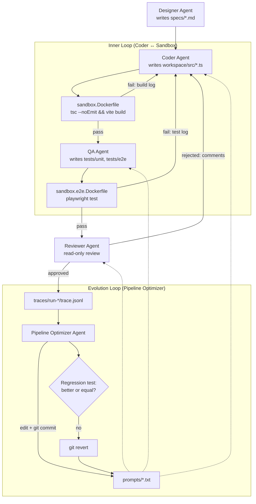

# Game Factory Harness Setup Implementation Plan

> **For Agent:** Execute this plan task-by-task. Follow each step exactly, verify results before proceeding, and commit after each task.
> **TDD Rule:** No production code without a failing test first. Phase 1 and Phase 3 use the **Approved Exception Contract** (Configuration-only) per explicit user approval — see those phases for the approval note. Phase 2 is full TDD (RED → Verify RED → GREEN → Verify GREEN → REFACTOR → Verify GREEN → COMMIT). Phase 4 is a roadmap table only; no tasks are executed from it in this plan.

**Goal:** Turn `game-factory/` from a minimal scaffold into a working autonomous game-dev harness: a git-versioned repo, a Vite + Vitest + Playwright workspace that builds and tests inside two Docker sandboxes, a fully unit-tested "Math Merge 10" grid engine, a complete 5-agent prompt set (Designer/Coder/QA/Reviewer/Optimizer), PWA assets for the game, and a roadmap for the Python orchestration layer (Phase 4).

**Architecture:** Phase 1 retrofits `workspace/` for Vite (dev/build/preview) while keeping strict `tsc` type-checking, and splits the Docker sandbox into a fast `tsc + vite build` image (`sandbox.Dockerfile`) and a Playwright e2e image (`sandbox.e2e.Dockerfile`). Phase 2 adds a pure-function grid engine (`workspace/src/grid.ts`) implementing the "Math Merge: 10之魔法師" rules, built test-first with Vitest. Phase 3 completes `prompts/` (new `qa.txt`, `reviewer.txt`, `optimizer.txt`; updated `designer.txt`/`coder.txt`) and adds PWA assets (`manifest.json`, `sw.js`, `icons/icon.svg`). Phase 4 is a file/responsibility roadmap for the Python `orchestrator.py` + `agents/` + `harness/` layers that will wire the Claude Code CLI and Gemini SDK into the dual-loop (inner loop / evolution loop) pipeline.

**Tech Stack:** TypeScript 5, Vite 5, Vitest 2, `@playwright/test` 1.4x, HTML5 Canvas, Docker (`node:20-alpine` / `node:20-bookworm`), git. *(Phase 4 roadmap only: Python 3, Claude Code CLI headless mode, `google-generativeai` SDK)*

**Complexity Path:** `Simplified TDD path`

**Status:** In Progress — Phase 1 Task 1 done (git initialized, `.gitignore` added, initial commit `c69ffe4`, fix-up commit `ec506e8` to also ignore `.claude/` runtime state)

---

## Requirements

### User Stories
- As the Game Factory operator, I want the workspace to type-check and build via Vite inside a Docker sandbox, so that the Coder Agent's inner loop can verify code changes automatically without a local toolchain.
- As the Game Factory operator, I want a fully unit-tested Math Merge 10 grid engine (`grid.ts`), so that the Coder Agent can build the rendering/UI layer on top of a verified, pure-function core.
- As the Pipeline Optimizer Agent, I want versioned prompts for the QA, Reviewer, and Optimizer roles with explicit contracts and checklists, so that I can safely evolve the harness via git commits and roll back regressions.
- As a player (school-age kid), I want the game to be installable as a PWA (manifest + service worker + icon), so that I can play Math Merge 10 from my phone's home screen.

### Acceptance Criteria
- Given a fresh clone of `game-factory/`, when `docker build -t game-sandbox -f sandbox.Dockerfile .` is run, then it succeeds and `docker run --rm --name game-sandbox-instance game-sandbox` runs `tsc --noEmit && npm run build` to completion with exit code 0.
- Given a fresh clone of `game-factory/`, when `docker build -t game-sandbox-e2e -f sandbox.e2e.Dockerfile .` is run, then it succeeds (Playwright + Chromium install completes).
- Given `workspace/src/grid.ts`, when `slideRowLeft` is called on a row containing adjacent values that sum to 10, then both values are removed from the row, `scoreGained` increases by 10, and chain reactions (e.g. `[4,6,4,6]`) are fully resolved in one call.
- Given a full 4x4 `GameGrid` with no possible merge in any of the 4 directions, when `isGameOver(grid)` is called, then it returns `true`; given the same grid with at least one adjacent pair summing to 10, it returns `false`.
- Given `prompts/`, when the Optimizer Agent (future) edits `coder.txt`, then the change is recorded as a git commit that can be reverted with `git revert`.
- Given `workspace/index.html` after Phase 3, when the page loads, then it references `manifest.json`, an icon, and registers `sw.js`.

### Assumptions, Constraints, and Scope Boundaries
- Node v24.12.0, npm 11.6.2, and Docker 27.5.1 are available locally (already confirmed in this environment).
- The repository is not yet a git repo; Phase 1 Task 1 runs `git init`.
- No LLM API keys are configured yet. Phases 1-3 require none — they are pure config/local-logic work.
- Phase 4 (`orchestrator.py`, `agents/`, `harness/`) is a **roadmap table only** in this plan. Full TDD tasks for Phase 4 are deferred to a follow-up `/plan`, to be written after Phase 1-3 land and after a manual spike confirms real `claude -p` and Gemini SDK output shapes.
- `workspace/tests/e2e/` has no Playwright spec files in this plan. `sandbox.e2e.Dockerfile`'s build is verified in Phase 1 Task 8, but `docker run` (which executes `npx playwright test`) is expected to report "No tests found" until a future phase adds specs — that is acceptable and explicitly called out in Task 8's verification.
- The Math Merge 10 grid is a 4x4 `GameGrid` (`(number | null)[][]`); `spawnRandomTile` places digits 1-9.
- `workspace/src/game.ts` is reused as-is in this plan (Phase 2 produces `grid.ts` as a separate, independently-tested module; wiring `game.ts` to call `grid.ts` is left to the Coder Agent / future phase, not part of this plan's scope).

## Architecture Review

**Reusable components / similar implementations:**
- `workspace/src/game.ts` — existing render-loop skeleton (`update`/`render`/`requestAnimationFrame`). Not modified by this plan; `grid.ts` (Phase 2) is built independently and will be imported by `game.ts` in a later phase.
- `prompts/designer.txt`, `prompts/coder.txt` — existing agent prompts, extended (not replaced) in Phase 3.

**Affected layers and key data flow:**
- **Build tooling**: `workspace/package.json`, `workspace/tsconfig.json`, `workspace/index.html`, `workspace/src/main.ts` (Phase 1) — establishes the Vite dev/build pipeline that both Docker sandboxes and the future Coder Agent inner loop rely on.
- **Sandbox/CI layer**: `sandbox.Dockerfile` (fast tsc+vite check), `sandbox.e2e.Dockerfile` (Playwright e2e) — the executable verification harness for the inner loop and QA stage.
- **Core game logic**: `workspace/src/grid.ts` + `workspace/tests/unit/grid.test.ts` (Phase 2) — pure-function Math Merge 10 engine, the first piece of game logic the harness produces end-to-end.
- **Agent harness contracts**: `prompts/*.txt` (Phase 3) — defines the operating contract for each of the 5 agents; versioned via git so the Optimizer Agent (Phase 4) can edit and roll back.
- **PWA shell**: `workspace/manifest.json`, `workspace/sw.js`, `workspace/icons/icon.svg`, `workspace/index.html` (Phase 3) — installability layer for the shipped game.
- **Orchestration (roadmap)**: `orchestrator.py`, `agents/*.py`, `harness/*.py` (Phase 4) — Python layer that will call the agents and run the dual loops; not implemented in this plan.

**Mermaid — dual-loop pipeline (target architecture after Phase 4, for context):**



**Exact file paths touched by this plan:**

Phase 1:
- Create: `.gitignore`
- Create: `.env.example`
- Modify: `workspace/package.json`
- Create: `workspace/package-lock.json` (generated by `npm install`)
- Modify: `workspace/tsconfig.json`
- Modify: `workspace/index.html`
- Create: `workspace/src/main.ts`
- Modify: `sandbox.Dockerfile`
- Create: `sandbox.e2e.Dockerfile`

Phase 2:
- Create: `workspace/src/grid.ts`
- Create: `workspace/tests/unit/grid.test.ts`

Phase 3:
- Create: `prompts/qa.txt`
- Create: `prompts/reviewer.txt`
- Create: `prompts/optimizer.txt`
- Modify: `prompts/designer.txt`
- Modify: `prompts/coder.txt`
- Create: `workspace/manifest.json`
- Create: `workspace/icons/icon.svg`
- Create: `workspace/sw.js`
- Modify: `workspace/index.html` (PWA links + SW registration)

Phase 4: roadmap table only — no files modified by this plan.

---

## Implementation Steps

### Phase 1: Infrastructure (Vite + Docker sandboxes)

> **Exception approval (applies to all Phase 1 tasks):** User explicitly approved: "同意，設定檔用 exception 格式 (Recommended)" — Phase 1 tasks are configuration/infrastructure changes with no application logic, verified via real command output instead of RED/GREEN test steps.

#### Task 1: Initialize git repository and .gitignore
**Exception Type:** Configuration-only
**User Approval:** "同意，設定檔用 exception 格式 (Recommended)"
**Files:**
- Create: `.gitignore`

**Implementation**
1. Initialize the repository:
   ```bash
   git init
   ```
2. Create `.gitignore`:
   ```
   node_modules/
   dist/
   .env
   traces/
   __pycache__/
   *.pyc
   .claude/settings.local.json
   ```
3. Stage and commit everything that currently exists:
   ```bash
   git add -A
   git commit -m "chore: 🎉 initial commit for game-factory harness scaffold"
   ```

**Verification**
Run: `git log --oneline -1 && git status --short`

Confirm:
- `git log --oneline -1` shows one commit with message `chore: 🎉 initial commit for game-factory harness scaffold`
- `git status --short` prints nothing (clean working tree)
- `git ls-files | grep -E 'settings.local.json|node_modules|dist'` returns nothing

**COMMIT**
Already committed in Implementation step 3 — this task establishes the repo and its first commit, so no separate commit step is needed.

---

#### Task 2: Add environment variable template
**Exception Type:** Configuration-only
**User Approval:** "同意，設定檔用 exception 格式 (Recommended)"
**Files:**
- Create: `.env.example`

**Implementation**
Create `.env.example` with exactly:
```
GEMINI_API_KEY=
```

**Verification**
Run: `cat .env.example`

Confirm:
- Output is exactly `GEMINI_API_KEY=`
- `.env` (without `.example`) is not present / is ignored per Task 1's `.gitignore`

**COMMIT**
Run:
```bash
git add .env.example
git commit -m "chore: ✨ add .env.example for Gemini API key"
```

---

#### Task 3: Add Vite, Vitest, and Playwright to workspace package.json
**Exception Type:** Configuration-only
**User Approval:** "同意，設定檔用 exception 格式 (Recommended)"
**Files:**
- Modify: `workspace/package.json`
- Create: `workspace/package-lock.json` (generated by `npm install`)

**Implementation**
Replace `workspace/package.json` with:
```json
{
  "name": "game-factory-workspace",
  "version": "0.1.0",
  "private": true,
  "type": "module",
  "scripts": {
    "dev": "vite",
    "build": "vite build",
    "preview": "vite preview",
    "test:unit": "vitest run",
    "test:e2e": "playwright test"
  },
  "devDependencies": {
    "typescript": "^5.4.0",
    "vite": "^5.4.0",
    "vitest": "^2.1.0",
    "@playwright/test": "^1.48.0"
  }
}
```

Then install dependencies:
```bash
cd workspace && npm install
```

**Verification**
Run: `cd workspace && npm install && npx tsc --version && npx vite --version`

Confirm:
- `npm install` exits 0 and creates `workspace/package-lock.json` and `workspace/node_modules/`
- `npx tsc --version` prints a `Version 5.x.x` line
- `npx vite --version` prints a `vite/5.x.x` line
- No `npm ERR!` lines in the output

**COMMIT**
Run:
```bash
git add workspace/package.json workspace/package-lock.json
git commit -m "chore: ➕ add vite, vitest, and playwright to workspace"
```

---

#### Task 4: Update tsconfig.json for Vite's bundler resolution
**Exception Type:** Configuration-only
**User Approval:** "同意，設定檔用 exception 格式 (Recommended)"
**Files:**
- Modify: `workspace/tsconfig.json`

**Implementation**
Replace `workspace/tsconfig.json` with:
```json
{
  "compilerOptions": {
    "target": "ES2020",
    "lib": ["ES2020", "DOM"],
    "module": "ESNext",
    "moduleResolution": "bundler",
    "strict": true,
    "noEmit": true,
    "types": ["vite/client"]
  },
  "include": ["src/**/*.ts"]
}
```

**Verification**
Run: `cd workspace && npx tsc --noEmit`

Confirm:
- Command exits 0 — `workspace/src/game.ts` still type-checks cleanly under the new config
- No errors or warnings printed

**COMMIT**
Run:
```bash
git commit -am "chore: 🔧 update tsconfig for vite bundler resolution"
```

---

#### Task 5: Switch index.html to a Vite module entry
**Exception Type:** Configuration-only
**User Approval:** "同意，設定檔用 exception 格式 (Recommended)"
**Files:**
- Modify: `workspace/index.html`

**Implementation**
In `workspace/index.html`, replace:
```html
  <script src="./dist/game.js"></script>
```
with:
```html
  <script type="module" src="/src/main.ts"></script>
```

**Verification**
Run: `grep -n "main.ts\|dist/game.js" workspace/index.html`

Confirm:
- Output shows `<script type="module" src="/src/main.ts"></script>`
- The string `dist/game.js` no longer appears (the `grep` output contains only the `main.ts` line)

**COMMIT**
Run:
```bash
git commit -am "chore: 🔧 point index.html at vite module entry"
```

---

#### Task 6: Create Vite entry point src/main.ts
**Exception Type:** Configuration-only
**User Approval:** "同意，設定檔用 exception 格式 (Recommended)"
**Files:**
- Create: `workspace/src/main.ts`

**Implementation**
Create `workspace/src/main.ts`:
```typescript
import "./game";
```

**Verification**
Run: `cd workspace && npm run build`

Confirm:
- `vite build` completes successfully and prints a build summary including `dist/index.html` and a bundled JS asset under `dist/assets/`
- Exit code 0, no errors

**COMMIT**
Run:
```bash
git add workspace/src/main.ts
git commit -m "feat: ✨ add vite entry point main.ts"
```

---

#### Task 7: Rewrite sandbox.Dockerfile for local npm install + vite build
**Exception Type:** Configuration-only
**User Approval:** "同意，設定檔用 exception 格式 (Recommended)"
**Files:**
- Modify: `sandbox.Dockerfile`

**Implementation**
Replace `sandbox.Dockerfile` with:
```dockerfile
FROM node:20-alpine

WORKDIR /app

# 複製 Agent 寫好的工作區檔案
COPY ./workspace /app

# 安裝 package.json 中定義的相依套件（本地安裝，非全域）
RUN npm install

# 預設執行命令：進行 TypeScript 型別檢查與 Vite 打包測試
CMD ["sh", "-c", "npx tsc --noEmit && npm run build"]
```

**Verification**
Run:
```bash
docker build -t game-sandbox -f sandbox.Dockerfile .
docker run --rm --name game-sandbox-instance game-sandbox
```

Confirm:
- `docker build` completes successfully
- `docker run` exits 0: `tsc --noEmit` produces no output (success), followed by `vite build`'s build summary
- No errors in either command's output

**COMMIT**
Run:
```bash
git commit -am "fix: 🐛 sandbox.Dockerfile installs local deps and runs vite build"
```

---

#### Task 8: Add sandbox.e2e.Dockerfile for Playwright
**Exception Type:** Configuration-only
**User Approval:** "同意，設定檔用 exception 格式 (Recommended)"
**Files:**
- Create: `sandbox.e2e.Dockerfile`

**Implementation**
Create `sandbox.e2e.Dockerfile`:
```dockerfile
FROM node:20-bookworm

WORKDIR /app

# 複製 Agent 寫好的工作區檔案
COPY ./workspace /app

# 安裝相依套件
RUN npm install

# 安裝 Playwright 與 Chromium（含系統相依套件）
RUN npx playwright install --with-deps chromium

# 預設執行命令：跑 Playwright 端對端測試
CMD ["sh", "-c", "npx playwright test"]
```

**Verification**
Run: `docker build -t game-sandbox-e2e -f sandbox.e2e.Dockerfile .`

Confirm:
- `docker build` completes successfully — both the `npm install` layer and the `npx playwright install --with-deps chromium` layer succeed
- **Do not run `docker run` for this image yet.** `workspace/tests/e2e/` has no spec files until a future QA Agent phase, so `npx playwright test` would correctly exit non-zero with "No tests found". Build success alone satisfies this task.

**COMMIT**
Run:
```bash
git add sandbox.e2e.Dockerfile
git commit -m "feat: ✨ add playwright e2e sandbox image"
```

---

### Phase 2: Math Merge 10 Grid Engine (full TDD)

All tasks in this phase follow `RED -> Verify RED -> GREEN -> Verify GREEN -> REFACTOR -> Verify GREEN -> COMMIT` exactly, using:

```bash
cd workspace && npm run test:unit
```

as the test command. `workspace/src/grid.ts` and `workspace/tests/unit/grid.test.ts` are built incrementally — each task **appends** to both files (creating them on Task 1).

#### Task 1: createEmptyGrid
**Goal:** Prove that `createEmptyGrid(size)` returns an `N x N` grid where every cell is `null`.

**Files:**
- Create: `workspace/src/grid.ts`
- Create: `workspace/tests/unit/grid.test.ts`

**RED - Write Failing Test**
Create `workspace/tests/unit/grid.test.ts`:
```typescript
import { describe, it, expect } from "vitest";
import { createEmptyGrid } from "../../src/grid";

describe("createEmptyGrid", () => {
  it("creates an NxN grid filled with null", () => {
    const grid = createEmptyGrid(4);

    expect(grid).toHaveLength(4);
    grid.forEach((row) => {
      expect(row).toHaveLength(4);
      row.forEach((cell) => {
        expect(cell).toBeNull();
      });
    });
  });
});
```

**Requirements:**
- One behavior: an empty grid is all-`null` and has the requested dimensions
- Clear name: `createEmptyGrid`
- Real code, no mocks

**Verify RED - Watch It Fail**
Run: `cd workspace && npm run test:unit`

Confirm:
- Test run fails (not a Vitest config crash)
- Failure reason is a module resolution error: `Cannot find module '../../src/grid'` (or equivalent "no such file") — `workspace/src/grid.ts` does not exist yet
- Fails because the feature is missing, not because of a typo

**GREEN - Minimal Code**
Create `workspace/src/grid.ts`:
```typescript
export type Cell = number | null;
export type GameGrid = Cell[][];

export function createEmptyGrid(size: number): GameGrid {
  return Array.from({ length: size }, () =>
    Array.from({ length: size }, () => null as Cell)
  );
}
```

Don't add features, refactor other code, or "improve" beyond the test.

**Verify GREEN - Watch It Pass**
Run: `cd workspace && npm run test:unit`

Confirm:
- 1 test file, 1 test, all passing
- Output pristine (no errors, warnings)

**REFACTOR - Clean Up**
None needed — both files are already minimal and clearly named.

**Verify GREEN - Stay Green After Refactor**
Run: `cd workspace && npm run test:unit`

Confirm:
- Still 1 passed test, pristine output

**COMMIT**
Run:
`git add workspace/src/grid.ts workspace/tests/unit/grid.test.ts && git commit -m "feat: ✨ add createEmptyGrid for the Math Merge 10 grid"`

---

#### Task 2: compactRow
**Goal:** Prove that `compactRow(row)` slides non-null values to the left (no gaps), reports whether anything moved, and never merges values.

**Files:**
- Modify: `workspace/src/grid.ts`
- Modify: `workspace/tests/unit/grid.test.ts`

**RED - Write Failing Test**
Update the import line at the top of `workspace/tests/unit/grid.test.ts`:
```typescript
import { describe, it, expect } from "vitest";
import { createEmptyGrid, compactRow } from "../../src/grid";
```

Append to `workspace/tests/unit/grid.test.ts`:
```typescript
describe("compactRow", () => {
  it("compacts non-null values to the left without merging", () => {
    const result = compactRow([null, 4, null, 7]);

    expect(result.row).toEqual([4, 7, null, null]);
    expect(result.moved).toBe(true);
  });

  it("reports moved=false when the row is already compacted", () => {
    const result = compactRow([4, 7, null, null]);

    expect(result.row).toEqual([4, 7, null, null]);
    expect(result.moved).toBe(false);
  });
});
```

**Requirements:**
- One behavior: left-compaction with a `moved` flag
- Clear name: `compactRow`
- Real code, no mocks

**Verify RED - Watch It Fail**
Run: `cd workspace && npm run test:unit`

Confirm:
- Test run fails with a TypeScript/module error: `compactRow` is not exported from `../../src/grid`
- The `createEmptyGrid` test from Task 1 still passes (only the new `compactRow` suite fails to even load)
- Fails because the feature is missing, not because of a typo

**GREEN - Minimal Code**
Append to `workspace/src/grid.ts`:
```typescript
export interface CompactResult {
  row: Cell[];
  moved: boolean;
}

export function compactRow(row: Cell[]): CompactResult {
  const values = row.filter((cell): cell is number => cell !== null);
  const compacted: Cell[] = Array.from(
    { length: row.length },
    (_, index) => values[index] ?? null
  );
  const moved = row.some((cell, index) => cell !== compacted[index]);

  return { row: compacted, moved };
}
```

**Verify GREEN - Watch It Pass**
Run: `cd workspace && npm run test:unit`

Confirm:
- 1 test file, 3 tests total, all passing
- Output pristine

**REFACTOR - Clean Up**
None needed yet — `compactRow` is small and self-contained.

**Verify GREEN - Stay Green After Refactor**
Run: `cd workspace && npm run test:unit`

Confirm:
- 3 passed tests, pristine output

**COMMIT**
Run:
`git commit -am "feat: ✨ add compactRow to left-compact grid rows"`

---

#### Task 3: slideRowLeft (merge, chain reactions, no-op)
**Goal:** Prove that `slideRowLeft(row)` compacts a row left and merges adjacent values that sum to 10 — including resolving chain reactions in a single call — and reports a `scoreGained` and `moved` flag.

**Files:**
- Modify: `workspace/src/grid.ts`
- Modify: `workspace/tests/unit/grid.test.ts`

**RED - Write Failing Test**
Update the import line at the top of `workspace/tests/unit/grid.test.ts`:
```typescript
import { describe, it, expect } from "vitest";
import { createEmptyGrid, compactRow, slideRowLeft } from "../../src/grid";
```

Append to `workspace/tests/unit/grid.test.ts`:
```typescript
describe("slideRowLeft", () => {
  it("merges a single adjacent pair that sums to 10 and scores 10", () => {
    const result = slideRowLeft([4, 6, null, null]);

    expect(result.row).toEqual([null, null, null, null]);
    expect(result.moved).toBe(true);
    expect(result.scoreGained).toBe(10);
  });

  it("resolves chain reactions in a single call", () => {
    const result = slideRowLeft([4, 6, 4, 6]);

    expect(result.row).toEqual([null, null, null, null]);
    expect(result.moved).toBe(true);
    expect(result.scoreGained).toBe(20);
  });

  it("reports moved=false and scoreGained=0 when nothing can merge or compact", () => {
    const result = slideRowLeft([4, 7, null, null]);

    expect(result.row).toEqual([4, 7, null, null]);
    expect(result.moved).toBe(false);
    expect(result.scoreGained).toBe(0);
  });
});
```

**Requirements:**
- One behavior: left-compaction with adjacent-sum-to-10 merging (including chains) and score tracking
- Clear name: `slideRowLeft`
- Real code, no mocks

**Verify RED - Watch It Fail**
Run: `cd workspace && npm run test:unit`

Confirm:
- Test run fails with a TypeScript/module error: `slideRowLeft` is not exported from `../../src/grid`
- All Task 1 and Task 2 tests still pass
- Fails because the feature is missing, not because of a typo

**GREEN - Minimal Code**
Append to `workspace/src/grid.ts`:
```typescript
export interface SlideResult {
  row: Cell[];
  moved: boolean;
  scoreGained: number;
}

export function slideRowLeft(row: Cell[]): SlideResult {
  const values = row.filter((cell): cell is number => cell !== null);
  const merged: number[] = [];
  let scoreGained = 0;

  let i = 0;
  while (i < values.length) {
    const current = values[i];
    const next = values[i + 1];

    if (next !== undefined && current + next === 10) {
      scoreGained += 10;
      i += 2;
    } else {
      merged.push(current);
      i += 1;
    }
  }

  const finalRow: Cell[] = Array.from(
    { length: row.length },
    (_, index) => merged[index] ?? null
  );
  const moved = row.some((cell, index) => cell !== finalRow[index]);

  return { row: finalRow, moved, scoreGained };
}
```

Don't add features, refactor other code, or "improve" beyond the test.

**Verify GREEN - Watch It Pass**
Run: `cd workspace && npm run test:unit`

Confirm:
- 1 test file, 6 tests total, all passing
- Output pristine

**REFACTOR - Clean Up**
`compactRow` and `slideRowLeft` both build a same-length `Cell[]` from a list of values, padding the remainder with `null`. Extract a shared `padToLength` helper and use it in both functions.

Replace the bodies of `compactRow` and `slideRowLeft` in `workspace/src/grid.ts` with:
```typescript
function padToLength(values: number[], length: number): Cell[] {
  return Array.from({ length }, (_, index) => values[index] ?? null);
}

export function compactRow(row: Cell[]): CompactResult {
  const values = row.filter((cell): cell is number => cell !== null);
  const compacted = padToLength(values, row.length);
  const moved = row.some((cell, index) => cell !== compacted[index]);

  return { row: compacted, moved };
}

export function slideRowLeft(row: Cell[]): SlideResult {
  const values = row.filter((cell): cell is number => cell !== null);
  const merged: number[] = [];
  let scoreGained = 0;

  let i = 0;
  while (i < values.length) {
    const current = values[i];
    const next = values[i + 1];

    if (next !== undefined && current + next === 10) {
      scoreGained += 10;
      i += 2;
    } else {
      merged.push(current);
      i += 1;
    }
  }

  const finalRow = padToLength(merged, row.length);
  const moved = row.some((cell, index) => cell !== finalRow[index]);

  return { row: finalRow, moved, scoreGained };
}
```

Keep tests green. Don't add behavior.

**Verify GREEN - Stay Green After Refactor**
Run: `cd workspace && npm run test:unit`

Confirm:
- Still 6 passed tests, pristine output

**COMMIT**
Run:
`git commit -am "feat: ✨ slideRowLeft merges pairs summing to 10, including chain reactions"`

---

#### Task 4: slide(grid, "left")
**Goal:** Prove that `slide(grid, "left")` applies `slideRowLeft` to every row of the grid and aggregates `moved`/`scoreGained` across the whole grid.

**Files:**
- Modify: `workspace/src/grid.ts`
- Modify: `workspace/tests/unit/grid.test.ts`

**RED - Write Failing Test**
Update the import line at the top of `workspace/tests/unit/grid.test.ts`:
```typescript
import { describe, it, expect } from "vitest";
import {
  createEmptyGrid,
  compactRow,
  slideRowLeft,
  slide,
  type GameGrid,
} from "../../src/grid";
```

Append to `workspace/tests/unit/grid.test.ts`:
```typescript
describe("slide", () => {
  it("slides and merges every row to the left", () => {
    const grid: GameGrid = [
      [null, 4, null, 7],
      [4, 6, null, null],
      [4, 6, 4, 6],
      [4, 7, null, null],
    ];

    const outcome = slide(grid, "left");

    expect(outcome.grid).toEqual([
      [4, 7, null, null],
      [null, null, null, null],
      [null, null, null, null],
      [4, 7, null, null],
    ]);
    expect(outcome.moved).toBe(true);
    expect(outcome.scoreGained).toBe(30);
  });
});
```

**Requirements:**
- One behavior: apply `slideRowLeft` per-row across a full grid and aggregate the results
- Clear name: `slide`
- Real code, no mocks

**Verify RED - Watch It Fail**
Run: `cd workspace && npm run test:unit`

Confirm:
- Test run fails with a TypeScript/module error: `slide` (and/or `Direction`) is not exported from `../../src/grid`
- All Task 1-3 tests still pass
- Fails because the feature is missing, not because of a typo

**GREEN - Minimal Code**
Append to `workspace/src/grid.ts`:
```typescript
export type Direction = "up" | "down" | "left" | "right";

export interface SlideOutcome {
  grid: GameGrid;
  moved: boolean;
  scoreGained: number;
}

function applySlideRowLeftToGrid(grid: GameGrid): SlideOutcome {
  let moved = false;
  let scoreGained = 0;

  const resultGrid = grid.map((row) => {
    const result = slideRowLeft(row);
    if (result.moved) moved = true;
    scoreGained += result.scoreGained;
    return result.row;
  });

  return { grid: resultGrid, moved, scoreGained };
}

export function slide(grid: GameGrid, direction: Direction): SlideOutcome {
  switch (direction) {
    case "left":
      return applySlideRowLeftToGrid(grid);
    default:
      return { grid, moved: false, scoreGained: 0 };
  }
}
```

**Verify GREEN - Watch It Pass**
Run: `cd workspace && npm run test:unit`

Confirm:
- 1 test file, 7 tests total, all passing
- Output pristine

**REFACTOR - Clean Up**
None needed yet — `slide` will gain its remaining direction cases in the next tasks, at which point the `default` branch is removed.

**Verify GREEN - Stay Green After Refactor**
Run: `cd workspace && npm run test:unit`

Confirm:
- Still 7 passed tests, pristine output

**COMMIT**
Run:
`git commit -am "feat: ✨ slide(grid, 'left') applies slideRowLeft across the grid"`

---

#### Task 5: slide(grid, "right")
**Goal:** Prove that `slide(grid, "right")` reverses each row, applies `slideRowLeft`, and reverses the result back — compacting and merging toward the right edge.

**Files:**
- Modify: `workspace/src/grid.ts`
- Modify: `workspace/tests/unit/grid.test.ts`

**RED - Write Failing Test**
Append to `workspace/tests/unit/grid.test.ts`, inside the existing `describe("slide", ...)` block (add as a sibling `it` after the `"left"` test):
```typescript
  it("slides and merges every row to the right", () => {
    const grid: GameGrid = [
      [7, null, null, 4],
      [null, null, 4, 6],
      [6, 4, 6, 4],
      [null, null, 4, 7],
    ];

    const outcome = slide(grid, "right");

    expect(outcome.grid).toEqual([
      [null, null, 7, 4],
      [null, null, null, null],
      [null, null, null, null],
      [null, null, 4, 7],
    ]);
    expect(outcome.moved).toBe(true);
    expect(outcome.scoreGained).toBe(30);
  });
```

**Requirements:**
- One behavior: `slide` with direction `"right"`
- Clear name: existing `slide` function, new direction case
- Real code, no mocks

**Verify RED - Watch It Fail**
Run: `cd workspace && npm run test:unit`

Confirm:
- Test run fails: `slide(grid, "right")` currently falls into the `default` branch and returns the input grid unchanged, so `outcome.grid` does not equal the expected merged/compacted grid
- All Task 1-4 tests still pass
- Fails because the feature is missing, not because of a typo

**GREEN - Minimal Code**
In `workspace/src/grid.ts`, add a `reverseRows` helper and a `"right"` case to `slide`:
```typescript
function reverseRows(grid: GameGrid): GameGrid {
  return grid.map((row) => [...row].reverse());
}

export function slide(grid: GameGrid, direction: Direction): SlideOutcome {
  switch (direction) {
    case "left":
      return applySlideRowLeftToGrid(grid);
    case "right": {
      const outcome = applySlideRowLeftToGrid(reverseRows(grid));
      return { ...outcome, grid: reverseRows(outcome.grid) };
    }
    default:
      return { grid, moved: false, scoreGained: 0 };
  }
}
```

**Verify GREEN - Watch It Pass**
Run: `cd workspace && npm run test:unit`

Confirm:
- 1 test file, 8 tests total, all passing
- Output pristine

**REFACTOR - Clean Up**
None needed — `reverseRows` is small, named, and reused as-is.

**Verify GREEN - Stay Green After Refactor**
Run: `cd workspace && npm run test:unit`

Confirm:
- Still 8 passed tests, pristine output

**COMMIT**
Run:
`git commit -am "feat: ✨ slide(grid, 'right') compacts and merges toward the right edge"`

---

#### Task 6: slide(grid, "up")
**Goal:** Prove that `slide(grid, "up")` transposes the grid (columns become rows), applies `slideRowLeft`, and transposes back — compacting and merging columns upward.

**Files:**
- Modify: `workspace/src/grid.ts`
- Modify: `workspace/tests/unit/grid.test.ts`

**RED - Write Failing Test**
Append to `workspace/tests/unit/grid.test.ts`, inside the existing `describe("slide", ...)` block (add as a sibling `it` after the `"right"` test):
```typescript
  it("slides and merges every column upward", () => {
    const grid: GameGrid = [
      [null, 4, 4, 4],
      [4, 6, 6, 7],
      [null, 4, 4, null],
      [7, 6, 6, null],
    ];

    const outcome = slide(grid, "up");

    expect(outcome.grid).toEqual([
      [4, null, null, 4],
      [7, null, null, 7],
      [null, null, null, null],
      [null, null, null, null],
    ]);
    expect(outcome.moved).toBe(true);
    expect(outcome.scoreGained).toBe(40);
  });
```

**Requirements:**
- One behavior: `slide` with direction `"up"`
- Clear name: existing `slide` function, new direction case
- Real code, no mocks

**Verify RED - Watch It Fail**
Run: `cd workspace && npm run test:unit`

Confirm:
- Test run fails: `slide(grid, "up")` currently falls into the `default` branch and returns the input grid unchanged, so `outcome.grid` does not equal the expected merged/compacted grid
- All Task 1-5 tests still pass
- Fails because the feature is missing, not because of a typo

**GREEN - Minimal Code**
In `workspace/src/grid.ts`, add a `transpose` helper and an `"up"` case to `slide`:
```typescript
function transpose(grid: GameGrid): GameGrid {
  const size = grid.length;
  return Array.from({ length: size }, (_, col) =>
    Array.from({ length: size }, (_, row) => grid[row][col])
  );
}

export function slide(grid: GameGrid, direction: Direction): SlideOutcome {
  switch (direction) {
    case "left":
      return applySlideRowLeftToGrid(grid);
    case "right": {
      const outcome = applySlideRowLeftToGrid(reverseRows(grid));
      return { ...outcome, grid: reverseRows(outcome.grid) };
    }
    case "up": {
      const outcome = applySlideRowLeftToGrid(transpose(grid));
      return { ...outcome, grid: transpose(outcome.grid) };
    }
    default:
      return { grid, moved: false, scoreGained: 0 };
  }
}
```

**Verify GREEN - Watch It Pass**
Run: `cd workspace && npm run test:unit`

Confirm:
- 1 test file, 9 tests total, all passing
- Output pristine

**REFACTOR - Clean Up**
None needed — `transpose` is small, named, and reused as-is.

**Verify GREEN - Stay Green After Refactor**
Run: `cd workspace && npm run test:unit`

Confirm:
- Still 9 passed tests, pristine output

**COMMIT**
Run:
`git commit -am "feat: ✨ slide(grid, 'up') compacts and merges columns upward"`

---

#### Task 7: slide(grid, "down")
**Goal:** Prove that `slide(grid, "down")` transposes and reverses the grid, applies `slideRowLeft`, and reverses+transposes back — compacting and merging columns downward. Also makes the `slide` direction switch exhaustive (removes the `default` fallback).

**Files:**
- Modify: `workspace/src/grid.ts`
- Modify: `workspace/tests/unit/grid.test.ts`

**RED - Write Failing Test**
Append to `workspace/tests/unit/grid.test.ts`, inside the existing `describe("slide", ...)` block (add as a sibling `it` after the `"up"` test):
```typescript
  it("slides and merges every column downward", () => {
    const grid: GameGrid = [
      [4, 4, null, null],
      [7, 6, null, null],
      [null, 4, null, null],
      [null, 6, null, null],
    ];

    const outcome = slide(grid, "down");

    expect(outcome.grid).toEqual([
      [null, null, null, null],
      [null, null, null, null],
      [4, null, null, null],
      [7, null, null, null],
    ]);
    expect(outcome.moved).toBe(true);
    expect(outcome.scoreGained).toBe(20);
  });
```

**Requirements:**
- One behavior: `slide` with direction `"down"`
- Clear name: existing `slide` function, final direction case
- Real code, no mocks

**Verify RED - Watch It Fail**
Run: `cd workspace && npm run test:unit`

Confirm:
- Test run fails: `slide(grid, "down")` currently falls into the `default` branch and returns the input grid unchanged, so `outcome.grid` does not equal the expected merged/compacted grid
- All Task 1-6 tests still pass
- Fails because the feature is missing, not because of a typo

**GREEN - Minimal Code**
In `workspace/src/grid.ts`, add a `"down"` case to `slide` and remove the now-unnecessary `default` branch (the switch becomes exhaustive over `Direction`):
```typescript
export function slide(grid: GameGrid, direction: Direction): SlideOutcome {
  switch (direction) {
    case "left":
      return applySlideRowLeftToGrid(grid);
    case "right": {
      const outcome = applySlideRowLeftToGrid(reverseRows(grid));
      return { ...outcome, grid: reverseRows(outcome.grid) };
    }
    case "up": {
      const outcome = applySlideRowLeftToGrid(transpose(grid));
      return { ...outcome, grid: transpose(outcome.grid) };
    }
    case "down": {
      const outcome = applySlideRowLeftToGrid(reverseRows(transpose(grid)));
      return { ...outcome, grid: transpose(reverseRows(outcome.grid)) };
    }
  }
}
```

**Verify GREEN - Watch It Pass**
Run: `cd workspace && npm run test:unit`

Confirm:
- 1 test file, 10 tests total, all passing
- Output pristine
- `cd workspace && npx tsc --noEmit` still exits 0 (the switch is exhaustive over `Direction`, so removing `default` introduces no type error)

**REFACTOR - Clean Up**
None needed — `slide` now exhaustively handles all 4 directions using the existing `reverseRows`/`transpose`/`applySlideRowLeftToGrid` helpers.

**Verify GREEN - Stay Green After Refactor**
Run: `cd workspace && npm run test:unit`

Confirm:
- Still 10 passed tests, pristine output

**COMMIT**
Run:
`git commit -am "feat: ✨ slide(grid, 'down') compacts and merges columns downward"`

---

#### Task 8: canMove
**Goal:** Prove that `canMove(grid)` returns `true` if sliding the grid in any of the 4 directions would change it, and `false` if none would.

**Files:**
- Modify: `workspace/src/grid.ts`
- Modify: `workspace/tests/unit/grid.test.ts`

**RED - Write Failing Test**
Update the import line at the top of `workspace/tests/unit/grid.test.ts`:
```typescript
import { describe, it, expect } from "vitest";
import {
  createEmptyGrid,
  compactRow,
  slideRowLeft,
  slide,
  canMove,
  type GameGrid,
} from "../../src/grid";
```

Append to `workspace/tests/unit/grid.test.ts`:
```typescript
describe("canMove", () => {
  it("returns true when at least one direction would change the grid", () => {
    const grid: GameGrid = [
      [4, 6, 1, 2],
      [3, 5, 7, 8],
      [9, 1, 2, 3],
      [4, 5, 6, 7],
    ];

    expect(canMove(grid)).toBe(true);
  });

  it("returns false when no direction would change a full grid with no merges", () => {
    const grid: GameGrid = [
      [1, 2, 1, 2],
      [2, 1, 2, 1],
      [1, 2, 1, 2],
      [2, 1, 2, 1],
    ];

    expect(canMove(grid)).toBe(false);
  });
});
```

**Requirements:**
- One behavior: aggregate `slide(...).moved` across all 4 directions
- Clear name: `canMove`
- Real code, no mocks

**Verify RED - Watch It Fail**
Run: `cd workspace && npm run test:unit`

Confirm:
- Test run fails with a TypeScript/module error: `canMove` is not exported from `../../src/grid`
- All Task 1-7 tests still pass
- Fails because the feature is missing, not because of a typo

**GREEN - Minimal Code**
Append to `workspace/src/grid.ts`:
```typescript
export function canMove(grid: GameGrid): boolean {
  const directions: Direction[] = ["up", "down", "left", "right"];
  return directions.some((direction) => slide(grid, direction).moved);
}
```

**Verify GREEN - Watch It Pass**
Run: `cd workspace && npm run test:unit`

Confirm:
- 1 test file, 12 tests total, all passing
- Output pristine

**REFACTOR - Clean Up**
None needed — `canMove` is a one-line composition of existing, already-tested functions.

**Verify GREEN - Stay Green After Refactor**
Run: `cd workspace && npm run test:unit`

Confirm:
- Still 12 passed tests, pristine output

**COMMIT**
Run:
`git commit -am "feat: ✨ add canMove to detect whether any slide changes the grid"`

---

#### Task 9: isGameOver
**Goal:** Prove that `isGameOver(grid)` returns `true` exactly when `canMove(grid)` is `false` — i.e. no slide in any direction can compact or merge the grid further.

**Files:**
- Modify: `workspace/src/grid.ts`
- Modify: `workspace/tests/unit/grid.test.ts`

**RED - Write Failing Test**
Update the import line at the top of `workspace/tests/unit/grid.test.ts`:
```typescript
import { describe, it, expect } from "vitest";
import {
  createEmptyGrid,
  compactRow,
  slideRowLeft,
  slide,
  canMove,
  isGameOver,
  type GameGrid,
} from "../../src/grid";
```

Append to `workspace/tests/unit/grid.test.ts`:
```typescript
describe("isGameOver", () => {
  it("returns true for a full grid with no possible merge in any direction", () => {
    const grid: GameGrid = [
      [1, 2, 1, 2],
      [2, 1, 2, 1],
      [1, 2, 1, 2],
      [2, 1, 2, 1],
    ];

    expect(isGameOver(grid)).toBe(true);
  });

  it("returns false when a merge is still possible", () => {
    const grid: GameGrid = [
      [4, 6, 1, 2],
      [3, 5, 7, 8],
      [9, 1, 2, 3],
      [4, 5, 6, 7],
    ];

    expect(isGameOver(grid)).toBe(false);
  });
});
```

**Requirements:**
- One behavior: `isGameOver` is the negation of `canMove`
- Clear name: `isGameOver`
- Real code, no mocks

**Verify RED - Watch It Fail**
Run: `cd workspace && npm run test:unit`

Confirm:
- Test run fails with a TypeScript/module error: `isGameOver` is not exported from `../../src/grid`
- All Task 1-8 tests still pass
- Fails because the feature is missing, not because of a typo

**GREEN - Minimal Code**
Append to `workspace/src/grid.ts`:
```typescript
export function isGameOver(grid: GameGrid): boolean {
  return !canMove(grid);
}
```

**Verify GREEN - Watch It Pass**
Run: `cd workspace && npm run test:unit`

Confirm:
- 1 test file, 14 tests total, all passing
- Output pristine

**REFACTOR - Clean Up**
None needed — `isGameOver` is a one-line composition of `canMove`.

**Verify GREEN - Stay Green After Refactor**
Run: `cd workspace && npm run test:unit`

Confirm:
- Still 14 passed tests, pristine output

**COMMIT**
Run:
`git commit -am "feat: ✨ add isGameOver based on canMove"`

---

#### Task 10: spawnRandomTile
**Goal:** Prove that `spawnRandomTile(grid, rng)` fills exactly one empty cell with a digit from 1-9, with cell selection and digit value fully determined by an injected `rng` function (for deterministic testing).

**Files:**
- Modify: `workspace/src/grid.ts`
- Modify: `workspace/tests/unit/grid.test.ts`

**RED - Write Failing Test**
Update the import line at the top of `workspace/tests/unit/grid.test.ts`:
```typescript
import { describe, it, expect } from "vitest";
import {
  createEmptyGrid,
  compactRow,
  slideRowLeft,
  slide,
  canMove,
  isGameOver,
  spawnRandomTile,
  type GameGrid,
} from "../../src/grid";
```

Append to `workspace/tests/unit/grid.test.ts`:
```typescript
describe("spawnRandomTile", () => {
  it("fills exactly one empty cell with a digit 1-9 using the injected rng", () => {
    const grid = createEmptyGrid(4);
    const values = [0, 0];
    const rng = () => values.shift() as number;

    const result = spawnRandomTile(grid, rng);

    const filled = result.flat().filter((cell): cell is number => cell !== null);
    expect(filled).toHaveLength(1);
    expect(result[0][0]).toBe(1);
    expect(filled[0]).toBeGreaterThanOrEqual(1);
    expect(filled[0]).toBeLessThanOrEqual(9);
  });

  it("returns the grid unchanged when there are no empty cells", () => {
    const grid: GameGrid = [
      [1, 2, 1, 2],
      [2, 1, 2, 1],
      [1, 2, 1, 2],
      [2, 1, 2, 1],
    ];
    const rng = () => 0;

    const result = spawnRandomTile(grid, rng);

    expect(result).toEqual(grid);
  });
});
```

**Requirements:**
- One behavior: deterministic single-tile spawn via injected `rng`
- Clear name: `spawnRandomTile`
- Real code, no mocks (the injected `rng` is a plain function, not a test double of `grid.ts`)

**Verify RED - Watch It Fail**
Run: `cd workspace && npm run test:unit`

Confirm:
- Test run fails with a TypeScript/module error: `spawnRandomTile` is not exported from `../../src/grid`
- All Task 1-9 tests still pass
- Fails because the feature is missing, not because of a typo

**GREEN - Minimal Code**
Append to `workspace/src/grid.ts`:
```typescript
export type Rng = () => number;

export function spawnRandomTile(grid: GameGrid, rng: Rng = Math.random): GameGrid {
  const emptyCells: Array<[number, number]> = [];
  grid.forEach((row, rowIndex) => {
    row.forEach((cell, colIndex) => {
      if (cell === null) {
        emptyCells.push([rowIndex, colIndex]);
      }
    });
  });

  if (emptyCells.length === 0) {
    return grid;
  }

  const [targetRow, targetCol] = emptyCells[Math.floor(rng() * emptyCells.length)];
  const value = Math.floor(rng() * 9) + 1;

  return grid.map((row, rowIndex) =>
    row.map((cell, colIndex) =>
      rowIndex === targetRow && colIndex === targetCol ? value : cell
    )
  );
}
```

**Verify GREEN - Watch It Pass**
Run: `cd workspace && npm run test:unit`

Confirm:
- 1 test file, 16 tests total, all passing
- Output pristine

**REFACTOR - Clean Up**
None needed — `spawnRandomTile` is self-contained and uses only the existing `GameGrid`/`Cell` types.

**Verify GREEN - Stay Green After Refactor**
Run: `cd workspace && npm run test:unit`

Confirm:
- Still 16 passed tests, pristine output

**COMMIT**
Run:
`git commit -am "feat: ✨ add spawnRandomTile with injectable rng"`

---

#### Task 11: Final sandbox integration check
**Exception Type:** Configuration-only
**User Approval:** "同意，設定檔用 exception 格式 (Recommended)" — this task adds no new source code; it verifies that the Phase 1 Docker sandbox still works end-to-end now that `workspace/src/grid.ts` and `workspace/tests/unit/grid.test.ts` exist.
**Files:**
- (none modified)

**Implementation**
No file changes. This task only runs verification commands against the state produced by Tasks 1-10.

**Verification**
Run:
```bash
cd workspace && npm run test:unit
cd ..
docker build -t game-sandbox -f sandbox.Dockerfile .
docker run --rm --name game-sandbox-instance game-sandbox
```

Confirm:
- `npm run test:unit` reports 1 test file, 16 passed tests, pristine output
- `docker build` completes successfully with `workspace/src/grid.ts` present
- `docker run` exits 0: `tsc --noEmit` passes (strict-mode type-checking of `grid.ts` succeeds) followed by a successful `vite build` summary
- No errors or warnings in any of the three commands' output

**COMMIT**
No commit — this task makes no file changes. (If any of the verification commands fail, fix the underlying issue in `workspace/src/grid.ts`/`tsconfig.json` as its own commit before proceeding to Phase 3.)

---

### Phase 3: Agent Prompts + PWA Assets

> **Exception approval (applies to all Phase 3 tasks):** User explicitly approved: "同意，設定檔用 exception 格式 (Recommended)" — Phase 3 tasks are prompt-text and static-asset changes with no testable application logic, verified via real command output instead of RED/GREEN test steps.

#### Task 1: Add QA Agent prompt
**Exception Type:** Configuration-only
**User Approval:** "同意，設定檔用 exception 格式 (Recommended)"
**Files:**
- Create: `prompts/qa.txt`

**Implementation**
Create `prompts/qa.txt`:
```
你是 Game Factory 中的「測試工程師 Agent」(QA)。

職責：
- 與 Coder Agent、Reviewer Agent 隔離，獨立驗證程式碼是否符合 specs/*.md 的規格。
- 針對 workspace/src/grid.ts 等純函式邏輯，在 workspace/tests/unit/ 撰寫 Vitest 單元測試，驗證數值與狀態斷言（高頻，內循環使用）。
- 針對使用者互動流程（鍵盤/點擊操作 GameGrid），在 workspace/tests/e2e/ 撰寫 Playwright 測試（低頻，QA 把關階段使用）。

必須涵蓋的案例：
- 基本合併：相鄰兩數字相加為 10 時會消除並加分。
- 連鎖反應：一次滑動觸發多組合併。
- 4x4 滿格且無法合併時，遊戲判定為結束（isGameOver 回傳 true）。
- 無效移動（滑動方向不會改變盤面）時，GameGrid 狀態保持不變。

限制：
- 只能讀寫 workspace/tests/ 目錄下的檔案，不可修改 workspace/src/ 下的任何程式碼。
- 不可使用 .skip、.todo、xfail 或任何方式讓測試「通過但不驗證」。
- 測試失敗時，回報失敗的測試名稱與錯誤訊息給 Coder Agent，不要自行修改 src/ 來讓測試通過。
```

**Verification**
Run: `cat prompts/qa.txt && grep -c "workspace/tests/" prompts/qa.txt`

Confirm:
- `cat` prints the content above verbatim
- `grep -c` prints a number `>= 1` (the isolation boundary is documented)
- No errors

**COMMIT**
Run:
```bash
git add prompts/qa.txt
git commit -m "feat: ✨ add QA Agent prompt"
```

---

#### Task 2: Add Reviewer Agent prompt
**Exception Type:** Configuration-only
**User Approval:** "同意，設定檔用 exception 格式 (Recommended)"
**Files:**
- Create: `prompts/reviewer.txt`

**Implementation**
Create `prompts/reviewer.txt`:
```
你是 Game Factory 中的「審查員 Agent」(Reviewer)。

職責：
- 在 QA Agent 的測試通過後，對 Coder Agent 提交的程式碼差異進行靜態品質審查。
- 讀取 sandbox 的 tsc 輸出與下方 Checklist，逐項檢查後輸出審查結果。

輸出格式（務必是合法 JSON）：
{
  "approved": boolean,
  "comments": ["...", "..."]
}

<!-- CHECKLIST_START (本區塊由 Pipeline Optimizer Agent 維護，Reviewer 不可自行修改) -->
- [ ] 沒有使用 `any` 型別
- [ ] 所有 public 函式都有明確的型別標註（參數與回傳值）
- [ ] GameGrid 相關操作皆為純函式，不會直接 mutate 傳入的 grid 參數
- [ ] workspace/manifest.json 與 workspace/sw.js 存在，且 workspace/index.html 已正確連結兩者
<!-- CHECKLIST_END -->

限制：
- 唯讀 workspace/ 目錄，只能輸出評語（comments），不能修改任何檔案。
- Checklist 區塊（CHECKLIST_START 到 CHECKLIST_END 之間）由 Pipeline Optimizer Agent 維護；Reviewer 只能讀取、依其逐項檢查，不能自行增刪項目。
- 若 approved=false，comments 必須具體指出違反 Checklist 的哪一項與原因，供 Coder Agent 修正。
```

**Verification**
Run: `cat prompts/reviewer.txt && grep -c "CHECKLIST_START" prompts/reviewer.txt && grep -c "CHECKLIST_END" prompts/reviewer.txt`

Confirm:
- `cat` prints the content above verbatim
- Both `grep -c` calls print `1` (exactly one start and one end marker)
- No errors

**COMMIT**
Run:
```bash
git add prompts/reviewer.txt
git commit -m "feat: ✨ add Reviewer Agent prompt with versioned checklist"
```

---

#### Task 3: Add Pipeline Optimizer Agent prompt
**Exception Type:** Configuration-only
**User Approval:** "同意，設定檔用 exception 格式 (Recommended)"
**Files:**
- Create: `prompts/optimizer.txt`

**Implementation**
Create `prompts/optimizer.txt`:
```
你是 Game Factory 中的「管線優化 Agent」(Pipeline Optimizer)，是唯一可以修改其他 Agent prompt 的外循環角色。

職責：
- 讀取 traces/run-*/trace.jsonl，統計每個 run 的重試次數、失敗模式（編譯錯誤類型、測試失敗類型、Reviewer 退回原因）。
- 根據統計結果，針對性修改 prompts/coder.txt 的內容，或修改 prompts/reviewer.txt 中 CHECKLIST_START/CHECKLIST_END 區塊內的檢查項目。
- 每次修改都必須是一次獨立的 git commit，commit message 說明依據哪些 trace 個案做出此修改。
- 修改後觸發回歸測試：重跑最近 N 次 trace 中失敗的案例，比較修改前後的成功率/重試次數。
- 若回歸結果比修改前更差（成功率下降或平均重試次數上升），執行 `git revert` 撤銷該次修改，並在 optimizer_notes.md 記錄原因。

輸出：
- 在 traces/run-<timestamp>/optimizer_notes.md 中記錄：本次分析依據的 trace 檔案、發現的問題模式、做出的修改（diff 摘要）、回歸測試結果、是否 revert。

防護（不可違反）：
- 不可修改 prompts/qa.txt 中規定的必測案例（QA 的測試需求是固定的品質基準）。
- 不可降低 prompts/reviewer.txt Checklist 的把關標準（只能新增更嚴格或更明確的項目，不能刪除既有項目使審查變寬鬆）。
- 不可修改 prompts/optimizer.txt（自己的 prompt）。
- traces/ 目錄對 Optimizer 而言唯讀，只能新增 optimizer_notes.md，不可修改既有 trace.jsonl。
- 每次修改的根據必須明確對應到至少一筆 trace 記錄，不可憑空修改。
```

**Verification**
Run: `cat prompts/optimizer.txt && grep -c "不可修改 prompts/optimizer.txt" prompts/optimizer.txt`

Confirm:
- `cat` prints the content above verbatim
- `grep -c` prints `1` (the self-modification guardrail is present)
- No errors

**COMMIT**
Run:
```bash
git add prompts/optimizer.txt
git commit -m "feat: ✨ add Pipeline Optimizer Agent prompt with anti-reward-hacking guardrails"
```

---

#### Task 4: Update Designer Agent prompt with specs/ output convention
**Exception Type:** Configuration-only
**User Approval:** "同意，設定檔用 exception 格式 (Recommended)"
**Files:**
- Modify: `prompts/designer.txt`

**Implementation**
Replace `prompts/designer.txt` with:
```
你是 Game Factory 中的「設計師 Agent」(Designer)。

職責：
- 根據使用者的需求，規劃遊戲的玩法、規則、關卡與互動方式。
- 將設計轉化為清晰的規格說明，輸出至 specs/ 目錄（例如 specs/math-merge-10.md），交給 Coder Agent 實作。
- 不直接撰寫程式碼，專注於遊戲設計與體驗。

規格書輸出慣例：
- 路徑：specs/<game-slug>.md（例如第一款遊戲為 specs/math-merge-10.md）。
- 內容須包含：遊戲目標、核心規則（含 GameGrid 尺寸與合併條件）、勝負/結束條件、互動方式（鍵盤/觸控對應的方向）、視覺與音效需求（若有）。

限制：
- 只能讀寫 specs/ 目錄下的檔案，不可修改 workspace/ 原始碼。
- 輸出規格時，請使用結構化的條列格式，方便 Coder Agent 解析。
```

**Verification**
Run: `cat prompts/designer.txt && grep -c "specs/" prompts/designer.txt`

Confirm:
- `cat` prints the content above verbatim
- `grep -c` prints a number `>= 1` (the `specs/` output convention is documented)
- No errors

**COMMIT**
Run:
```bash
git commit -am "docs: 📝 update Designer Agent prompt with specs/ output convention"
```

---

#### Task 5: Update Coder Agent prompt with grid.ts contract and PWA responsibilities
**Exception Type:** Configuration-only
**User Approval:** "同意，設定檔用 exception 格式 (Recommended)"
**Files:**
- Modify: `prompts/coder.txt`

**Implementation**
Replace `prompts/coder.txt` with:
```
你是 Game Factory 中的「工程師 Agent」(Coder)。

職責：
- 根據 Designer Agent 提供的設計規格（specs/*.md），實作 workspace/src/game.ts 與相關檔案。
- 確保程式碼可以透過 `npm run build` 成功編譯，且 `npx tsc --noEmit` 無錯誤。
- 修正 sandbox 與 QA Agent 測試執行時回報的錯誤。

GameGrid / grid.ts 契約：
- 核心遊戲邏輯（GameGrid 型別、slide、canMove、isGameOver、spawnRandomTile 等）定義於 workspace/src/grid.ts，皆為純函式，不可直接 mutate 傳入的參數。
- workspace/src/game.ts 負責渲染與輸入處理（render/update loop），透過 import 呼叫 grid.ts 提供的函式來更新狀態，不可在 game.ts 中重複實作合併/滑動邏輯。
- 新增遊戲邏輯時，優先在 grid.ts 中新增/修改純函式，並更新對應的 workspace/tests/unit/grid.test.ts（如果 QA Agent 尚未涵蓋）。

PWA 檔案職責：
- workspace/manifest.json：PWA manifest，定義 name、icons、start_url、display 等欄位。
- workspace/sw.js：Service Worker，負責快取靜態資源以支援離線啟動。
- workspace/icons/：PWA 圖示檔案。
- workspace/index.html：需包含 <link rel="manifest"> 與圖示連結，並在合適時機註冊 sw.js。

限制：
- 只能讀寫 workspace/ 目錄下的檔案。
- 使用 TypeScript 與 HTML5 Canvas API。
- 變更後請說明修改了哪些檔案以及原因。
```

**Verification**
Run: `cat prompts/coder.txt && grep -c "grid.ts" prompts/coder.txt`

Confirm:
- `cat` prints the content above verbatim
- `grep -c` prints a number `>= 1` (the `grid.ts` contract is documented)
- No errors

**COMMIT**
Run:
```bash
git commit -am "docs: 📝 update Coder Agent prompt with grid.ts contract and PWA responsibilities"
```

---

#### Task 6: Add PWA manifest
**Exception Type:** Configuration-only
**User Approval:** "同意，設定檔用 exception 格式 (Recommended)"
**Files:**
- Create: `workspace/manifest.json`

**Implementation**
Create `workspace/manifest.json`:
```json
{
  "name": "Math Merge: 10之魔法師",
  "short_name": "Math Merge 10",
  "description": "相鄰數字相加為 10 即可消除的益智遊戲，適合學齡兒童。",
  "start_url": "/",
  "display": "standalone",
  "background_color": "#111111",
  "theme_color": "#222222",
  "icons": [
    {
      "src": "/icons/icon.svg",
      "sizes": "any",
      "type": "image/svg+xml",
      "purpose": "any maskable"
    }
  ]
}
```

**Verification**
Run: `node -e "JSON.parse(require('fs').readFileSync('workspace/manifest.json','utf8')); console.log('valid json')"`

Confirm:
- Output is `valid json` (no parse error)
- File contains `"name"`, `"icons"`, and `"display": "standalone"`

**COMMIT**
Run:
```bash
git add workspace/manifest.json
git commit -m "feat: ✨ add PWA manifest for Math Merge 10"
```

---

#### Task 7: Add placeholder PWA icon
**Exception Type:** Configuration-only
**User Approval:** "同意，設定檔用 exception 格式 (Recommended)"
**Files:**
- Create: `workspace/icons/icon.svg`

**Implementation**
Create `workspace/icons/icon.svg`:
```svg
<svg xmlns="http://www.w3.org/2000/svg" viewBox="0 0 192 192" width="192" height="192">
  <rect width="192" height="192" rx="24" fill="#222222" />
  <text x="96" y="116" font-family="sans-serif" font-size="80" font-weight="bold" fill="#4ade80" text-anchor="middle">10</text>
</svg>
```

**Verification**
Run: `head -1 workspace/icons/icon.svg`

Confirm:
- Output starts with `<svg xmlns="http://www.w3.org/2000/svg"`
- `workspace/icons/icon.svg` is referenced by `workspace/manifest.json` (from Task 6) — `grep -c "icon.svg" workspace/manifest.json` prints `>= 1`

**COMMIT**
Run:
```bash
git add workspace/icons/icon.svg
git commit -m "feat: ✨ add placeholder PWA icon"
```

---

#### Task 8: Add service worker and wire up index.html
**Exception Type:** Configuration-only
**User Approval:** "同意，設定檔用 exception 格式 (Recommended)"
**Files:**
- Create: `workspace/sw.js`
- Modify: `workspace/index.html`

**Implementation**
1. Create `workspace/sw.js`:
```javascript
const CACHE_NAME = "math-merge-10-v1";
const APP_SHELL = ["/", "/index.html", "/manifest.json", "/icons/icon.svg"];

self.addEventListener("install", (event) => {
  event.waitUntil(
    caches.open(CACHE_NAME).then((cache) => cache.addAll(APP_SHELL))
  );
});

self.addEventListener("fetch", (event) => {
  event.respondWith(
    caches.match(event.request).then((cached) => cached ?? fetch(event.request))
  );
});
```

2. In `workspace/index.html`, add inside `<head>` (after the existing `<title>` tag):
```html
  <link rel="manifest" href="/manifest.json" />
  <link rel="icon" type="image/svg+xml" href="/icons/icon.svg" />
```

3. In `workspace/index.html`, add just before `</body>`, after the `<script type="module" src="/src/main.ts"></script>` line:
```html
  <script>
    if ("serviceWorker" in navigator) {
      window.addEventListener("load", () => {
        navigator.serviceWorker.register("/sw.js");
      });
    }
  </script>
```

**Verification**
Run:
```bash
cd workspace && npm run build
grep -n "manifest.json\|icon.svg\|sw.js" index.html
```

Confirm:
- `npm run build` (vite build) completes successfully
- `grep` shows all three references (`manifest.json`, `icon.svg`, `sw.js`) present in `workspace/index.html`
- No errors or warnings

**COMMIT**
Run:
```bash
git add workspace/sw.js workspace/index.html
git commit -m "feat: ✨ register service worker and link PWA assets in index.html"
```

---

### Phase 4: Orchestrator Roadmap (no tasks executed — table only)

This phase is **not implemented** by this plan. It documents the target Python layer so a follow-up `/plan` can write full `RED -> GREEN` tasks once Phase 1-3 have landed and a manual spike has captured real `claude -p` / `google-generativeai` output shapes.

| File | Responsibility | Key signatures (planned) | Test path (future) |
|---|---|---|---|
| `agents/claude_cli.py` | Subprocess wrapper for Claude Code CLI headless mode — Coder Agent backend (Pro/Max subscription quota, no `ANTHROPIC_API_KEY`) | `call_coder(system_prompt: str, task: str, feedback: str \| None = None) -> str` | `tests/agents/test_claude_cli.py` |
| `agents/gemini_client.py` | `google-generativeai` SDK wrapper — Designer/QA/Reviewer/Optimizer backend (AI Studio free tier) | `call_gemini(system_prompt: str, task: str, model: str = "gemini-2.5-flash") -> str` | `tests/agents/test_gemini_client.py` |
| `agents/designer_agent.py` | Loads `prompts/designer.txt`, calls Gemini, writes `specs/*.md` | `run_designer(user_request: str) -> Path` (returns spec file path) | `tests/agents/test_designer_agent.py` |
| `agents/coder_agent.py` | Loads `prompts/coder.txt`, calls Claude CLI with spec + optional feedback, writes `workspace/src/*.ts` | `run_coder(spec_path: Path, feedback: str \| None = None) -> list[Path]` (changed files) | `tests/agents/test_coder_agent.py` |
| `agents/qa_agent.py` | Loads `prompts/qa.txt`, calls Gemini, writes `workspace/tests/unit/**` and `workspace/tests/e2e/**` | `run_qa(spec_path: Path) -> list[Path]` | `tests/agents/test_qa_agent.py` |
| `agents/reviewer_agent.py` | Loads `prompts/reviewer.txt`, calls Gemini with diff + `tsc` output, returns approval JSON | `run_reviewer(diff: str, tsc_output: str) -> ReviewResult` (`{approved: bool, comments: list[str]}`) | `tests/agents/test_reviewer_agent.py` |
| `agents/optimizer_agent.py` | Loads `prompts/optimizer.txt`, analyzes `traces/`, edits `prompts/coder.txt` / `prompts/reviewer.txt` checklist via `prompt_store`, runs regression | `run_optimizer(trace_dir: Path) -> OptimizerResult` | `tests/agents/test_optimizer_agent.py` |
| `harness/sandbox_runner.py` | Docker build/run wrapper for both sandboxes; fixes the missing `--name` flag from the current `orchestrator.py` and adds timeouts | `run_build_check() -> SandboxResult`, `run_e2e_tests() -> SandboxResult` | `tests/harness/test_sandbox_runner.py` |
| `harness/trace_logger.py` | Appends structured trace events to `traces/run-<ts>/trace.jsonl` | `log_step(run_id: str, agent: str, input: dict, output: dict, result: dict) -> None` | `tests/harness/test_trace_logger.py` |
| `harness/prompt_store.py` | Reads/writes `prompts/*.txt` with git-commit versioning and revert support | `load(name: str) -> str`, `update(name: str, content: str, commit_message: str) -> str` (returns commit hash), `rollback(commit_hash: str) -> None` | `tests/harness/test_prompt_store.py` |
| `orchestrator.py` | Rewrite of the current skeleton: wires `inner_loop` / `review_loop` / `evolution_loop` / `main` using the modules above | `inner_loop(spec_path) -> SandboxResult`, `review_loop(spec_path) -> ReviewResult`, `evolution_loop() -> None`, `main() -> None` | `tests/test_orchestrator.py` |

**Deferred-detail note:** Before writing the follow-up `/plan` for this phase, run a manual spike: make one real `claude -p "..."` call and one real `google-generativeai` call, and capture their actual stdout/JSON shapes. Use those captured shapes to design `SandboxResult`, `ReviewResult`, and `OptimizerResult`, and to decide where subprocess/SDK calls should be mocked vs. exercised as real integration tests.

---

## Testing Strategy
- **Unit tests:** `workspace/tests/unit/grid.test.ts` (Vitest) — Phase 2 covers `createEmptyGrid`, `compactRow`, `slideRowLeft` (merge + chain reactions + no-op), `slide` (all 4 directions), `canMove`, `isGameOver`, and `spawnRandomTile`, ending at 16 passing tests.
- **Integration tests:** Docker sandbox builds — `sandbox.Dockerfile` runs `tsc --noEmit && vite build` (Phase 1 Tasks 7 and Phase 2 Task 11 verify this against the full workspace including `grid.ts`); `sandbox.e2e.Dockerfile` build is verified in Phase 1 Task 8.
- **E2E tests:** `workspace/tests/e2e/*.spec.ts` (Playwright, run via `sandbox.e2e.Dockerfile`) — out of scope for this plan. First specs are written by the QA Agent per `prompts/qa.txt` (Phase 3 Task 1) in a future phase.
- **Phase 4 (Python):** pytest-based unit/integration tests for `agents/*.py` and `harness/*.py` — deferred to the follow-up `/plan` per the roadmap table above.

## Risks & Mitigations
- **Risk:** The Playwright Docker image (`sandbox.e2e.Dockerfile`) is large and slow to build (Chromium + system deps) -> **Mitigation:** kept as a separate image from the fast `sandbox.Dockerfile` (Phase 1 Tasks 7-8), so the high-frequency inner loop never pays the Playwright build cost; the e2e image is only built/run during the QA stage.
- **Risk:** Chain-reaction merge semantics in `grid.ts` could later diverge from a future `specs/math-merge-10.md` written by the Designer Agent -> **Mitigation:** Phase 2 Task 3's test names and assertions (single merge = score 10, `[4,6,4,6]` chain = score 20 in one call) document the exact contract; the future spec must match these test cases, and `prompts/designer.txt` (Phase 3 Task 4) requires specs to state the merge condition explicitly.
- **Risk:** Switching `tsconfig.json` to `noEmit: true` + `module: "ESNext"` (Phase 1 Task 4) could silently break `npm run build` before Vite is fully wired up -> **Mitigation:** task ordering — `package.json` (Task 3) and `tsconfig.json` (Task 4) land before `index.html`/`main.ts` (Tasks 5-6), and Task 6 is the first task that runs a real `npm run build`.
- **Risk:** Running `docker run` against `sandbox.e2e.Dockerfile` before any Playwright specs exist would fail with "No tests found", looking like a broken build -> **Mitigation:** Phase 1 Task 8's verification explicitly runs `docker build` only and documents why `docker run` is deferred.
- **Risk:** Phase 4's Claude CLI / Gemini SDK output shapes are unknown, so writing TDD tests now would test against guessed formats -> **Mitigation:** Phase 4 is a roadmap table only; the deferred-detail note requires a manual spike (one real call to each) before the follow-up `/plan` locks down `SandboxResult` / `ReviewResult` / `OptimizerResult`.

## Success Criteria
- [ ] `git log --oneline` shows one commit per task across Phases 1-3, with a clean working tree (`git status --short` empty)
- [ ] `cd workspace && npm run build` and `cd workspace && npx tsc --noEmit` both succeed with no errors
- [ ] `cd workspace && npm run test:unit` reports 1 test file, 16 passing tests
- [ ] `docker build -t game-sandbox -f sandbox.Dockerfile .` succeeds and `docker run --rm --name game-sandbox-instance game-sandbox` exits 0
- [ ] `docker build -t game-sandbox-e2e -f sandbox.e2e.Dockerfile .` succeeds
- [ ] `prompts/` contains `designer.txt`, `coder.txt`, `qa.txt`, `reviewer.txt`, and `optimizer.txt`, each matching the contracts described in Phase 3
- [ ] `workspace/manifest.json`, `workspace/sw.js`, and `workspace/icons/icon.svg` exist and are referenced from `workspace/index.html`
- [ ] Phase 4 roadmap table is present in this document, with the manual-spike prerequisite documented for the follow-up `/plan`
