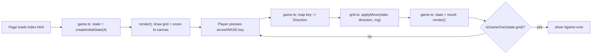

# Math Merge 10 — Game Body Completion Implementation Plan

> **For Agent:** Execute this plan task-by-task. Follow each step exactly, verify test results before proceeding, and commit after each task.
> **TDD Rule:** No production code without a failing test first.

**Goal:** Make Math Merge 10 actually playable — write the Designer spec, extend `grid.ts` with a `GameState`/`applyMove` state machine, wire `game.ts` to render the grid on canvas and respond to keyboard input via `grid.ts`, and add Playwright e2e coverage against the real running app.

**Architecture:** `grid.ts` stays the single source of pure game-state logic (this plan adds `GameState`, `createInitialState`, `applyMove` to it). `game.ts` becomes a thin, event-driven render/input layer that imports those functions — no game logic is duplicated in `game.ts`. Playwright drives the real Vite dev server and uses `window`-exposed test hooks (`__getGameState`, `__setTestState`) for deterministic setup/assertions, since `spawnRandomTile` defaults to `Math.random`.

**Tech Stack:** TypeScript, Vite, Vitest, Playwright, HTML5 Canvas

**Complexity Path:** `E2E path` (overall), with two embedded sub-patterns:
- Phase 2 (`grid.ts` state machine) = `Simplified TDD path` via Vitest — same pattern as the existing `grid.ts` work.
- `specs/math-merge-10.md` (Phase 1) and `playwright.config.ts` (Phase 3) = **Configuration-only exception** (content/config, not behavior) — approved by user as part of this plan's approval.

**Status:** Complete — all 5 phases / 9 tasks done. specs/math-merge-10.md written, grid.ts extended with GameState/createInitialState/applyMove (19/19 unit tests), Playwright e2e wired (3/3), sandbox.e2e.Dockerfile run passes 3/3 in-container (latest commit aa4e71a, includes a small vitest.config.ts fix to scope Vitest to tests/unit/).

---

## Requirements

### User Stories
- As a player, I want to slide tiles and merge adjacent numbers summing to 10, so that I can score points.
- As a player, I want to see my current score and a "Game Over" indicator when no moves remain, so that I know the game state.
- As a Designer Agent, I want a written spec at `specs/math-merge-10.md`, so that the Coder/QA agents share a single contract for the game's rules.
- As a QA Agent, I want Playwright e2e tests that exercise real keyboard interaction, so that UI-level regressions in `game.ts` are caught.

### Acceptance Criteria
- Given a fresh page load, when `game.ts` initializes, then the board has exactly 2 randomly placed tiles (values 1-9) and the score is 0.
- Given a board with two adjacent tiles summing to 10 in a row, when the player presses the matching arrow key, then those tiles merge to `null`, the score increases by 10, and exactly one new tile spawns.
- Given a board where no slide direction changes the grid, when the player presses any arrow key, then the `#game-over` element becomes visible.
- Given `specs/math-merge-10.md`, when read, then it contains all 5 sections required by `prompts/designer.txt`: 遊戲目標, 核心規則, 勝負/結束條件, 互動方式, 視覺與音效需求.

### Assumptions, Constraints, and Scope Boundaries
- Grid size is fixed at 4x4, matching the existing `grid.test.ts` coverage and the spec written in Phase 1.
- `game.ts` moves from the current unused `requestAnimationFrame` loop to an event-driven model (render on load + after each keydown) — correct fit for a turn-based puzzle; no animation/tweening in this plan.
- `game.ts` exposes two test-only hooks on `window` — `__getGameState(): GameState` and `__setTestState(state: GameState, rng?: Rng): void` — typed via local `as unknown as {...}` casts (no `any`). These are intentionally part of the shipped `game.ts`; they are how Playwright achieves deterministic setup despite `spawnRandomTile`'s default `Math.random`.
- "Game Over" is surfaced via a dedicated `#game-over` element in `index.html` (toggled with the `hidden` attribute) in addition to canvas rendering — canvas remains the primary renderer per `prompts/coder.txt`'s Canvas API requirement; the DOM node exists for e2e assertions and accessibility only.
- Out of scope: touch/swipe input, sound effects (per spec's 視覺與音效需求: v1 不需音效), and Phase 4 of the prior harness-setup plan (`agents/`, `harness/`, `orchestrator.py` rewrite) — deferred per prior decision.

## Architecture Review

**Reused components:**
- `workspace/src/grid.ts` — `GameGrid`, `Cell`, `Direction`, `Rng`, `slide`, `isGameOver`, `spawnRandomTile`, `createEmptyGrid` (all existing, unchanged). Phase 2 below ADDS `GameState`, `createInitialState`, `applyMove` to this same file, following its existing pure-function style.
- `workspace/tests/unit/grid.test.ts` — existing 16-test Vitest suite; Phase 2 extends it to 19 tests.
- `workspace/index.html` — existing canvas (`#game`), PWA links, service-worker registration; Phase 4 adds one `#game-over` div.
- `workspace/sandbox.e2e.Dockerfile` (repo root) — already builds and installs Chromium; Phase 5 runs it end-to-end now that real specs exist.

**Data flow (Mermaid):**



**Files that will change:**
- New: `specs/math-merge-10.md`
- New: `workspace/playwright.config.ts`
- New: `workspace/tests/e2e/math-merge.spec.ts`
- Modify: `workspace/src/grid.ts`
- Modify: `workspace/tests/unit/grid.test.ts`
- Modify: `workspace/src/game.ts` (full rewrite)
- Modify: `workspace/index.html` (add `#game-over` div)

---

## Implementation Steps

### Phase 1: Designer Spec

#### Task 1: Create specs/math-merge-10.md
**Exception Type:** Generated content (Designer Agent output — markdown spec, not behavior)
**User Approval:** Approved as part of this plan's overall approval (Configuration-only / Generated-content exceptions called out in the plan summary).

**Files:**
- Create: `specs/math-merge-10.md`

**Implementation**

Create `specs/math-merge-10.md` with exactly this content:

```markdown
# Math Merge: 10 之魔法師

## 遊戲目標
玩家在 4x4 的方格盤面上滑動數字方塊，將相鄰且總和為 10 的兩個數字方塊合併消除，盡可能取得高分。

## 核心規則
- **GameGrid 尺寸**：4x4（16 格），每格為 1-9 的數字或空格（null）。
- **初始狀態**：遊戲開始時，盤面上會隨機產生 2 個數字方塊（值為 1-9）。
- **滑動操作**：玩家可向上/下/左/右滑動整個盤面。同一行/列中的數字方塊會朝滑動方向移動並靠齊。
- **合併條件**：滑動時，若同一行/列中相鄰兩個數字方塊的總和恰好為 10，則兩者合併消除（變為 null），並獲得 10 分。
- **連鎖反應**：一次滑動可觸發多組合併（例如 [4,6,4,6] 滑動後全部消除，得 20 分）。
- **新方塊產生**：每次成功滑動（盤面有變化）後，會在剩餘空格中隨機產生一個新的數字方塊（值為 1-9）。
- **無效滑動**：若滑動方向不會改變盤面（沒有方塊可移動或合併），則不產生新方塊，盤面保持不變。

## 勝負/結束條件
- 當盤面填滿（16 格皆非空）且任何方向的滑動都無法移動或合併任何方塊時，遊戲結束（Game Over）。
- 遊戲沒有「獲勝」上限，玩家目標是在遊戲結束前盡可能取得高分。

## 互動方式
- **鍵盤**：方向鍵（↑↓←→）或 WASD 對應上/下/左/右滑動。
- **觸控**（未來擴充）：滑動手勢（swipe）對應上/下/左/右，本版本不實作。

## 視覺與音效需求
- 使用 HTML5 Canvas 繪製 4x4 盤面，每個方塊顯示數字。
- 畫面上顯示目前分數（score）。
- 遊戲結束時顯示「Game Over」提示。
- 音效：v1 不需音效。
```

**Verification**

Run (from repo root):
```bash
grep -E "^## " specs/math-merge-10.md
```

Confirm:
- Output is exactly these 5 lines, in this order:
  ```
  ## 遊戲目標
  ## 核心規則
  ## 勝負/結束條件
  ## 互動方式
  ## 視覺與音效需求
  ```
- `npm run build` (from `workspace/`) still passes — `specs/` is outside `workspace/`, so this confirms the new file does not interfere with the build.

**COMMIT**
Run:
`git commit -m "docs: 📝 add Math Merge 10 design spec (specs/math-merge-10.md)"`

---

### Phase 2: Game State Logic in grid.ts (Full TDD)

All commands in this phase run from `workspace/`. Test command: `npm run test:unit`.

#### Task 1: GameState type + createInitialState
**Goal:** A fresh game starts as a 4x4 (or NxN) grid with exactly two randomly placed tiles and a score of 0, via a pure, rng-injectable function.

**Files:**
- Modify: `workspace/tests/unit/grid.test.ts`
- Modify: `workspace/src/grid.ts`

**RED - Write Failing Test**

In `workspace/tests/unit/grid.test.ts`, update the import to add `createInitialState`:

```typescript
import {
  createEmptyGrid,
  compactRow,
  slideRowLeft,
  slide,
  canMove,
  isGameOver,
  spawnRandomTile,
  createInitialState,
  type GameGrid,
} from "../../src/grid";
```

Then append this new `describe` block at the end of the file:

```typescript

describe("createInitialState", () => {
  it("creates a grid with exactly two tiles (values 1-9) and score 0", () => {
    const rng = () => 0;

    const state = createInitialState(4, rng);

    expect(state.score).toBe(0);
    expect(state.grid).toHaveLength(4);
    const filled = state.grid.flat().filter((cell): cell is number => cell !== null);
    expect(filled).toHaveLength(2);
    expect(state.grid[0][0]).toBe(1);
    expect(state.grid[0][1]).toBe(1);
  });
});
```

**Requirements:**
- One behavior: initial state has exactly 2 tiles and score 0, deterministic via injected rng.
- Real code, no mocks.

**Verify RED - Watch It Fail**
Run: `npm run test:unit`

Confirm:
- The test run fails (not errors due to syntax).
- Failure is `TypeError: createInitialState is not a function` (or equivalent "not exported" error) from the new test.
- The other 16 existing tests still pass.
- Fails because `createInitialState` does not exist yet (not a typo).

**Test passes?** You're testing existing behavior. Fix test.

**Test errors with a syntax/import error unrelated to the missing function?** Fix the error, re-run until it fails for the expected reason.

**GREEN - Minimal Code**

In `workspace/src/grid.ts`, append after `spawnRandomTile`:

```typescript

export interface GameState {
  grid: GameGrid;
  score: number;
}

export function createInitialState(size: number, rng: Rng = Math.random): GameState {
  const empty = createEmptyGrid(size);
  const withFirstTile = spawnRandomTile(empty, rng);
  const grid = spawnRandomTile(withFirstTile, rng);
  return { grid, score: 0 };
}
```

Don't add features, refactor other code, or "improve" beyond the test.

**Verify GREEN - Watch It Pass**
Run: `npm run test:unit`

Confirm:
- All 17 tests pass.
- Output is pristine (no errors, warnings).

**Test fails?** Fix code, not test.

**REFACTOR - Clean Up**
No duplication introduced — `createInitialState` reuses `createEmptyGrid` and `spawnRandomTile` directly. No refactor needed for this task.

**Verify GREEN - Stay Green After Refactor**
Run: `npm run test:unit`

Confirm:
- All 17 tests still pass.
- Output is pristine.

**COMMIT**
Run:
`git commit -m "feat: ✨ add GameState type and createInitialState to grid.ts"`

---

#### Task 2: applyMove — moved branch (score + spawn)
**Goal:** When a slide changes the grid, `applyMove` returns a new state with the score increased by the slide's `scoreGained` and exactly one new tile spawned.

**Files:**
- Modify: `workspace/tests/unit/grid.test.ts`
- Modify: `workspace/src/grid.ts`

**RED - Write Failing Test**

In `workspace/tests/unit/grid.test.ts`, update the import to add `applyMove` and the `GameState` type:

```typescript
import {
  createEmptyGrid,
  compactRow,
  slideRowLeft,
  slide,
  canMove,
  isGameOver,
  spawnRandomTile,
  createInitialState,
  applyMove,
  type GameGrid,
  type GameState,
} from "../../src/grid";
```

Then append this new `describe` block at the end of the file:

```typescript

describe("applyMove", () => {
  it("slides, increases score by scoreGained, and spawns a new tile when the move changes the grid", () => {
    const state: GameState = {
      grid: [
        [4, 6, null, null],
        [null, null, null, null],
        [null, null, null, null],
        [null, null, null, null],
      ],
      score: 0,
    };
    const rng = () => 0;

    const result = applyMove(state, "left", rng);

    expect(result.score).toBe(10);
    expect(result.grid[0][0]).toBe(1);
    const filled = result.grid.flat().filter((cell): cell is number => cell !== null);
    expect(filled).toHaveLength(1);
  });
});
```

**Requirements:**
- One behavior: moved slide updates score and spawns a tile.
- Real code, no mocks.

**Verify RED - Watch It Fail**
Run: `npm run test:unit`

Confirm:
- The new test fails with `TypeError: applyMove is not a function` (or equivalent "not exported" error).
- All 17 previously-passing tests still pass.
- Fails because `applyMove` does not exist yet (not a typo).

**Test passes?** You're testing existing behavior. Fix test.

**GREEN - Minimal Code**

In `workspace/src/grid.ts`, append after `createInitialState`:

```typescript

export function applyMove(state: GameState, direction: Direction, rng: Rng = Math.random): GameState {
  const outcome = slide(state.grid, direction);
  const grid = spawnRandomTile(outcome.grid, rng);
  return { grid, score: state.score + outcome.scoreGained };
}
```

Don't add features, refactor other code, or "improve" beyond the test.

**Verify GREEN - Watch It Pass**
Run: `npm run test:unit`

Confirm:
- All 18 tests pass.
- Output is pristine (no errors, warnings).

**Test fails?** Fix code, not test.

**REFACTOR - Clean Up**
No duplication introduced — `applyMove` composes `slide` and `spawnRandomTile` directly. No refactor needed for this task.

**Verify GREEN - Stay Green After Refactor**
Run: `npm run test:unit`

Confirm:
- All 18 tests still pass.
- Output is pristine.

**COMMIT**
Run:
`git commit -m "feat: ✨ add applyMove to grid.ts (slide, score, spawn)"`

---

#### Task 3: applyMove — no-op branch (state unchanged)
**Goal:** When a slide does not change the grid (`moved === false`), `applyMove` returns the original state unchanged — no spawn, no score change.

**Files:**
- Modify: `workspace/tests/unit/grid.test.ts`
- Modify: `workspace/src/grid.ts`

**RED - Write Failing Test**

In `workspace/tests/unit/grid.test.ts`, append a second `it` inside the existing `describe("applyMove", ...)` block (added in Task 2), right after the first test:

```typescript

  it("returns the state unchanged when the move does not change the grid", () => {
    const state: GameState = {
      grid: [
        [4, 7, null, null],
        [4, 7, null, null],
        [4, 7, null, null],
        [4, 7, null, null],
      ],
      score: 5,
    };
    const rng = () => 0;

    const result = applyMove(state, "left", rng);

    expect(result).toEqual(state);
  });
```

**Requirements:**
- One behavior: no-op slide leaves state untouched (no spawn, no score change).
- Real code, no mocks.

**Verify RED - Watch It Fail**
Run: `npm run test:unit`

Confirm:
- The new test fails: `expect(result).toEqual(state)` fails because `result.grid` has a spawned tile that `state.grid` does not (the Task 2 implementation always calls `spawnRandomTile`, even when `moved === false`).
- All 18 previously-passing tests still pass.
- Fails because the no-op guard is missing (not a typo).

**Test passes?** You're testing existing behavior. Fix test.

**GREEN - Minimal Code**

In `workspace/src/grid.ts`, modify `applyMove` to add an early-return guard:

```typescript
export function applyMove(state: GameState, direction: Direction, rng: Rng = Math.random): GameState {
  const outcome = slide(state.grid, direction);
  if (!outcome.moved) {
    return state;
  }
  const grid = spawnRandomTile(outcome.grid, rng);
  return { grid, score: state.score + outcome.scoreGained };
}
```

Don't add features, refactor other code, or "improve" beyond the test.

**Verify GREEN - Watch It Pass**
Run: `npm run test:unit`

Confirm:
- All 19 tests pass.
- Output is pristine (no errors, warnings).

**Test fails?** Fix code, not test.

**REFACTOR - Clean Up**
Review `grid.ts` end-to-end: `GameState`, `createInitialState`, and `applyMove` follow the same pure-function, no-mutation style as `slide`/`spawnRandomTile`. No further refactor needed.

**Verify GREEN - Stay Green After Refactor**
Run: `npm run test:unit`

Confirm:
- All 19 tests still pass.
- Output is pristine.

**COMMIT**
Run:
`git commit -m "fix: 🐛 applyMove returns state unchanged for no-op moves"`

---

### Phase 3: Playwright Setup

#### Task 1: Create workspace/playwright.config.ts
**Exception Type:** Configuration-only
**User Approval:** Approved as part of this plan's overall approval (Configuration-only / Generated-content exceptions called out in the plan summary).

**Files:**
- Create: `workspace/playwright.config.ts`

**Implementation**

Create `workspace/playwright.config.ts` with exactly this content:

```typescript
import { defineConfig } from "@playwright/test";

export default defineConfig({
  testDir: "./tests/e2e",
  webServer: {
    command: "npm run dev",
    url: "http://localhost:5173",
    reuseExistingServer: !process.env.CI,
    timeout: 30_000,
  },
  use: {
    baseURL: "http://localhost:5173",
  },
});
```

**Verification**

Run (from `workspace/`):
```bash
npx playwright install chromium
```

Confirm:
- The command completes successfully (downloads the Chromium browser binary if not already cached — one-time setup).
- `cat playwright.config.ts` shows the content above verbatim.
- Real `npm run test:e2e` pass/fail coverage begins in Phase 4 Task 1, once a spec file exists — `playwright test` with zero spec files is not a meaningful pass/fail signal, so it is not used as this task's verification.

**COMMIT**
Run:
`git commit -m "feat: ✨ add Playwright config for e2e tests"`

---

### Phase 4: game.ts ↔ grid.ts Integration via E2E

All commands in this phase run from `workspace/`. Test command: `npm run test:e2e` (Playwright's `webServer` auto-starts the Vite dev server on port 5173).

#### Task 1: Initial render + state hook
**Goal:** On page load, `game.ts` creates the initial game state via `grid.ts` and renders it; `window.__getGameState()` exposes that state for e2e assertions.

**Files:**
- Create: `workspace/tests/e2e/math-merge.spec.ts`
- Modify: `workspace/src/game.ts`

**RED - Write Failing Test**

Create `workspace/tests/e2e/math-merge.spec.ts` with this content:

```typescript
import { test, expect } from "@playwright/test";
import type { GameState } from "../../src/grid";

test("renders the initial board with two tiles and score 0", async ({ page }) => {
  await page.goto("/");

  const state = await page.evaluate(
    () => (window as unknown as { __getGameState: () => GameState }).__getGameState()
  );

  expect(state.score).toBe(0);
  expect(state.grid).toHaveLength(4);
  const filled = state.grid.flat().filter((cell) => cell !== null);
  expect(filled).toHaveLength(2);
});
```

**Requirements:**
- One behavior: initial board has 2 tiles and score 0, observable from outside via `window.__getGameState`.
- Real code, no mocks — runs against the actual Vite dev server in a real browser.

**Verify RED - Watch It Fail**
Run: `npm run test:e2e`

Confirm:
- The test fails because `page.evaluate` throws — `window.__getGameState` is not a function (`TypeError: ... __getGameState is not a function` or "Cannot read properties of undefined").
- Fails because the hook does not exist yet (not a typo, not a server-start failure). If the dev server itself fails to start, fix that first — that is not the expected RED reason.

**Test passes?** You're testing existing behavior. Fix test.

**Test errors on server startup?** Fix the dev server / config issue, re-run until it fails for the expected reason (missing `__getGameState`).

**GREEN - Minimal Code**

Replace the entire contents of `workspace/src/game.ts` with:

```typescript
import { createInitialState, type GameState } from "./grid";

const GRID_SIZE = 4;
const canvas = document.getElementById("game") as HTMLCanvasElement;
const ctx = canvas.getContext("2d") as CanvasRenderingContext2D;

let state: GameState = createInitialState(GRID_SIZE);

function render(): void {
  const cellSize = canvas.width / GRID_SIZE;
  ctx.clearRect(0, 0, canvas.width, canvas.height);

  state.grid.forEach((row, rowIndex) => {
    row.forEach((cell, colIndex) => {
      const x = colIndex * cellSize;
      const y = rowIndex * cellSize;

      ctx.strokeStyle = "#444";
      ctx.strokeRect(x, y, cellSize, cellSize);

      if (cell !== null) {
        ctx.fillStyle = "#4ade80";
        ctx.font = "32px sans-serif";
        ctx.textAlign = "center";
        ctx.textBaseline = "middle";
        ctx.fillText(String(cell), x + cellSize / 2, y + cellSize / 2);
      }
    });
  });

  ctx.fillStyle = "#fff";
  ctx.font = "20px sans-serif";
  ctx.textAlign = "left";
  ctx.textBaseline = "alphabetic";
  ctx.fillText(`Score: ${state.score}`, 10, 20);
}

(window as unknown as { __getGameState: () => GameState }).__getGameState = () => state;

render();
```

Don't add features, refactor other code, or "improve" beyond the test.

**Verify GREEN - Watch It Pass**
Run: `npm run test:e2e`

Confirm:
- 1/1 test passes.
- Output is pristine (no errors, warnings).
- `npx tsc --noEmit` (from `workspace/`) also passes — `game.ts` is fully typed, no `any`.

**Test fails?** Fix code, not test.

**REFACTOR - Clean Up**
`render()` is a single cohesive function with one responsibility (draw grid + score). No duplication to remove yet — keep as-is.

**Verify GREEN - Stay Green After Refactor**
Run: `npm run test:e2e`

Confirm:
- 1/1 test still passes.
- Output is pristine.

**COMMIT**
Run:
`git commit -m "feat: ✨ render initial GameGrid from grid.ts on canvas"`

---

#### Task 2: Keyboard merge + score
**Goal:** Pressing an arrow/WASD key calls `grid.ts`'s `applyMove` and re-renders; `window.__setTestState` lets e2e tests set a deterministic board + rng.

**Files:**
- Modify: `workspace/tests/e2e/math-merge.spec.ts`
- Modify: `workspace/src/game.ts`

**RED - Write Failing Test**

Append this test to `workspace/tests/e2e/math-merge.spec.ts`:

```typescript

test("pressing ArrowLeft merges adjacent tiles summing to 10, increases score, and spawns a new tile", async ({ page }) => {
  await page.goto("/");

  const mergeState: GameState = {
    grid: [
      [4, 6, null, null],
      [null, null, null, null],
      [null, null, null, null],
      [null, null, null, null],
    ],
    score: 0,
  };

  await page.evaluate((state) => {
    (window as unknown as { __setTestState: (s: GameState, rng: () => number) => void }).__setTestState(
      state,
      () => 0
    );
  }, mergeState);

  await page.keyboard.press("ArrowLeft");

  const result = await page.evaluate(
    () => (window as unknown as { __getGameState: () => GameState }).__getGameState()
  );

  expect(result.score).toBe(10);
  expect(result.grid[0][0]).toBe(1);
  expect(result.grid[0][1]).toBeNull();
});
```

**Requirements:**
- One behavior: a keypress drives `applyMove` end-to-end (slide + score + spawn), deterministic via injected rng.
- Real code, no mocks — real browser, real keypress, real dev server.

**Verify RED - Watch It Fail**
Run: `npm run test:e2e`

Confirm:
- The new test fails because `window.__setTestState` is not a function.
- Task 1's test ("renders the initial board...") still passes — 1/2 pass.
- Fails because the hook and keydown handler do not exist yet (not a typo).

**Test passes?** You're testing existing behavior. Fix test.

**GREEN - Minimal Code**

Replace the entire contents of `workspace/src/game.ts` with:

```typescript
import {
  createInitialState,
  applyMove,
  type Direction,
  type GameState,
  type Rng,
} from "./grid";

const GRID_SIZE = 4;
const canvas = document.getElementById("game") as HTMLCanvasElement;
const ctx = canvas.getContext("2d") as CanvasRenderingContext2D;

let state: GameState = createInitialState(GRID_SIZE);
let rng: Rng = Math.random;

function render(): void {
  const cellSize = canvas.width / GRID_SIZE;
  ctx.clearRect(0, 0, canvas.width, canvas.height);

  state.grid.forEach((row, rowIndex) => {
    row.forEach((cell, colIndex) => {
      const x = colIndex * cellSize;
      const y = rowIndex * cellSize;

      ctx.strokeStyle = "#444";
      ctx.strokeRect(x, y, cellSize, cellSize);

      if (cell !== null) {
        ctx.fillStyle = "#4ade80";
        ctx.font = "32px sans-serif";
        ctx.textAlign = "center";
        ctx.textBaseline = "middle";
        ctx.fillText(String(cell), x + cellSize / 2, y + cellSize / 2);
      }
    });
  });

  ctx.fillStyle = "#fff";
  ctx.font = "20px sans-serif";
  ctx.textAlign = "left";
  ctx.textBaseline = "alphabetic";
  ctx.fillText(`Score: ${state.score}`, 10, 20);
}

const KEY_TO_DIRECTION: Record<string, Direction> = {
  ArrowUp: "up",
  ArrowDown: "down",
  ArrowLeft: "left",
  ArrowRight: "right",
  w: "up",
  s: "down",
  a: "left",
  d: "right",
};

function handleKeydown(event: KeyboardEvent): void {
  const direction = KEY_TO_DIRECTION[event.key];
  if (!direction) return;

  state = applyMove(state, direction, rng);
  render();
}

window.addEventListener("keydown", handleKeydown);

(window as unknown as { __getGameState: () => GameState }).__getGameState = () => state;

(window as unknown as {
  __setTestState: (s: GameState, testRng?: Rng) => void;
}).__setTestState = (s, testRng) => {
  state = s;
  if (testRng) rng = testRng;
  render();
};

render();
```

Don't add features, refactor other code, or "improve" beyond the test.

**Verify GREEN - Watch It Pass**
Run: `npm run test:e2e`

Confirm:
- 2/2 tests pass.
- Output is pristine (no errors, warnings).
- `npx tsc --noEmit` (from `workspace/`) also passes — no `any`.

**Test fails?** Fix code, not test.

**REFACTOR - Clean Up**
`KEY_TO_DIRECTION` centralizes all key bindings in one map; `handleKeydown` and `__setTestState` both funnel through `applyMove`/`render`, so there is no duplicated move logic. No further refactor needed.

**Verify GREEN - Stay Green After Refactor**
Run: `npm run test:e2e`

Confirm:
- 2/2 tests still pass.
- Output is pristine.

**COMMIT**
Run:
`git commit -m "feat: ✨ wire keyboard input to grid.ts applyMove"`

---

#### Task 3: Game Over overlay
**Goal:** When `isGameOver(state.grid)` is true, the `#game-over` element becomes visible.

**Files:**
- Modify: `workspace/tests/e2e/math-merge.spec.ts`
- Modify: `workspace/index.html`
- Modify: `workspace/src/game.ts`

**RED - Write Failing Test**

Append this test to `workspace/tests/e2e/math-merge.spec.ts`:

```typescript

test("shows the Game Over overlay when no moves remain", async ({ page }) => {
  await page.goto("/");

  const gameOverState: GameState = {
    grid: [
      [1, 2, 1, 2],
      [2, 1, 2, 1],
      [1, 2, 1, 2],
      [2, 1, 2, 1],
    ],
    score: 0,
  };

  await page.evaluate((state) => {
    (window as unknown as { __setTestState: (s: GameState) => void }).__setTestState(state);
  }, gameOverState);

  await expect(page.locator("#game-over")).toBeVisible();
});
```

**Requirements:**
- One behavior: a full, no-merge-possible board makes `#game-over` visible.
- Real code, no mocks. Reuses the exact grid from `grid.test.ts`'s `isGameOver` "returns true" case.

**Verify RED - Watch It Fail**
Run: `npm run test:e2e`

Confirm:
- The new test fails: `expect(page.locator("#game-over")).toBeVisible()` times out because no element with id `game-over` exists yet.
- Tasks 1 and 2's tests still pass — 2/3 pass.
- Fails because the element/wiring does not exist yet (not a typo).

**Test passes?** You're testing existing behavior. Fix test.

**GREEN - Minimal Code**

In `workspace/index.html`, add a `#game-over` div immediately after the `<canvas>` element:

```html
  <canvas id="game" width="800" height="600"></canvas>
  <div id="game-over" hidden>Game Over</div>
```

Replace the entire contents of `workspace/src/game.ts` with:

```typescript
import {
  createInitialState,
  applyMove,
  isGameOver,
  type Direction,
  type GameState,
  type Rng,
} from "./grid";

const GRID_SIZE = 4;
const canvas = document.getElementById("game") as HTMLCanvasElement;
const ctx = canvas.getContext("2d") as CanvasRenderingContext2D;
const gameOverEl = document.getElementById("game-over") as HTMLDivElement;

let state: GameState = createInitialState(GRID_SIZE);
let rng: Rng = Math.random;

function render(): void {
  const cellSize = canvas.width / GRID_SIZE;
  ctx.clearRect(0, 0, canvas.width, canvas.height);

  state.grid.forEach((row, rowIndex) => {
    row.forEach((cell, colIndex) => {
      const x = colIndex * cellSize;
      const y = rowIndex * cellSize;

      ctx.strokeStyle = "#444";
      ctx.strokeRect(x, y, cellSize, cellSize);

      if (cell !== null) {
        ctx.fillStyle = "#4ade80";
        ctx.font = "32px sans-serif";
        ctx.textAlign = "center";
        ctx.textBaseline = "middle";
        ctx.fillText(String(cell), x + cellSize / 2, y + cellSize / 2);
      }
    });
  });

  ctx.fillStyle = "#fff";
  ctx.font = "20px sans-serif";
  ctx.textAlign = "left";
  ctx.textBaseline = "alphabetic";
  ctx.fillText(`Score: ${state.score}`, 10, 20);

  gameOverEl.hidden = !isGameOver(state.grid);
}

const KEY_TO_DIRECTION: Record<string, Direction> = {
  ArrowUp: "up",
  ArrowDown: "down",
  ArrowLeft: "left",
  ArrowRight: "right",
  w: "up",
  s: "down",
  a: "left",
  d: "right",
};

function handleKeydown(event: KeyboardEvent): void {
  const direction = KEY_TO_DIRECTION[event.key];
  if (!direction) return;

  state = applyMove(state, direction, rng);
  render();
}

window.addEventListener("keydown", handleKeydown);

(window as unknown as { __getGameState: () => GameState }).__getGameState = () => state;

(window as unknown as {
  __setTestState: (s: GameState, testRng?: Rng) => void;
}).__setTestState = (s, testRng) => {
  state = s;
  if (testRng) rng = testRng;
  render();
};

render();
```

Don't add features, refactor other code, or "improve" beyond the test.

**Verify GREEN - Watch It Pass**
Run: `npm run test:e2e`

Confirm:
- 3/3 tests pass.
- Output is pristine (no errors, warnings).
- `npx tsc --noEmit` (from `workspace/`) also passes — no `any`.

**Test fails?** Fix code, not test.

**REFACTOR - Clean Up**
`render()` now has three responsibilities (draw grid, draw score, toggle game-over). All three are short, sequential, and operate on the same `state` — no extraction needed at this size. `game.ts` contains no duplicated `slide`/`merge`/`isGameOver` logic; all game rules come from `grid.ts` imports, satisfying `prompts/coder.txt`'s contract.

**Verify GREEN - Stay Green After Refactor**
Run: `npm run test:e2e`

Confirm:
- 3/3 tests still pass.
- Output is pristine.

**COMMIT**
Run:
`git commit -m "feat: ✨ show Game Over overlay based on grid.ts isGameOver"`

---

### Phase 5: Final E2E Sandbox Integration

#### Task 1: Run sandbox.e2e.Dockerfile end-to-end with real specs
**Exception Type:** Configuration-only (no new code — final integration check, mirrors the Phase 2 final check in the prior harness-setup plan)
**User Approval:** Approved as part of this plan's overall approval.

**Files:**
- None (verification-only; uses existing `sandbox.e2e.Dockerfile` at repo root)

**Implementation**

No file changes. This task proves the Docker e2e sandbox — built but only build-verified in the prior plan (no specs existed yet) — now runs the real Playwright suite from Phase 4 to completion.

**Verification**

Run (from repo root):
```bash
docker build -f sandbox.e2e.Dockerfile -t game-sandbox-e2e .
docker run --rm game-sandbox-e2e
```

Confirm:
- `docker build` completes successfully (installs deps + Chromium via `npx playwright install --with-deps chromium`).
- `docker run` executes `npx playwright test` and reports **3 passed** (the same 3 tests from Phase 4, now running inside the container against the containerized dev server).
- Exit code of `docker run` is `0`.
- Output is pristine (no errors, no flaky retries).

**COMMIT**

No commit — this task only verifies existing committed code runs correctly in the sandbox. If verification fails, fix the underlying issue (in `game.ts`, `grid.ts`, specs, or the Dockerfile) under its own RED→GREEN cycle in the relevant phase above, then re-run this task.

---

## Testing Strategy
- **Unit tests** (`workspace/tests/unit/grid.test.ts`, run via `npm run test:unit`): cover all pure state-transition logic in `grid.ts`, including the new `GameState`, `createInitialState`, and `applyMove` (19 tests total after Phase 2).
- **E2E tests** (`workspace/tests/e2e/math-merge.spec.ts`, run via `npm run test:e2e`): cover the real integration between `game.ts` and `grid.ts` through a real browser — initial render, keyboard-driven merge/score/spawn, and the Game Over overlay (3 tests after Phase 4). Determinism is achieved via `window.__setTestState(state, rng?)`, avoiding reliance on `Math.random`.
- **Sandbox integration** (`sandbox.e2e.Dockerfile`, Phase 5): proves the full e2e suite also passes in the containerized environment used by the QA Agent in Phase 4 of the harness-setup plan.

## Risks & Mitigations
- **Risk**: Playwright browser binaries are not installed in the local dev environment, causing `npm run test:e2e` to fail with a browser-not-found error. → **Mitigation**: Phase 3 Task 1 runs `npx playwright install chromium` before any e2e test is written.
- **Risk**: Canvas-only rendering makes UI state impossible to assert on directly from Playwright. → **Mitigation**: `game.ts` exposes `window.__getGameState()` / `window.__setTestState()` test hooks (typed, no `any`), and a dedicated `#game-over` DOM element for the end-state check.
- **Risk**: `spawnRandomTile`'s default `Math.random` makes e2e outcomes non-deterministic. → **Mitigation**: `__setTestState` accepts an optional `rng` override used by `applyMove`, so Phase 4 Task 2's merge test has a fully predictable outcome (`rng = () => 0`).
- **Risk**: Phase 4 Task 1 rewrites `game.ts` from scratch, which is a larger-than-usual GREEN step. → **Mitigation**: the rewrite is the *entire* remaining game body — its correctness is fully pinned by the e2e test (1 behavior: initial render + state hook), and Tasks 2–3 incrementally extend the same file with their own RED tests before any further changes.

## Success Criteria
- [x] `specs/math-merge-10.md` exists and contains all 5 required sections (遊戲目標, 核心規則, 勝負/結束條件, 互動方式, 視覺與音效需求).
- [x] `workspace/tests/unit/grid.test.ts` passes 19/19 (`npm run test:unit`).
- [x] `workspace/src/grid.ts` exports `GameState`, `createInitialState`, and `applyMove` as pure functions with no `any`.
- [x] `workspace/playwright.config.ts` exists and `npx playwright install chromium` has been run.
- [x] `workspace/tests/e2e/math-merge.spec.ts` passes 3/3 (`npm run test:e2e`).
- [x] `workspace/src/game.ts` imports all game-state logic from `grid.ts` (no duplicated slide/merge/isGameOver logic).
- [x] `workspace/index.html` includes the `#game-over` element.
- [x] `docker run --rm game-sandbox-e2e` (built from `sandbox.e2e.Dockerfile`) passes 3/3 Playwright tests.
- [x] `npx tsc --noEmit` and `npm run build` (from `workspace/`) both pass with no errors.

