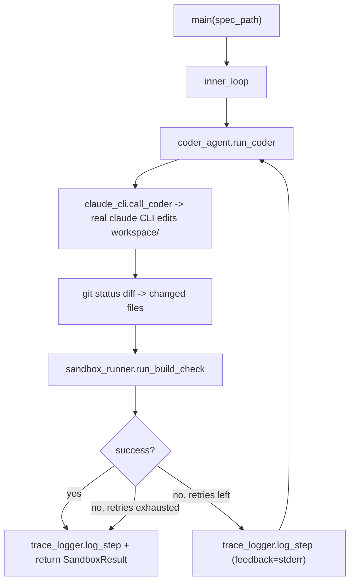

# Orchestrator Inner Loop (Phase 4a) Implementation Plan

> **For Agent:** Execute this plan task-by-task. Follow each step exactly, verify test results before proceeding, and commit after each task.
> **TDD Rule:** No production code without a failing test first.

**Goal:** Replace the `orchestrator.py` skeleton with a working, fully-tested `inner_loop` that drives the real Claude Code CLI to edit `workspace/` per a spec and verifies the result in the existing Docker sandbox, retrying with failure feedback on build failure.

**Architecture:** Two new Python packages — `harness/` (trace logging, git-versioned prompt store, Docker sandbox runner) and `agents/` (Claude CLI subprocess wrapper + Coder Agent) — composed by a rewritten `orchestrator.inner_loop` / `main`. All subprocess/git/Docker interactions take dependency-injected `repo_root` / `traces_root` parameters for hermetic unit testing with `unittest.mock`.

**Tech Stack:** Python 3 (3.14 available at `/opt/homebrew/bin/python3`), pytest, `subprocess`, `git` CLI, Docker CLI, the `claude` Code CLI (`@anthropic-ai/claude-code@2.1.177` at `/opt/homebrew/bin/claude`).

**Complexity Path:** `Simplified TDD path`
**Status:** Draft

---

## Requirements

### User Stories
- As the game-factory orchestrator, I want `agents/coder_agent.run_coder()` to invoke the real Claude Code CLI to edit `workspace/` source files according to a spec, so that AI-generated code can be produced without manual intervention.
- As the game-factory orchestrator, I want `harness/sandbox_runner.py` to build and run the existing Docker sandboxes with a correctly-named container and a timeout, so that build/test verification doesn't hang indefinitely or silently mis-invoke `docker run`.
- As the game-factory orchestrator, I want `orchestrator.inner_loop()` to retry the Coder Agent with sandbox failure feedback up to a max number of attempts, logging every attempt via `harness/trace_logger.py`, so that future runs (and the deferred Phase 4b evolution loop) have a structured trace to learn from.
- As a maintainer, I want `harness/prompt_store.py` to manage `prompts/*.txt` via git-versioned load/update/rollback, so that future prompt-tuning (Phase 4b's optimizer agent) can safely experiment and revert.

### Acceptance Criteria
- Given a spec file path and the `prompts/coder.txt` system prompt, when `coder_agent.run_coder(spec_path)` is called, then it invokes `claude_cli.call_coder` with that system prompt and the spec content as the task, and returns the list of `workspace/`-relative paths that changed.
- Given a `docker run` invocation, when `sandbox_runner.run_build_check()` runs, then the container is launched with `--name <instance-name>` immediately preceding the instance name (fixing the current bug), and the result is mapped into a `SandboxResult` dataclass.
- Given `sandbox_runner.run_build_check()` returns `success=False` on the first attempt and `success=True` on the second, when `orchestrator.inner_loop(spec_path)` runs with `max_retries=3`, then `coder_agent.run_coder` is called twice (the second call's `feedback` includes the first failure's `stderr`), and `inner_loop` returns the successful `SandboxResult`.
- Given `prompt_store.update("coder", new_content, "msg", repo_root)` is called against a temp git repo, when it completes, then `prompts/coder.txt` contains `new_content`, the working tree is clean, and the returned value is a 40-character hex commit hash.

### Assumptions, Constraints, and Scope Boundaries
- `GEMINI_API_KEY` is not configured (no `.env`, `google-generativeai` not installed). `agents/gemini_client.py`, the Designer/QA/Reviewer/Optimizer agents, and `orchestrator.review_loop`/`evolution_loop` are explicitly **out of scope** — deferred to a future "Phase 4b" plan written after a real `call_gemini` spike.
- The `claude` CLI binary is confirmed at `/opt/homebrew/bin/claude` (npm `@anthropic-ai/claude-code@2.1.177`) and responds to `claude -p "Reply with exactly: OK"`. All Python `subprocess` calls use **list-form** args targeting `"claude"` on `PATH` — this bypasses the user's shell alias (`claude='caffeinate -dis claude'`), which only applies to interactive shells, not `subprocess.run`.
- No Python project scaffolding exists yet (no `pyproject.toml`, `pytest` not installed). Phase A bootstraps this.
- Real Docker (`docker build`/`docker run`) and real `claude -p` smoke tests are pytest-marked (`docker`, `claude_cli`) and excluded from the default `pytest` run via `addopts`; run manually as each phase's final verification step.
- `harness/prompt_store.py` tests operate on a temporary `git init` fixture (`tmp_path`) — never on the real repo's `prompts/` history.
- Grid size, game logic, etc. (`workspace/`) are unchanged by this plan — Phase 4a only adds the Python orchestration layer.

## Architecture Review
- **Reusable components**: `prompts/coder.txt` (existing Coder Agent system prompt, defines `workspace/`-only file scope), `sandbox.Dockerfile` (built as `-t game-sandbox`), `sandbox.e2e.Dockerfile` (built as `-t game-sandbox-e2e`), `specs/math-merge-10.md` (existing spec, reused by Task G4's integration check), the real `claude` CLI binary.
- **Affected layers**: two new Python packages, `harness/` (cross-cutting infra: tracing, git-versioned prompt store, Docker sandbox execution) and `agents/` (AI-agent subprocess wrappers); `orchestrator.py` rewritten to compose them via `inner_loop`/`main`.
- **Data flow**: `orchestrator.main()` → `inner_loop(spec_path)` → [`agents/coder_agent.run_coder()` → `agents/claude_cli.call_coder()` → real `claude` CLI edits `workspace/`] → `harness/sandbox_runner.run_build_check()` → (docker build/run `sandbox.Dockerfile`) → `SandboxResult` → on failure, loop back to `run_coder` with `feedback=stderr` (up to `max_retries`), else return. Every attempt logged via `harness/trace_logger.log_step()`.



- **Exact file paths**:
  - New: `pyproject.toml`, `agents/__init__.py`, `agents/claude_cli.py`, `agents/coder_agent.py`, `harness/__init__.py`, `harness/trace_logger.py`, `harness/prompt_store.py`, `harness/sandbox_runner.py`, `tests/__init__.py`, `tests/agents/__init__.py`, `tests/agents/test_claude_cli.py`, `tests/agents/test_coder_agent.py`, `tests/harness/__init__.py`, `tests/harness/test_trace_logger.py`, `tests/harness/test_prompt_store.py`, `tests/harness/test_sandbox_runner.py`, `tests/test_orchestrator.py`
  - Modified: `orchestrator.py`, `.gitignore`

## Implementation Steps

### Phase A: Python Project Setup

#### Task A1: Bootstrap pytest project (pyproject.toml + package markers)
**Exception Type:** Configuration-only
**User Approval:** User approved the plan's "Phase A: Python Project Setup (Configuration-only, 2 tasks)" via ExitPlanMode.
**Files:**
- Create: `pyproject.toml`
- Create: `agents/__init__.py`
- Create: `harness/__init__.py`
- Create: `tests/__init__.py`
- Create: `tests/agents/__init__.py`
- Create: `tests/harness/__init__.py`

**Implementation**

`pyproject.toml`:
```toml
[project]
name = "game-factory"
version = "0.1.0"
description = "AI agent pipeline that builds small TypeScript games"
requires-python = ">=3.12"

[tool.pytest.ini_options]
testpaths = ["tests"]
markers = [
    "slow: long-running checks, excluded by default",
    "docker: requires a local Docker daemon, excluded by default",
    "claude_cli: invokes the real claude CLI binary, excluded by default",
]
addopts = "-m \"not slow and not docker and not claude_cli\""
```

`agents/__init__.py`, `harness/__init__.py`, `tests/__init__.py`, `tests/agents/__init__.py`, `tests/harness/__init__.py`: each an empty file.

**Verification**
Run:
```bash
python3 -m pip install pytest
cd /Users/kyo.lai82/Projects/Personal/game-factory && python3 -m pytest --collect-only
```

Confirm:
- `pip install pytest` succeeds
- `pytest --collect-only` exits with code `5` ("no tests ran" / "no tests collected") — **not** code `2`/`4` (which would indicate a config or import error)
- No `ModuleNotFoundError`, `INTERNALERROR`, or traceback in the output

**COMMIT**
Run:
`git commit -m "chore: 🔧 bootstrap pytest project for Phase 4a (pyproject.toml, package markers)"`

#### Task A2: Add `.pytest_cache/` to `.gitignore`
**Exception Type:** Configuration-only
**User Approval:** User approved the plan's "Phase A: Python Project Setup (Configuration-only, 2 tasks)" via ExitPlanMode.
**Files:**
- Modify: `.gitignore`

**Implementation**
Append a new line `.pytest_cache/` to `.gitignore` (existing entries `node_modules/`, `dist/`, `.env`, `traces/`, `__pycache__/`, `*.pyc`, `.claude/` remain unchanged).

**Verification**
Run:
```bash
cd /Users/kyo.lai82/Projects/Personal/game-factory && python3 -m pytest --collect-only && git status --short
```

Confirm:
- `pytest --collect-only` still exits with code `5`
- `git status --short` shows no untracked `.pytest_cache/` entry (only the modified `.gitignore` and new files from Task A1, if not yet committed)

**COMMIT**
Run:
`git commit -m "chore: 🔧 ignore .pytest_cache/"`

---

### Phase B: `harness/trace_logger.py`

#### Task B1: `log_step` creates run directory and appends JSONL lines
**Goal:** `log_step()` writes one JSON line per call into `<traces_root>/<run_id>/trace.jsonl`, creating the directory if needed and appending (not overwriting) on repeated calls.

**Files:**
- Create: `harness/trace_logger.py`
- Test: `tests/harness/test_trace_logger.py`

**RED - Write Failing Test**
```python
import json
from pathlib import Path

from harness import trace_logger


def test_log_step_appends_jsonl_lines(tmp_path: Path) -> None:
    trace_logger.log_step(
        run_id="run-test123",
        agent="coder",
        input={"task": "x"},
        output={"raw": "y"},
        result={"success": True},
        traces_root=tmp_path,
    )
    trace_logger.log_step(
        run_id="run-test123",
        agent="coder",
        input={"task": "x2"},
        output={"raw": "y2"},
        result={"success": False},
        traces_root=tmp_path,
    )

    trace_file = tmp_path / "run-test123" / "trace.jsonl"
    lines = trace_file.read_text().splitlines()

    assert len(lines) == 2
    first = json.loads(lines[0])
    second = json.loads(lines[1])
    assert first["run_id"] == "run-test123"
    assert first["agent"] == "coder"
    assert second["result"] == {"success": False}
```

**Requirements:**
- One behavior: directory creation + append-on-repeat
- Real code (no mocks): real filesystem via `tmp_path`

**Verify RED - Watch It Fail**
Run: `python3 -m pytest tests/harness/test_trace_logger.py -v`

Confirm:
- Fails with `ModuleNotFoundError: No module named 'harness.trace_logger'` (the module doesn't exist yet — this is the expected "missing implementation" signal for a brand-new module)
- No unrelated collection errors (e.g. `tests/harness/__init__.py` from Task A1 must exist so `harness.trace_logger` resolves as a sub-package import)

**GREEN - Minimal Code**
`harness/trace_logger.py`:
```python
import json
from pathlib import Path
from typing import Any


def log_step(
    run_id: str,
    agent: str,
    input: dict[str, Any],
    output: dict[str, Any],
    result: dict[str, Any],
    traces_root: Path,
) -> None:
    run_dir = traces_root / run_id
    run_dir.mkdir(parents=True, exist_ok=True)

    record = {"run_id": run_id, "agent": agent, "result": result}

    with (run_dir / "trace.jsonl").open("a") as f:
        f.write(json.dumps(record) + "\n")
```

**Verify GREEN - Watch It Pass**
Run: `python3 -m pytest tests/harness/test_trace_logger.py -v`

Confirm:
- Test passes
- Output pristine (no errors, warnings)

**REFACTOR - Clean Up**
No duplication or naming issues at this size — skip.

**Verify GREEN - Stay Green After Refactor**
Run: `python3 -m pytest tests/harness/test_trace_logger.py -v`

Confirm: still passes.

**COMMIT**
Run:
`git commit -m "feat: ✨ add harness/trace_logger.log_step with JSONL append"`

#### Task B2: trace record contains run_id, agent, input, output, result, timestamp
**Goal:** Each JSONL line is a JSON object with exactly the keys `run_id`, `agent`, `input`, `output`, `result`, `timestamp`; `input`/`output`/`result` round-trip the passed dicts exactly, and `timestamp` is a parseable ISO-8601 UTC datetime.

**Files:**
- Modify: `harness/trace_logger.py`
- Test: `tests/harness/test_trace_logger.py`

**RED - Write Failing Test**
Add to `tests/harness/test_trace_logger.py` (add `from datetime import datetime` to the imports):
```python
def test_log_step_record_contains_expected_keys_and_values(tmp_path: Path) -> None:
    trace_logger.log_step(
        run_id="run-abc",
        agent="coder",
        input={"task": "do x"},
        output={"raw": "did x"},
        result={"success": True},
        traces_root=tmp_path,
    )

    record = json.loads(
        (tmp_path / "run-abc" / "trace.jsonl").read_text().splitlines()[0]
    )

    assert set(record.keys()) == {
        "run_id",
        "agent",
        "input",
        "output",
        "result",
        "timestamp",
    }
    assert record["input"] == {"task": "do x"}
    assert record["output"] == {"raw": "did x"}
    assert record["result"] == {"success": True}
    datetime.fromisoformat(record["timestamp"])  # must not raise
```

**Requirements:**
- One behavior: full record shape
- Real code (no mocks)

**Verify RED - Watch It Fail**
Run: `python3 -m pytest tests/harness/test_trace_logger.py -v`

Confirm:
- New test fails with `AssertionError` on `set(record.keys()) == {...}` (actual is `{"run_id", "agent"}`)
- Task B1's test still passes

**GREEN - Minimal Code**
`harness/trace_logger.py` — extend the record dict:
```python
import json
from datetime import datetime, timezone
from pathlib import Path
from typing import Any


def log_step(
    run_id: str,
    agent: str,
    input: dict[str, Any],
    output: dict[str, Any],
    result: dict[str, Any],
    traces_root: Path,
) -> None:
    run_dir = traces_root / run_id
    run_dir.mkdir(parents=True, exist_ok=True)

    record = {
        "run_id": run_id,
        "agent": agent,
        "input": input,
        "output": output,
        "result": result,
        "timestamp": datetime.now(timezone.utc).isoformat(),
    }

    with (run_dir / "trace.jsonl").open("a") as f:
        f.write(json.dumps(record) + "\n")
```

**Verify GREEN - Watch It Pass**
Run: `python3 -m pytest tests/harness/test_trace_logger.py -v`

Confirm:
- Both tests pass
- Output pristine

**REFACTOR - Clean Up**
No duplication — skip.

**Verify GREEN - Stay Green After Refactor**
Run: `python3 -m pytest tests/harness/test_trace_logger.py -v`

Confirm: still passes.

**COMMIT**
Run:
`git commit -m "feat: ✨ add full trace record shape (input/output/result/timestamp)"`

#### Task B3: `traces_root=None` defaults to `<repo_root>/traces/`
**Goal:** Calling `log_step(...)` without `traces_root` (or passing `None`) writes under `<repo_root>/traces/<run_id>/trace.jsonl`, where `<repo_root>` is the game-factory repo root.

**Files:**
- Modify: `harness/trace_logger.py`
- Test: `tests/harness/test_trace_logger.py`

**RED - Write Failing Test**
Add to `tests/harness/test_trace_logger.py`:
```python
def test_log_step_default_traces_root_resolves_under_repo_root(
    tmp_path: Path, monkeypatch: pytest.MonkeyPatch
) -> None:
    monkeypatch.setattr(trace_logger, "REPO_ROOT", tmp_path)

    trace_logger.log_step(
        run_id="run-default",
        agent="coder",
        input={},
        output={},
        result={"success": True},
    )

    assert (tmp_path / "traces" / "run-default" / "trace.jsonl").exists()
```
Add `import pytest` to the test file's imports.

**Requirements:**
- One behavior: default path resolution
- Real code (no mocks); `monkeypatch` swaps the module-level constant only

**Verify RED - Watch It Fail**
Run: `python3 -m pytest tests/harness/test_trace_logger.py -v`

Confirm:
- Fails with `TypeError: log_step() missing 1 required positional argument: 'traces_root'`
- Tasks B1/B2 tests still pass

**GREEN - Minimal Code**
`harness/trace_logger.py` — add `REPO_ROOT` constant and default-resolution:
```python
import json
from datetime import datetime, timezone
from pathlib import Path
from typing import Any

REPO_ROOT = Path(__file__).resolve().parent.parent


def log_step(
    run_id: str,
    agent: str,
    input: dict[str, Any],
    output: dict[str, Any],
    result: dict[str, Any],
    traces_root: Path | None = None,
) -> None:
    if traces_root is None:
        traces_root = REPO_ROOT / "traces"

    run_dir = traces_root / run_id
    run_dir.mkdir(parents=True, exist_ok=True)

    record = {
        "run_id": run_id,
        "agent": agent,
        "input": input,
        "output": output,
        "result": result,
        "timestamp": datetime.now(timezone.utc).isoformat(),
    }

    with (run_dir / "trace.jsonl").open("a") as f:
        f.write(json.dumps(record) + "\n")
```

**Verify GREEN - Watch It Pass**
Run: `python3 -m pytest tests/harness/test_trace_logger.py -v`

Confirm:
- All 3 tests pass
- Output pristine

**REFACTOR - Clean Up**
No duplication — skip.

**Verify GREEN - Stay Green After Refactor**
Run: `python3 -m pytest tests/harness/test_trace_logger.py -v`

Confirm: still passes.

**COMMIT**
Run:
`git commit -m "feat: ✨ default trace_logger traces_root to <repo_root>/traces"`

---

### Phase C: `harness/prompt_store.py`

All tasks share this fixture, introduced in Task C1's test file and reused by C2-C4:
```python
import subprocess
from pathlib import Path

import pytest

from harness import prompt_store


@pytest.fixture
def repo(tmp_path: Path) -> Path:
    repo_root = tmp_path
    (repo_root / "prompts").mkdir()
    (repo_root / "prompts" / "coder.txt").write_text("original coder prompt\n")

    subprocess.run(["git", "init"], cwd=repo_root, check=True, capture_output=True)
    subprocess.run(
        ["git", "config", "user.email", "test@example.com"], cwd=repo_root, check=True
    )
    subprocess.run(["git", "config", "user.name", "Test"], cwd=repo_root, check=True)
    subprocess.run(["git", "add", "prompts/coder.txt"], cwd=repo_root, check=True)
    subprocess.run(
        ["git", "commit", "-m", "init"], cwd=repo_root, check=True, capture_output=True
    )

    return repo_root
```

#### Task C1: `load(name, repo_root)` reads `prompts/<name>.txt`; missing name raises `FileNotFoundError`
**Goal:** `prompt_store.load("coder", repo_root)` returns the exact text of `prompts/coder.txt`; an unknown name raises `FileNotFoundError`.

**Files:**
- Create: `harness/prompt_store.py`
- Test: `tests/harness/test_prompt_store.py`

**RED - Write Failing Test**
`tests/harness/test_prompt_store.py` (full file, including the fixture above):
```python
import subprocess
from pathlib import Path

import pytest

from harness import prompt_store


@pytest.fixture
def repo(tmp_path: Path) -> Path:
    repo_root = tmp_path
    (repo_root / "prompts").mkdir()
    (repo_root / "prompts" / "coder.txt").write_text("original coder prompt\n")

    subprocess.run(["git", "init"], cwd=repo_root, check=True, capture_output=True)
    subprocess.run(
        ["git", "config", "user.email", "test@example.com"], cwd=repo_root, check=True
    )
    subprocess.run(["git", "config", "user.name", "Test"], cwd=repo_root, check=True)
    subprocess.run(["git", "add", "prompts/coder.txt"], cwd=repo_root, check=True)
    subprocess.run(
        ["git", "commit", "-m", "init"], cwd=repo_root, check=True, capture_output=True
    )

    return repo_root


def test_load_returns_prompt_content(repo: Path) -> None:
    assert prompt_store.load("coder", repo_root=repo) == "original coder prompt\n"


def test_load_missing_prompt_raises_file_not_found(repo: Path) -> None:
    with pytest.raises(FileNotFoundError):
        prompt_store.load("nonexistent", repo_root=repo)
```

**Requirements:**
- Two behaviors covered by one minimal implementation: read existing file, propagate missing-file error
- Real code: real temp git repo via `tmp_path` + `subprocess`

**Verify RED - Watch It Fail**
Run: `python3 -m pytest tests/harness/test_prompt_store.py -v`

Confirm:
- Fails with `ModuleNotFoundError: No module named 'harness.prompt_store'`

**GREEN - Minimal Code**
`harness/prompt_store.py`:
```python
from pathlib import Path


def load(name: str, repo_root: Path) -> str:
    return (repo_root / "prompts" / f"{name}.txt").read_text()
```

**Verify GREEN - Watch It Pass**
Run: `python3 -m pytest tests/harness/test_prompt_store.py -v`

Confirm:
- Both tests pass (`Path.read_text()` naturally raises `FileNotFoundError` for the missing-name case)
- Output pristine

**REFACTOR - Clean Up**
No duplication — skip.

**Verify GREEN - Stay Green After Refactor**
Run: `python3 -m pytest tests/harness/test_prompt_store.py -v`

Confirm: still passes.

**COMMIT**
Run:
`git commit -m "feat: ✨ add harness/prompt_store.load"`

#### Task C2: `update(name, content, commit_message, repo_root)` writes, commits, returns hash
**Goal:** `update()` writes new content to `prompts/<name>.txt`, stages and commits only that file, and returns the new `HEAD` commit hash; the working tree is clean afterward.

**Files:**
- Modify: `harness/prompt_store.py`
- Test: `tests/harness/test_prompt_store.py`

**RED - Write Failing Test**
Add to `tests/harness/test_prompt_store.py` (add `import subprocess` already present from the fixture):
```python
def test_update_writes_commits_and_returns_hash(repo: Path) -> None:
    new_hash = prompt_store.update(
        "coder", "new content\n", "test: update coder prompt", repo_root=repo
    )

    assert len(new_hash) == 40
    assert all(c in "0123456789abcdef" for c in new_hash)
    assert (repo / "prompts" / "coder.txt").read_text() == "new content\n"

    head = subprocess.run(
        ["git", "rev-parse", "HEAD"], cwd=repo, capture_output=True, text=True, check=True
    ).stdout.strip()
    assert new_hash == head

    status = subprocess.run(
        ["git", "status", "--porcelain"], cwd=repo, capture_output=True, text=True, check=True
    ).stdout
    assert status == ""
```

**Requirements:**
- One behavior: write + commit + return hash + clean tree
- Real code: real temp git repo

**Verify RED - Watch It Fail**
Run: `python3 -m pytest tests/harness/test_prompt_store.py -v`

Confirm:
- Fails with `AttributeError: module 'harness.prompt_store' has no attribute 'update'`
- Task C1 tests still pass

**GREEN - Minimal Code**
`harness/prompt_store.py` — add `update`:
```python
import subprocess
from pathlib import Path


def load(name: str, repo_root: Path) -> str:
    return (repo_root / "prompts" / f"{name}.txt").read_text()


def update(name: str, content: str, commit_message: str, repo_root: Path) -> str:
    rel_path = f"prompts/{name}.txt"
    (repo_root / rel_path).write_text(content)

    subprocess.run(["git", "add", rel_path], cwd=repo_root, check=True)
    subprocess.run(
        ["git", "commit", "-m", commit_message], cwd=repo_root, check=True, capture_output=True
    )

    return subprocess.run(
        ["git", "rev-parse", "HEAD"], cwd=repo_root, capture_output=True, text=True, check=True
    ).stdout.strip()
```

**Verify GREEN - Watch It Pass**
Run: `python3 -m pytest tests/harness/test_prompt_store.py -v`

Confirm:
- All tests pass
- Output pristine

**REFACTOR - Clean Up**
No duplication — skip.

**Verify GREEN - Stay Green After Refactor**
Run: `python3 -m pytest tests/harness/test_prompt_store.py -v`

Confirm: still passes.

**COMMIT**
Run:
`git commit -m "feat: ✨ add harness/prompt_store.update with git commit"`

#### Task C3: `rollback(commit_hash, repo_root)` restores prior content via a new commit
**Goal:** `rollback(h1, repo_root)` restores `prompts/` to commit `h1`'s content via a new (non-destructive) commit; `load()` afterward returns `h1`'s content again and the tree is clean.

**Files:**
- Modify: `harness/prompt_store.py`
- Test: `tests/harness/test_prompt_store.py`

**RED - Write Failing Test**
Add to `tests/harness/test_prompt_store.py`:
```python
def test_rollback_restores_prior_content(repo: Path) -> None:
    h1 = prompt_store.update("coder", "version 1\n", "v1", repo_root=repo)
    prompt_store.update("coder", "version 2\n", "v2", repo_root=repo)

    prompt_store.rollback(h1, repo_root=repo)

    assert prompt_store.load("coder", repo_root=repo) == "version 1\n"

    status = subprocess.run(
        ["git", "status", "--porcelain"], cwd=repo, capture_output=True, text=True, check=True
    ).stdout
    assert status == ""
```

**Requirements:**
- One behavior: rollback restores content via new commit
- Real code: real temp git repo, two real `update()` calls then `rollback`

**Verify RED - Watch It Fail**
Run: `python3 -m pytest tests/harness/test_prompt_store.py -v`

Confirm:
- Fails with `AttributeError: module 'harness.prompt_store' has no attribute 'rollback'`
- Tasks C1-C2 tests still pass

**GREEN - Minimal Code**
`harness/prompt_store.py` — add `rollback`:
```python
def rollback(commit_hash: str, repo_root: Path) -> None:
    subprocess.run(
        ["git", "checkout", commit_hash, "--", "prompts/"],
        cwd=repo_root,
        check=True,
        capture_output=True,
    )
    subprocess.run(["git", "add", "prompts/"], cwd=repo_root, check=True)
    subprocess.run(
        ["git", "commit", "-m", f"revert: rollback prompts/ to {commit_hash}"],
        cwd=repo_root,
        check=True,
        capture_output=True,
    )
```

**Verify GREEN - Watch It Pass**
Run: `python3 -m pytest tests/harness/test_prompt_store.py -v`

Confirm:
- All tests pass
- Output pristine

**REFACTOR - Clean Up**
No duplication — skip.

**Verify GREEN - Stay Green After Refactor**
Run: `python3 -m pytest tests/harness/test_prompt_store.py -v`

Confirm: still passes.

**COMMIT**
Run:
`git commit -m "feat: ✨ add harness/prompt_store.rollback via revert commit"`

#### Task C4: `rollback` with an invalid hash raises `PromptStoreError`
**Goal:** `rollback("deadbeef", repo_root)` (not a real commit) raises a `PromptStoreError` with a clear message, instead of letting a raw `subprocess.CalledProcessError` propagate.

**Files:**
- Modify: `harness/prompt_store.py`
- Test: `tests/harness/test_prompt_store.py`

**RED - Write Failing Test**
Add to `tests/harness/test_prompt_store.py`:
```python
def test_rollback_invalid_hash_raises_prompt_store_error(repo: Path) -> None:
    with pytest.raises(prompt_store.PromptStoreError):
        prompt_store.rollback("deadbeef", repo_root=repo)
```

**Requirements:**
- One behavior: invalid hash -> clear, typed error
- Real code: real temp git repo, real (failing) `git checkout`

**Verify RED - Watch It Fail**
Run: `python3 -m pytest tests/harness/test_prompt_store.py -v`

Confirm:
- Fails with `AttributeError: module 'harness.prompt_store' has no attribute 'PromptStoreError'` (raised while evaluating `pytest.raises(prompt_store.PromptStoreError)`, before `rollback` even runs)
- Tasks C1-C3 tests still pass

**GREEN - Minimal Code**
`harness/prompt_store.py` — add `PromptStoreError` and convert the checkout failure:
```python
class PromptStoreError(Exception):
    pass


def rollback(commit_hash: str, repo_root: Path) -> None:
    checkout = subprocess.run(
        ["git", "checkout", commit_hash, "--", "prompts/"],
        cwd=repo_root,
        capture_output=True,
        text=True,
    )
    if checkout.returncode != 0:
        raise PromptStoreError(
            f"rollback to {commit_hash!r} failed: {checkout.stderr.strip()}"
        )

    subprocess.run(["git", "add", "prompts/"], cwd=repo_root, check=True)
    subprocess.run(
        ["git", "commit", "-m", f"revert: rollback prompts/ to {commit_hash}"],
        cwd=repo_root,
        check=True,
        capture_output=True,
    )
```

**Verify GREEN - Watch It Pass**
Run: `python3 -m pytest tests/harness/test_prompt_store.py -v`

Confirm:
- All 5 tests pass
- Output pristine

**REFACTOR - Clean Up**
No duplication — skip.

**Verify GREEN - Stay Green After Refactor**
Run: `python3 -m pytest tests/harness/test_prompt_store.py -v`

Confirm: still passes.

**COMMIT**
Run:
`git commit -m "feat: ✨ raise PromptStoreError on invalid rollback hash"`

---

### Phase D: `harness/sandbox_runner.py`

#### Task D1: `SandboxResult` frozen, equality-comparable dataclass
**Goal:** `SandboxResult(success, stdout, stderr, returncode)` is a frozen dataclass usable as a return value and comparable with `==`.

**Files:**
- Create: `harness/sandbox_runner.py`
- Test: `tests/harness/test_sandbox_runner.py`

**RED - Write Failing Test**
```python
from harness.sandbox_runner import SandboxResult


def test_sandbox_result_is_comparable_dataclass() -> None:
    a = SandboxResult(success=True, stdout="ok", stderr="", returncode=0)
    b = SandboxResult(success=True, stdout="ok", stderr="", returncode=0)

    assert a == b
    assert a.success is True
    assert a.stdout == "ok"
    assert a.stderr == ""
    assert a.returncode == 0
```

**Requirements:**
- One behavior: dataclass shape + equality
- Real code (no mocks)

**Verify RED - Watch It Fail**
Run: `python3 -m pytest tests/harness/test_sandbox_runner.py -v`

Confirm:
- Fails with `ModuleNotFoundError: No module named 'harness.sandbox_runner'`

**GREEN - Minimal Code**
`harness/sandbox_runner.py`:
```python
from dataclasses import dataclass


@dataclass(frozen=True)
class SandboxResult:
    success: bool
    stdout: str
    stderr: str
    returncode: int
```

**Verify GREEN - Watch It Pass**
Run: `python3 -m pytest tests/harness/test_sandbox_runner.py -v`

Confirm:
- Test passes
- Output pristine

**REFACTOR - Clean Up**
No duplication — skip.

**Verify GREEN - Stay Green After Refactor**
Run: `python3 -m pytest tests/harness/test_sandbox_runner.py -v`

Confirm: still passes.

**COMMIT**
Run:
`git commit -m "feat: ✨ add harness/sandbox_runner.SandboxResult"`

#### Task D2: `run_build_check()` builds and runs with the corrected `--name` flag
**Goal:** `run_build_check()` runs `docker build -t game-sandbox -f sandbox.Dockerfile .`, then `docker run --rm --name <instance> game-sandbox` (the `--name` bug fix), and maps the run step's result into a `SandboxResult`.

**Files:**
- Modify: `harness/sandbox_runner.py`
- Test: `tests/harness/test_sandbox_runner.py`

**RED - Write Failing Test**
Add to `tests/harness/test_sandbox_runner.py`:
```python
from unittest.mock import MagicMock, patch

from harness.sandbox_runner import SandboxResult, run_build_check


def test_run_build_check_uses_correct_name_flag_and_maps_result() -> None:
    build_result = MagicMock(returncode=0, stdout="build ok", stderr="")
    run_result = MagicMock(returncode=0, stdout="tsc ok", stderr="")

    with patch(
        "harness.sandbox_runner.subprocess.run", side_effect=[build_result, run_result]
    ) as mock_run:
        result = run_build_check()

    build_call_args = mock_run.call_args_list[0].args[0]
    run_call_args = mock_run.call_args_list[1].args[0]

    assert build_call_args == [
        "docker",
        "build",
        "-t",
        "game-sandbox",
        "-f",
        "sandbox.Dockerfile",
        ".",
    ]

    name_index = run_call_args.index("--name")
    assert run_call_args[name_index + 1]  # an instance-name token follows --name
    assert run_call_args[0:3] == ["docker", "run", "--rm"]
    assert run_call_args[-1] == "game-sandbox"

    assert result == SandboxResult(success=True, stdout="tsc ok", stderr="", returncode=0)
```

**Requirements:**
- One behavior: correct build/run command construction (including the `--name` fix) + result mapping
- `subprocess.run` mocked via `unittest.mock.patch`

**Verify RED - Watch It Fail**
Run: `python3 -m pytest tests/harness/test_sandbox_runner.py -v`

Confirm:
- Fails with `AttributeError: module 'harness.sandbox_runner' has no attribute 'run_build_check'`
- Task D1 test still passes

**GREEN - Minimal Code**
`harness/sandbox_runner.py` — add `run_build_check`:
```python
import subprocess
from dataclasses import dataclass


@dataclass(frozen=True)
class SandboxResult:
    success: bool
    stdout: str
    stderr: str
    returncode: int


def run_build_check() -> SandboxResult:
    subprocess.run(
        ["docker", "build", "-t", "game-sandbox", "-f", "sandbox.Dockerfile", "."],
        capture_output=True,
        text=True,
    )

    run = subprocess.run(
        ["docker", "run", "--rm", "--name", "game-sandbox-instance", "game-sandbox"],
        capture_output=True,
        text=True,
    )

    return SandboxResult(
        success=run.returncode == 0,
        stdout=run.stdout,
        stderr=run.stderr,
        returncode=run.returncode,
    )
```

**Verify GREEN - Watch It Pass**
Run: `python3 -m pytest tests/harness/test_sandbox_runner.py -v`

Confirm:
- Both tests pass
- Output pristine

**REFACTOR - Clean Up**
No duplication — skip.

**Verify GREEN - Stay Green After Refactor**
Run: `python3 -m pytest tests/harness/test_sandbox_runner.py -v`

Confirm: still passes.

**COMMIT**
Run:
`git commit -m "fix: 🐛 add missing --name flag to docker run in run_build_check"`

#### Task D3: build-failure short-circuit, `timeout=` on both calls, `TimeoutExpired` handling
**Goal:** If `docker build` returns nonzero, `run_build_check()` returns `success=False` without calling `docker run`; both `docker build`/`docker run` calls pass `timeout=`; a `subprocess.TimeoutExpired` from either call is caught and converted into `SandboxResult(success=False, ...)` instead of propagating.

**Files:**
- Modify: `harness/sandbox_runner.py`
- Test: `tests/harness/test_sandbox_runner.py`

**RED - Write Failing Test**
Add to `tests/harness/test_sandbox_runner.py` (add `import subprocess` to imports):
```python
def test_run_build_check_short_circuits_on_build_failure() -> None:
    build_result = MagicMock(returncode=1, stdout="", stderr="tsc error")

    with patch(
        "harness.sandbox_runner.subprocess.run", side_effect=[build_result]
    ) as mock_run:
        result = run_build_check()

    assert mock_run.call_count == 1  # docker run was never called
    assert result == SandboxResult(success=False, stdout="", stderr="tsc error", returncode=1)


def test_run_build_check_passes_timeout_to_subprocess_run() -> None:
    build_result = MagicMock(returncode=0, stdout="", stderr="")
    run_result = MagicMock(returncode=0, stdout="", stderr="")

    with patch(
        "harness.sandbox_runner.subprocess.run", side_effect=[build_result, run_result]
    ) as mock_run:
        run_build_check()

    assert "timeout" in mock_run.call_args_list[0].kwargs
    assert "timeout" in mock_run.call_args_list[1].kwargs


def test_run_build_check_handles_timeout_expired() -> None:
    with patch(
        "harness.sandbox_runner.subprocess.run",
        side_effect=subprocess.TimeoutExpired(cmd=["docker", "build"], timeout=300),
    ):
        result = run_build_check()

    assert result.success is False
    assert "timeout" in result.stderr.lower()
```

**Requirements:**
- Three related behaviors covered by one minimal implementation: short-circuit, `timeout=` kwarg, `TimeoutExpired` -> failure result
- `subprocess.run` mocked

**Verify RED - Watch It Fail**
Run: `python3 -m pytest tests/harness/test_sandbox_runner.py -v`

Confirm:
- `test_run_build_check_short_circuits_on_build_failure` **errors** with `StopIteration` (Task D2's code unconditionally calls `subprocess.run` a second time against the exhausted single-item `side_effect` list)
- `test_run_build_check_passes_timeout_to_subprocess_run` **fails** with `AssertionError` (`"timeout"` not in `call_args_list[0].kwargs`)
- `test_run_build_check_handles_timeout_expired` **errors** with uncaught `subprocess.TimeoutExpired`
- All three outcomes correctly indicate the missing behaviors this task adds; Tasks D1-D2 tests still pass

**GREEN - Minimal Code**
`harness/sandbox_runner.py` — add timeouts, short-circuit, and `TimeoutExpired` handling:
```python
import subprocess
from dataclasses import dataclass

BUILD_TIMEOUT_S = 300
RUN_TIMEOUT_S = 60


@dataclass(frozen=True)
class SandboxResult:
    success: bool
    stdout: str
    stderr: str
    returncode: int


def run_build_check() -> SandboxResult:
    try:
        build = subprocess.run(
            ["docker", "build", "-t", "game-sandbox", "-f", "sandbox.Dockerfile", "."],
            capture_output=True,
            text=True,
            timeout=BUILD_TIMEOUT_S,
        )
    except subprocess.TimeoutExpired:
        return SandboxResult(success=False, stdout="", stderr="docker build timed out", returncode=-1)

    if build.returncode != 0:
        return SandboxResult(
            success=False, stdout=build.stdout, stderr=build.stderr, returncode=build.returncode
        )

    try:
        run = subprocess.run(
            ["docker", "run", "--rm", "--name", "game-sandbox-instance", "game-sandbox"],
            capture_output=True,
            text=True,
            timeout=RUN_TIMEOUT_S,
        )
    except subprocess.TimeoutExpired:
        return SandboxResult(success=False, stdout="", stderr="docker run timed out", returncode=-1)

    return SandboxResult(
        success=run.returncode == 0,
        stdout=run.stdout,
        stderr=run.stderr,
        returncode=run.returncode,
    )
```

**Verify GREEN - Watch It Pass**
Run: `python3 -m pytest tests/harness/test_sandbox_runner.py -v`

Confirm:
- All 5 tests pass
- Output pristine

**REFACTOR - Clean Up**
No duplication yet — skip (Task D4 extracts the shared helper once `run_e2e_tests` exists).

**Verify GREEN - Stay Green After Refactor**
Run: `python3 -m pytest tests/harness/test_sandbox_runner.py -v`

Confirm: still passes.

**COMMIT**
Run:
`git commit -m "feat: ✨ add timeouts and build-failure short-circuit to run_build_check"`

#### Task D4: `run_e2e_tests()` mirrors `run_build_check()`; extract shared `_run_sandbox` helper
**Goal:** `run_e2e_tests()` builds `-t game-sandbox-e2e -f sandbox.e2e.Dockerfile .` and runs it with a container name distinct from `run_build_check()`'s, returning a `SandboxResult` the same way. Both functions are implemented via a shared private helper.

**Files:**
- Modify: `harness/sandbox_runner.py`
- Test: `tests/harness/test_sandbox_runner.py`

**RED - Write Failing Test**
Add to `tests/harness/test_sandbox_runner.py`:
```python
from harness.sandbox_runner import run_e2e_tests


def test_run_e2e_tests_uses_e2e_dockerfile_and_distinct_container_name() -> None:
    build_result = MagicMock(returncode=0, stdout="", stderr="")
    run_result = MagicMock(returncode=0, stdout="3 passed", stderr="")

    with patch(
        "harness.sandbox_runner.subprocess.run", side_effect=[build_result, run_result]
    ) as mock_run:
        result = run_e2e_tests()

    build_call_args = mock_run.call_args_list[0].args[0]
    run_call_args = mock_run.call_args_list[1].args[0]

    assert build_call_args == [
        "docker",
        "build",
        "-t",
        "game-sandbox-e2e",
        "-f",
        "sandbox.e2e.Dockerfile",
        ".",
    ]

    name_index = run_call_args.index("--name")
    e2e_container_name = run_call_args[name_index + 1]
    assert e2e_container_name != "game-sandbox-instance"
    assert run_call_args[-1] == "game-sandbox-e2e"

    assert result == SandboxResult(success=True, stdout="3 passed", stderr="", returncode=0)
```

**Requirements:**
- One behavior: e2e build/run command construction + result mapping
- `subprocess.run` mocked

**Verify RED - Watch It Fail**
Run: `python3 -m pytest tests/harness/test_sandbox_runner.py -v`

Confirm:
- Fails with `AttributeError: module 'harness.sandbox_runner' has no attribute 'run_e2e_tests'`
- Tasks D1-D3 tests still pass

**GREEN - Minimal Code**
`harness/sandbox_runner.py` — add `run_e2e_tests` as a near-duplicate of `run_build_check` with e2e constants:
```python
def run_e2e_tests() -> SandboxResult:
    try:
        build = subprocess.run(
            ["docker", "build", "-t", "game-sandbox-e2e", "-f", "sandbox.e2e.Dockerfile", "."],
            capture_output=True,
            text=True,
            timeout=BUILD_TIMEOUT_S,
        )
    except subprocess.TimeoutExpired:
        return SandboxResult(success=False, stdout="", stderr="docker build timed out", returncode=-1)

    if build.returncode != 0:
        return SandboxResult(
            success=False, stdout=build.stdout, stderr=build.stderr, returncode=build.returncode
        )

    try:
        run = subprocess.run(
            ["docker", "run", "--rm", "--name", "game-sandbox-e2e-instance", "game-sandbox-e2e"],
            capture_output=True,
            text=True,
            timeout=RUN_TIMEOUT_S,
        )
    except subprocess.TimeoutExpired:
        return SandboxResult(success=False, stdout="", stderr="docker run timed out", returncode=-1)

    return SandboxResult(
        success=run.returncode == 0,
        stdout=run.stdout,
        stderr=run.stderr,
        returncode=run.returncode,
    )
```

**Verify GREEN - Watch It Pass**
Run: `python3 -m pytest tests/harness/test_sandbox_runner.py -v`

Confirm:
- All 6 tests pass
- Output pristine

**REFACTOR - Clean Up**
Extract the duplicated build/run/timeout logic from `run_build_check` and `run_e2e_tests` into a shared `_run_sandbox(dockerfile, image_tag, container_name)` helper:
```python
def _run_sandbox(dockerfile: str, image_tag: str, container_name: str) -> SandboxResult:
    try:
        build = subprocess.run(
            ["docker", "build", "-t", image_tag, "-f", dockerfile, "."],
            capture_output=True,
            text=True,
            timeout=BUILD_TIMEOUT_S,
        )
    except subprocess.TimeoutExpired:
        return SandboxResult(success=False, stdout="", stderr="docker build timed out", returncode=-1)

    if build.returncode != 0:
        return SandboxResult(
            success=False, stdout=build.stdout, stderr=build.stderr, returncode=build.returncode
        )

    try:
        run = subprocess.run(
            ["docker", "run", "--rm", "--name", container_name, image_tag],
            capture_output=True,
            text=True,
            timeout=RUN_TIMEOUT_S,
        )
    except subprocess.TimeoutExpired:
        return SandboxResult(success=False, stdout="", stderr="docker run timed out", returncode=-1)

    return SandboxResult(
        success=run.returncode == 0,
        stdout=run.stdout,
        stderr=run.stderr,
        returncode=run.returncode,
    )


def run_build_check() -> SandboxResult:
    return _run_sandbox("sandbox.Dockerfile", "game-sandbox", "game-sandbox-instance")


def run_e2e_tests() -> SandboxResult:
    return _run_sandbox("sandbox.e2e.Dockerfile", "game-sandbox-e2e", "game-sandbox-e2e-instance")
```

**Verify GREEN - Stay Green After Refactor**
Run: `python3 -m pytest tests/harness/test_sandbox_runner.py -v`

Confirm:
- All 6 tests still pass
- Output pristine

**COMMIT**
Run:
`git commit -m "refactor: ♻️ extract _run_sandbox helper shared by run_build_check and run_e2e_tests"`

#### Task D5: Manual smoke test — real `run_build_check()` succeeds against this repo
**Exception Type:** Configuration-only
**User Approval:** User approved the plan's "Phase D ... 5. (Manual, marked `docker`, excluded from default run): real `run_build_check()` against this repo returns `success=True`" via ExitPlanMode.
**Files:**
- Modify: `tests/harness/test_sandbox_runner.py`

**Implementation**
Add a real (unmocked), marker-gated test:
```python
import shutil

import pytest


@pytest.mark.docker
@pytest.mark.skipif(shutil.which("docker") is None, reason="Docker not available")
def test_run_build_check_real_docker_succeeds() -> None:
    result = run_build_check()

    assert result.success is True
    assert "error" not in result.stdout.lower()
```

**Verification**
Run: `python3 -m pytest tests/harness/test_sandbox_runner.py -m docker -v`

Confirm:
- 1 passed (real `docker build`/`docker run` against `sandbox.Dockerfile`, which Phase 1-3 already verified passes)
- Default run (`python3 -m pytest tests/harness/test_sandbox_runner.py -v`, no `-m docker`) still shows 6 passed and does **not** run this test (excluded by `pyproject.toml`'s `addopts`)
- Output pristine (no errors, warnings)

**COMMIT**
Run:
`git commit -m "test: ✅ add real-docker smoke test for run_build_check (marked docker)"`

---

### Phase E: `agents/claude_cli.py`

#### Task E1: `call_coder` invokes `claude` via list-form `subprocess.run` with the expected flags and `cwd`
**Goal:** `call_coder(system_prompt, task, repo_root=...)` calls `subprocess.run(["claude", "-p", task, "--append-system-prompt", system_prompt, "--permission-mode", "acceptEdits"], cwd=repo_root, capture_output=True, text=True)` — list-form args (no `shell=True`), with `task` after `-p` and `system_prompt` after `--append-system-prompt`.

**Files:**
- Create: `agents/claude_cli.py`
- Test: `tests/agents/test_claude_cli.py`

**RED - Write Failing Test**
```python
from pathlib import Path
from unittest.mock import MagicMock, patch

from agents.claude_cli import call_coder


def test_call_coder_invokes_claude_with_expected_args_and_cwd(tmp_path: Path) -> None:
    mock_result = MagicMock(returncode=0, stdout="done", stderr="")

    with patch("agents.claude_cli.subprocess.run", return_value=mock_result) as mock_run:
        call_coder(system_prompt="SYSTEM", task="TASK", repo_root=tmp_path)

    args, kwargs = mock_run.call_args
    cmd = args[0]

    assert cmd[0] == "claude"
    assert "-p" in cmd
    assert cmd[cmd.index("-p") + 1] == "TASK"
    assert "--append-system-prompt" in cmd
    assert cmd[cmd.index("--append-system-prompt") + 1] == "SYSTEM"
    assert "--permission-mode" in cmd
    assert cmd[cmd.index("--permission-mode") + 1] == "acceptEdits"

    assert kwargs.get("shell") is not True
    assert kwargs["cwd"] == tmp_path
```

**Requirements:**
- One behavior: command construction + `cwd`
- `subprocess.run` mocked

**Verify RED - Watch It Fail**
Run: `python3 -m pytest tests/agents/test_claude_cli.py -v`

Confirm:
- Fails with `ModuleNotFoundError: No module named 'agents.claude_cli'`

**GREEN - Minimal Code**
`agents/claude_cli.py`:
```python
import subprocess
from pathlib import Path


def call_coder(
    system_prompt: str,
    task: str,
    feedback: str | None = None,
    repo_root: Path | None = None,
) -> str:
    result = subprocess.run(
        [
            "claude",
            "-p",
            task,
            "--append-system-prompt",
            system_prompt,
            "--permission-mode",
            "acceptEdits",
        ],
        cwd=repo_root,
        capture_output=True,
        text=True,
    )
    return result.stdout
```

**Verify GREEN - Watch It Pass**
Run: `python3 -m pytest tests/agents/test_claude_cli.py -v`

Confirm:
- Test passes
- Output pristine

**REFACTOR - Clean Up**
No duplication — skip.

**Verify GREEN - Stay Green After Refactor**
Run: `python3 -m pytest tests/agents/test_claude_cli.py -v`

Confirm: still passes.

**COMMIT**
Run:
`git commit -m "feat: ✨ add agents/claude_cli.call_coder subprocess wrapper"`

#### Task E2: `call_coder` appends `feedback` to the prompt when provided
**Goal:** When `feedback` is not `None`, the prompt text passed after `-p` contains both the original `task` and a `"## Previous attempt feedback:\n{feedback}"` block.

**Files:**
- Modify: `agents/claude_cli.py`
- Test: `tests/agents/test_claude_cli.py`

**RED - Write Failing Test**
Add to `tests/agents/test_claude_cli.py`:
```python
def test_call_coder_appends_feedback_to_prompt(tmp_path: Path) -> None:
    mock_result = MagicMock(returncode=0, stdout="done", stderr="")

    with patch("agents.claude_cli.subprocess.run", return_value=mock_result) as mock_run:
        call_coder(
            system_prompt="SYSTEM",
            task="Implement feature X",
            feedback="tsc error: missing semicolon",
            repo_root=tmp_path,
        )

    cmd = mock_run.call_args.args[0]
    prompt = cmd[cmd.index("-p") + 1]

    assert "Implement feature X" in prompt
    assert "## Previous attempt feedback:" in prompt
    assert "tsc error: missing semicolon" in prompt
```

**Requirements:**
- One behavior: feedback concatenation
- `subprocess.run` mocked

**Verify RED - Watch It Fail**
Run: `python3 -m pytest tests/agents/test_claude_cli.py -v`

Confirm:
- Fails with `AssertionError` — Task E1's GREEN ignores `feedback`, so `prompt == "Implement feature X"` and `"## Previous attempt feedback:"` is not in it
- Task E1 test still passes

**GREEN - Minimal Code**
`agents/claude_cli.py` — build `prompt` from `task` + `feedback`:
```python
import subprocess
from pathlib import Path


def call_coder(
    system_prompt: str,
    task: str,
    feedback: str | None = None,
    repo_root: Path | None = None,
) -> str:
    prompt = task
    if feedback is not None:
        prompt = f"{task}\n\n## Previous attempt feedback:\n{feedback}"

    result = subprocess.run(
        [
            "claude",
            "-p",
            prompt,
            "--append-system-prompt",
            system_prompt,
            "--permission-mode",
            "acceptEdits",
        ],
        cwd=repo_root,
        capture_output=True,
        text=True,
    )
    return result.stdout
```

**Verify GREEN - Watch It Pass**
Run: `python3 -m pytest tests/agents/test_claude_cli.py -v`

Confirm:
- Both tests pass
- Output pristine

**REFACTOR - Clean Up**
No duplication — skip.

**Verify GREEN - Stay Green After Refactor**
Run: `python3 -m pytest tests/agents/test_claude_cli.py -v`

Confirm: still passes.

**COMMIT**
Run:
`git commit -m "feat: ✨ append previous-attempt feedback to coder prompt"`

#### Task E3: stripped return value on success; `ClaudeCliError` on nonzero exit or timeout
**Goal:** `call_coder` returns `result.stdout.strip()` when `returncode == 0`; raises `ClaudeCliError(result.stderr)` on nonzero `returncode`; and converts a `subprocess.TimeoutExpired` into a `ClaudeCliError` whose message mentions "timed out".

**Files:**
- Modify: `agents/claude_cli.py`
- Test: `tests/agents/test_claude_cli.py`

**RED - Write Failing Test**
Add to `tests/agents/test_claude_cli.py` (update the top import to `from agents.claude_cli import ClaudeCliError, call_coder`, and add `import subprocess` and `import pytest`):
```python
def test_call_coder_returns_stripped_stdout_on_success(tmp_path: Path) -> None:
    mock_result = MagicMock(returncode=0, stdout="  done  \n", stderr="")

    with patch("agents.claude_cli.subprocess.run", return_value=mock_result):
        assert call_coder(system_prompt="SYSTEM", task="TASK", repo_root=tmp_path) == "done"


def test_call_coder_raises_on_nonzero_returncode(tmp_path: Path) -> None:
    mock_result = MagicMock(returncode=1, stdout="", stderr="auth error")

    with patch("agents.claude_cli.subprocess.run", return_value=mock_result):
        with pytest.raises(ClaudeCliError, match="auth error"):
            call_coder(system_prompt="SYSTEM", task="TASK", repo_root=tmp_path)


def test_call_coder_converts_timeout_expired_to_claude_cli_error(tmp_path: Path) -> None:
    with patch(
        "agents.claude_cli.subprocess.run",
        side_effect=subprocess.TimeoutExpired(cmd=["claude"], timeout=600),
    ):
        with pytest.raises(ClaudeCliError, match="timed out"):
            call_coder(system_prompt="SYSTEM", task="TASK", repo_root=tmp_path)
```

**Requirements:**
- Three related behaviors covered by one minimal implementation: strip stdout, error on nonzero exit, error on timeout
- `subprocess.run` mocked

**Verify RED - Watch It Fail**
Run: `python3 -m pytest tests/agents/test_claude_cli.py -v`

Confirm:
- The updated import line (`from agents.claude_cli import ClaudeCliError, call_coder`) causes `ImportError: cannot import name 'ClaudeCliError'`, which is a **collection error for the whole file** — this is the expected "missing symbol" signal for a brand-new exception type; Task E3's GREEN defines `ClaudeCliError`, which resolves the import and lets all 5 tests (E1, E2, and the 3 new ones) run

**GREEN - Minimal Code**
`agents/claude_cli.py` — add `ClaudeCliError`, `CLAUDE_TIMEOUT_S`, error handling, and `.strip()`:
```python
import subprocess
from pathlib import Path

CLAUDE_TIMEOUT_S = 600


class ClaudeCliError(Exception):
    pass


def call_coder(
    system_prompt: str,
    task: str,
    feedback: str | None = None,
    repo_root: Path | None = None,
) -> str:
    prompt = task
    if feedback is not None:
        prompt = f"{task}\n\n## Previous attempt feedback:\n{feedback}"

    try:
        result = subprocess.run(
            [
                "claude",
                "-p",
                prompt,
                "--append-system-prompt",
                system_prompt,
                "--permission-mode",
                "acceptEdits",
            ],
            cwd=repo_root,
            capture_output=True,
            text=True,
            timeout=CLAUDE_TIMEOUT_S,
        )
    except subprocess.TimeoutExpired:
        raise ClaudeCliError(f"claude CLI timed out after {CLAUDE_TIMEOUT_S}s")

    if result.returncode != 0:
        raise ClaudeCliError(result.stderr)

    return result.stdout.strip()
```

**Verify GREEN - Watch It Pass**
Run: `python3 -m pytest tests/agents/test_claude_cli.py -v`

Confirm:
- All 5 tests pass
- Output pristine

**REFACTOR - Clean Up**
No duplication — skip.

**Verify GREEN - Stay Green After Refactor**
Run: `python3 -m pytest tests/agents/test_claude_cli.py -v`

Confirm: still passes.

**COMMIT**
Run:
`git commit -m "feat: ✨ raise ClaudeCliError on nonzero exit or timeout, strip stdout"`

#### Task E4: Manual smoke test — real `claude` CLI replies to a trivial prompt
**Exception Type:** Configuration-only
**User Approval:** User approved the plan's "Phase E ... 4. (Manual, marked `claude_cli`, excluded from default run): real `call_coder(system_prompt="", task="Reply with exactly: OK")` returns `"OK"`" via ExitPlanMode.
**Files:**
- Modify: `tests/agents/test_claude_cli.py`

**Implementation**
Add a real (unmocked), marker-gated test:
```python
import pytest


@pytest.mark.claude_cli
def test_call_coder_real_claude_cli_replies_ok() -> None:
    result = call_coder(system_prompt="", task="Reply with exactly: OK")

    assert result == "OK"
```

**Verification**
Run: `python3 -m pytest tests/agents/test_claude_cli.py -m claude_cli -v`

Confirm:
- 1 passed (real `claude -p "Reply with exactly: OK" --permission-mode acceptEdits`, already confirmed responsive during this plan's research)
- Default run (`python3 -m pytest tests/agents/test_claude_cli.py -v`, no `-m claude_cli`) still shows 5 passed and does **not** run this test
- Output pristine (no errors, warnings)

**COMMIT**
Run:
`git commit -m "test: ✅ add real-claude-cli smoke test for call_coder (marked claude_cli)"`

---

### Phase F: `agents/coder_agent.py`

#### Task F1: `run_coder` loads the coder prompt, reads the spec, and calls `claude_cli.call_coder`
**Goal:** `run_coder(spec_path, feedback=None, repo_root=...)` loads `prompts/coder.txt` via `prompt_store.load("coder", repo_root)` as `system_prompt`, reads `spec_path`'s content into `task`, and calls `claude_cli.call_coder(system_prompt=system_prompt, task=task, feedback=feedback, repo_root=repo_root)`.

**Files:**
- Create: `agents/coder_agent.py`
- Create: `tests/agents/conftest.py`
- Create: `tests/agents/test_coder_agent.py`

**RED - Write Failing Test**
`tests/agents/conftest.py`:
```python
import subprocess
from pathlib import Path

import pytest


@pytest.fixture
def repo(tmp_path: Path) -> Path:
    subprocess.run(["git", "init"], cwd=tmp_path, check=True, capture_output=True)
    subprocess.run(
        ["git", "config", "user.email", "test@example.com"],
        cwd=tmp_path,
        check=True,
        capture_output=True,
    )
    subprocess.run(["git", "config", "user.name", "Test"], cwd=tmp_path, check=True, capture_output=True)

    workspace = tmp_path / "workspace"
    workspace.mkdir()
    (workspace / "README.md").write_text("placeholder\n")

    subprocess.run(["git", "add", "."], cwd=tmp_path, check=True, capture_output=True)
    subprocess.run(["git", "commit", "-m", "initial commit"], cwd=tmp_path, check=True, capture_output=True)

    return tmp_path
```

`tests/agents/test_coder_agent.py`:
```python
from pathlib import Path
from unittest.mock import patch

from agents import coder_agent


def test_run_coder_loads_prompt_and_passes_feedback(repo: Path) -> None:
    spec_path = repo / "spec.md"
    spec_path.write_text("Build a snake game")

    with patch(
        "agents.coder_agent.prompt_store.load", return_value="SYSTEM PROMPT"
    ) as mock_load, patch(
        "agents.coder_agent.claude_cli.call_coder", return_value="done"
    ) as mock_call:
        coder_agent.run_coder(spec_path, feedback="fix this", repo_root=repo)

    mock_load.assert_called_once_with("coder", repo)
    mock_call.assert_called_once_with(
        system_prompt="SYSTEM PROMPT",
        task="Build a snake game",
        feedback="fix this",
        repo_root=repo,
    )
```

**Requirements:**
- One behavior: `prompt_store.load` + `spec_path.read_text()` + `claude_cli.call_coder` are called with the right arguments
- `prompt_store.load` and `claude_cli.call_coder` mocked

**Verify RED - Watch It Fail**
Run: `python3 -m pytest tests/agents/test_coder_agent.py -v`

Confirm:
- Fails with `ModuleNotFoundError: No module named 'agents.coder_agent'`

**GREEN - Minimal Code**
`agents/coder_agent.py`:
```python
from pathlib import Path

from agents import claude_cli
from harness import prompt_store


def run_coder(
    spec_path: Path,
    feedback: str | None = None,
    repo_root: Path | None = None,
) -> list[Path]:
    system_prompt = prompt_store.load("coder", repo_root)
    task = spec_path.read_text()

    claude_cli.call_coder(
        system_prompt=system_prompt,
        task=task,
        feedback=feedback,
        repo_root=repo_root,
    )

    return []
```

**Verify GREEN - Watch It Pass**
Run: `python3 -m pytest tests/agents/test_coder_agent.py -v`

Confirm:
- Test passes
- Output pristine

**REFACTOR - Clean Up**
No duplication — skip.

**Verify GREEN - Stay Green After Refactor**
Run: `python3 -m pytest tests/agents/test_coder_agent.py -v`

Confirm: still passes.

**COMMIT**
Run:
`git commit -m "feat: ✨ add agents/coder_agent.run_coder (loads prompt, calls coder)"`

#### Task F2: `run_coder` returns newly-created `workspace/` files
**Goal:** After `claude_cli.call_coder` runs, `run_coder` detects files changed under `workspace/` via `git status --porcelain workspace/` and returns them as `list[Path]` relative to `repo_root`.

**Files:**
- Modify: `agents/coder_agent.py`
- Modify: `tests/agents/test_coder_agent.py`

**RED - Write Failing Test**
Add to `tests/agents/test_coder_agent.py`:
```python
def test_run_coder_returns_changed_workspace_files(repo: Path) -> None:
    def fake_call_coder(**kwargs):
        (repo / "workspace" / "new_file.ts").write_text("export const x = 1;\n")
        return "done"

    spec_path = repo / "spec.md"
    spec_path.write_text("Add new_file.ts")

    with patch("agents.coder_agent.prompt_store.load", return_value="SYSTEM"), patch(
        "agents.coder_agent.claude_cli.call_coder", side_effect=fake_call_coder
    ):
        changed = coder_agent.run_coder(spec_path, repo_root=repo)

    assert changed == [Path("workspace/new_file.ts")]
```

**Requirements:**
- One behavior: changed files under `workspace/` are detected and returned
- `claude_cli.call_coder` mocked with a side effect that writes a new file (simulating Claude's own edit)

**Verify RED - Watch It Fail**
Run: `python3 -m pytest tests/agents/test_coder_agent.py -v`

Confirm:
- New test fails with `AssertionError` — Task F1's GREEN always returns `[]`, so `changed == []` while the test expects `[Path("workspace/new_file.ts")]`
- F1's test still passes

**GREEN - Minimal Code**
`agents/coder_agent.py` — add `_workspace_status` and return the files reported by `git status --porcelain workspace/` after the call:
```python
import subprocess
from pathlib import Path

from agents import claude_cli
from harness import prompt_store


def _workspace_status(repo_root: Path) -> set[str]:
    result = subprocess.run(
        ["git", "status", "--porcelain", "workspace/"],
        cwd=repo_root,
        capture_output=True,
        text=True,
        check=True,
    )
    return {line[3:] for line in result.stdout.splitlines() if line}


def run_coder(
    spec_path: Path,
    feedback: str | None = None,
    repo_root: Path | None = None,
) -> list[Path]:
    system_prompt = prompt_store.load("coder", repo_root)
    task = spec_path.read_text()

    claude_cli.call_coder(
        system_prompt=system_prompt,
        task=task,
        feedback=feedback,
        repo_root=repo_root,
    )

    after = _workspace_status(repo_root)
    return sorted(Path(p) for p in after)
```

**Verify GREEN - Watch It Pass**
Run: `python3 -m pytest tests/agents/test_coder_agent.py -v`

Confirm:
- Both tests pass
- Output pristine

**REFACTOR - Clean Up**
No duplication — skip.

**Verify GREEN - Stay Green After Refactor**
Run: `python3 -m pytest tests/agents/test_coder_agent.py -v`

Confirm: still passes.

**COMMIT**
Run:
`git commit -m "feat: ✨ detect new workspace/ files via git status after coder run"`

#### Task F3: `run_coder` ignores pre-existing `workspace/` changes (only reports new diffs)
**Goal:** Files already changed in `workspace/` *before* `run_coder` is called (e.g. left over from a prior attempt) must not appear in the returned list when `claude_cli.call_coder` makes no further changes — `run_coder` must diff against a snapshot taken *before* the call, not just list `workspace/`'s current status.

**Files:**
- Modify: `agents/coder_agent.py`
- Modify: `tests/agents/test_coder_agent.py`

**RED - Write Failing Test**
Add to `tests/agents/test_coder_agent.py`:
```python
def test_run_coder_returns_empty_list_for_preexisting_changes_only(repo: Path) -> None:
    (repo / "workspace" / "preexisting.ts").write_text("export const y = 2;\n")

    spec_path = repo / "spec.md"
    spec_path.write_text("Do nothing")

    with patch("agents.coder_agent.prompt_store.load", return_value="SYSTEM"), patch(
        "agents.coder_agent.claude_cli.call_coder", return_value="done"
    ):
        changed = coder_agent.run_coder(spec_path, repo_root=repo)

    assert changed == []
```

**Requirements:**
- One behavior: pre-existing dirty `workspace/` files are excluded from the result when `call_coder` makes no new changes
- `claude_cli.call_coder` mocked with no side effect

**Verify RED - Watch It Fail**
Run: `python3 -m pytest tests/agents/test_coder_agent.py -v`

Confirm:
- New test fails with `AssertionError` — Task F2's GREEN lists `workspace/`'s current status regardless of pre-existing changes, so `changed == [Path("workspace/preexisting.ts")]` while the test expects `[]`
- F1 and F2's tests still pass

**GREEN - Minimal Code**
`agents/coder_agent.py` — snapshot `_workspace_status` *before* calling `call_coder` and return only the difference:
```python
def run_coder(
    spec_path: Path,
    feedback: str | None = None,
    repo_root: Path | None = None,
) -> list[Path]:
    system_prompt = prompt_store.load("coder", repo_root)
    task = spec_path.read_text()

    before = _workspace_status(repo_root)

    claude_cli.call_coder(
        system_prompt=system_prompt,
        task=task,
        feedback=feedback,
        repo_root=repo_root,
    )

    after = _workspace_status(repo_root)
    changed = after - before
    return sorted(Path(p) for p in changed)
```

**Verify GREEN - Watch It Pass**
Run: `python3 -m pytest tests/agents/test_coder_agent.py -v`

Confirm:
- All 3 tests pass
- Output pristine

**REFACTOR - Clean Up**
No duplication — skip.

**Verify GREEN - Stay Green After Refactor**
Run: `python3 -m pytest tests/agents/test_coder_agent.py -v`

Confirm: still passes.

**COMMIT**
Run:
`git commit -m "fix: 🐛 only report workspace/ changes introduced by this coder run"`

---

### Phase G: `orchestrator.py` rewrite

#### Task G1: `inner_loop` composes `run_coder` then `run_build_check`
**Goal:** Replace the old `run_sandbox_test`/`autonomous_loop` implementation with `inner_loop(spec_path, max_retries=3, repo_root=None)`, which calls `coder_agent.run_coder(spec_path, feedback=None, repo_root=repo_root)` then returns `sandbox_runner.run_build_check()`.

**Files:**
- Modify: `orchestrator.py`
- Create: `tests/test_orchestrator.py`

**RED - Write Failing Test**
`tests/test_orchestrator.py`:
```python
from pathlib import Path
from unittest.mock import patch

import orchestrator
from harness.sandbox_runner import SandboxResult


def test_inner_loop_calls_run_coder_then_run_build_check(tmp_path: Path) -> None:
    spec_path = tmp_path / "spec.md"
    spec_path.write_text("Build something")

    success_result = SandboxResult(success=True, stdout="ok", stderr="", returncode=0)

    with patch("orchestrator.coder_agent.run_coder", return_value=[]) as mock_run_coder, patch(
        "orchestrator.sandbox_runner.run_build_check", return_value=success_result
    ) as mock_build_check:
        result = orchestrator.inner_loop(spec_path, repo_root=tmp_path)

    mock_run_coder.assert_called_once_with(spec_path, feedback=None, repo_root=tmp_path)
    mock_build_check.assert_called_once()
    assert result == success_result
```

**Requirements:**
- One behavior: `run_coder` then `run_build_check`, result passed through
- Both mocked

**Verify RED - Watch It Fail**
Run: `python3 -m pytest tests/test_orchestrator.py -v`

Confirm:
- Fails with `AttributeError: <module 'orchestrator' ...> does not have the attribute 'coder_agent'` — raised by `patch()` when resolving its target, since the current `orchestrator.py` does not import `agents.coder_agent` yet

**GREEN - Minimal Code**
Replace the entire contents of `orchestrator.py` (removing the old `run_sandbox_test`/`autonomous_loop`/`__main__` block):
```python
from pathlib import Path

from agents import coder_agent
from harness import sandbox_runner

REPO_ROOT = Path(__file__).resolve().parent


def inner_loop(
    spec_path: Path,
    max_retries: int = 3,
    repo_root: Path | None = None,
) -> sandbox_runner.SandboxResult:
    if repo_root is None:
        repo_root = REPO_ROOT

    coder_agent.run_coder(spec_path, feedback=None, repo_root=repo_root)
    return sandbox_runner.run_build_check()
```

**Verify GREEN - Watch It Pass**
Run: `python3 -m pytest tests/test_orchestrator.py -v`

Confirm:
- Test passes
- Output pristine

**REFACTOR - Clean Up**
No duplication — skip.

**Verify GREEN - Stay Green After Refactor**
Run: `python3 -m pytest tests/test_orchestrator.py -v`

Confirm: still passes.

**COMMIT**
Run:
`git commit -m "feat: ✨ rewrite orchestrator.inner_loop (run_coder -> run_build_check)"`

#### Task G2: `inner_loop` retries on failure, feeding back `stderr`
**Goal:** On `run_build_check` failure, `inner_loop` retries up to `max_retries` times, passing the previous attempt's `SandboxResult.stderr` as `feedback` to the next `run_coder` call. Returns as soon as a build succeeds, or the last (failed) result once `max_retries` is exhausted.

**Files:**
- Modify: `orchestrator.py`
- Modify: `tests/test_orchestrator.py`

**RED - Write Failing Test**
Add to `tests/test_orchestrator.py` (add `import pytest` at the top):
```python
@pytest.mark.parametrize(
    "build_results, expected_calls, expected_success",
    [
        (
            [
                SandboxResult(success=False, stdout="", stderr="tsc error: foo", returncode=1),
                SandboxResult(success=True, stdout="ok", stderr="", returncode=0),
            ],
            2,
            True,
        ),
        (
            [
                SandboxResult(success=False, stdout="", stderr="tsc error: A", returncode=1),
                SandboxResult(success=False, stdout="", stderr="tsc error: B", returncode=1),
                SandboxResult(success=False, stdout="", stderr="tsc error: C", returncode=1),
            ],
            3,
            False,
        ),
    ],
)
def test_inner_loop_retries_with_feedback_on_failure(
    tmp_path: Path, build_results, expected_calls, expected_success
) -> None:
    spec_path = tmp_path / "spec.md"
    spec_path.write_text("Build something")

    with patch("orchestrator.coder_agent.run_coder", return_value=[]) as mock_run_coder, patch(
        "orchestrator.sandbox_runner.run_build_check", side_effect=build_results
    ) as mock_build_check:
        result = orchestrator.inner_loop(spec_path, max_retries=3, repo_root=tmp_path)

    assert mock_run_coder.call_count == expected_calls
    assert mock_build_check.call_count == expected_calls
    assert result.success is expected_success

    feedback_args = [call.kwargs["feedback"] for call in mock_run_coder.call_args_list]
    assert feedback_args[0] is None
    for i in range(1, expected_calls):
        assert feedback_args[i] == build_results[i - 1].stderr
```

**Requirements:**
- One behavior: retry loop with feedback threading
- Both `run_coder`/`run_build_check` mocked; parametrized for eventual-success and exhausted-retries

**Verify RED - Watch It Fail**
Run: `python3 -m pytest tests/test_orchestrator.py -v`

Confirm:
- Both new parametrized cases fail with `AssertionError` — Task G1's GREEN calls `run_coder`/`run_build_check` exactly once with no retry loop, so `mock_run_coder.call_count == 1` for both cases, mismatching `expected_calls` (2 and 3); for the first case `result.success` is also `False` (the mocked first failure), mismatching `expected_success=True`
- Task G1's test still passes

**GREEN - Minimal Code**
`orchestrator.py` — wrap the call in a retry loop:
```python
from pathlib import Path

from agents import coder_agent
from harness import sandbox_runner

REPO_ROOT = Path(__file__).resolve().parent


def inner_loop(
    spec_path: Path,
    max_retries: int = 3,
    repo_root: Path | None = None,
) -> sandbox_runner.SandboxResult:
    if repo_root is None:
        repo_root = REPO_ROOT

    feedback: str | None = None
    result: sandbox_runner.SandboxResult

    for _ in range(max_retries):
        coder_agent.run_coder(spec_path, feedback=feedback, repo_root=repo_root)
        result = sandbox_runner.run_build_check()

        if result.success:
            return result

        feedback = result.stderr

    return result
```

**Verify GREEN - Watch It Pass**
Run: `python3 -m pytest tests/test_orchestrator.py -v`

Confirm:
- All 3 tests pass
- Output pristine

**REFACTOR - Clean Up**
No duplication — skip.

**Verify GREEN - Stay Green After Refactor**
Run: `python3 -m pytest tests/test_orchestrator.py -v`

Confirm: still passes.

**COMMIT**
Run:
`git commit -m "feat: ✨ retry inner_loop on build failure with stderr feedback"`

#### Task G3: each attempt is logged via `trace_logger.log_step`
**Goal:** After each `run_build_check` call, `inner_loop` calls `trace_logger.log_step(run_id=..., agent="coder", input=feedback, output=<changed files as strings>, result=dataclasses.asdict(sandbox_result), traces_root=repo_root / "traces")`. The same `run_id` is used for every attempt within one `inner_loop` call.

**Files:**
- Modify: `orchestrator.py`
- Modify: `tests/test_orchestrator.py`

**RED - Write Failing Test**
Add to `tests/test_orchestrator.py` (add `import dataclasses` at the top):
```python
def test_inner_loop_logs_each_attempt(tmp_path: Path) -> None:
    spec_path = tmp_path / "spec.md"
    spec_path.write_text("Build something")

    build_results = [
        SandboxResult(success=False, stdout="", stderr="tsc error: foo", returncode=1),
        SandboxResult(success=True, stdout="ok", stderr="", returncode=0),
    ]

    with patch("orchestrator.coder_agent.run_coder", return_value=[]), patch(
        "orchestrator.sandbox_runner.run_build_check", side_effect=build_results
    ), patch("orchestrator.trace_logger.log_step") as mock_log_step:
        orchestrator.inner_loop(spec_path, max_retries=3, repo_root=tmp_path)

    assert mock_log_step.call_count == 2

    for call, sandbox_result in zip(mock_log_step.call_args_list, build_results):
        kwargs = call.kwargs
        assert kwargs["agent"] == "coder"
        assert kwargs["result"] == dataclasses.asdict(sandbox_result)

    run_ids = {call.kwargs["run_id"] for call in mock_log_step.call_args_list}
    assert len(run_ids) == 1
```

**Requirements:**
- One behavior: per-attempt trace logging with a shared `run_id`
- `trace_logger.log_step` mocked

**Verify RED - Watch It Fail**
Run: `python3 -m pytest tests/test_orchestrator.py -v`

Confirm:
- Fails with `AttributeError: <module 'orchestrator' ...> does not have the attribute 'trace_logger'` — raised by `patch()` when resolving its target, since the current `orchestrator.py` does not import `harness.trace_logger` yet
- All prior tests still pass

**GREEN - Minimal Code**
`orchestrator.py` — add `dataclasses`, `uuid`, and `trace_logger` imports; generate one `run_id` per `inner_loop` call; log after each attempt:
```python
import dataclasses
import uuid
from pathlib import Path

from agents import coder_agent
from harness import sandbox_runner, trace_logger

REPO_ROOT = Path(__file__).resolve().parent


def inner_loop(
    spec_path: Path,
    max_retries: int = 3,
    repo_root: Path | None = None,
) -> sandbox_runner.SandboxResult:
    if repo_root is None:
        repo_root = REPO_ROOT

    run_id = uuid.uuid4().hex
    feedback: str | None = None
    result: sandbox_runner.SandboxResult

    for _ in range(max_retries):
        changed_files = coder_agent.run_coder(spec_path, feedback=feedback, repo_root=repo_root)
        result = sandbox_runner.run_build_check()

        trace_logger.log_step(
            run_id=run_id,
            agent="coder",
            input=feedback,
            output=[str(p) for p in changed_files],
            result=dataclasses.asdict(result),
            traces_root=repo_root / "traces",
        )

        if result.success:
            return result

        feedback = result.stderr

    return result
```

**Verify GREEN - Watch It Pass**
Run: `python3 -m pytest tests/test_orchestrator.py -v`

Confirm:
- All 4 tests pass
- Output pristine
- Tasks G1/G2's tests don't mock `trace_logger.log_step`, so they now make real (but harmless) writes to `tmp_path/traces/<run_id>/trace.jsonl` — pytest's `tmp_path` is auto-cleaned, so this does not pollute the repo's real `traces/`

**REFACTOR - Clean Up**
No duplication — skip.

**Verify GREEN - Stay Green After Refactor**
Run: `python3 -m pytest tests/test_orchestrator.py -v`

Confirm: still passes.

**COMMIT**
Run:
`git commit -m "feat: ✨ log each inner_loop attempt via trace_logger.log_step"`

#### Task G4: `main(argv)` resolves a spec path and runs `inner_loop`
**Goal:** `main(argv)` uses `argv[0]` as the spec path if provided, otherwise defaults to `REPO_ROOT / "specs" / "math-merge-10.md"`; calls `inner_loop(spec_path)`; prints a `✅`/`❌` summary line; returns `0` on success and `1` on failure. `if __name__ == "__main__": sys.exit(main())` wires this to the CLI.

**Files:**
- Modify: `orchestrator.py`
- Modify: `tests/test_orchestrator.py`

**RED - Write Failing Test**
Add to `tests/test_orchestrator.py`:
```python
def test_main_resolves_default_spec_path_and_returns_zero_on_success(capsys) -> None:
    success_result = SandboxResult(success=True, stdout="ok", stderr="", returncode=0)

    with patch("orchestrator.inner_loop", return_value=success_result) as mock_inner_loop:
        exit_code = orchestrator.main([])

    mock_inner_loop.assert_called_once_with(orchestrator.REPO_ROOT / "specs" / "math-merge-10.md")
    assert exit_code == 0
    assert "✅" in capsys.readouterr().out


def test_main_uses_provided_spec_path_and_returns_one_on_failure(tmp_path: Path, capsys) -> None:
    failure_result = SandboxResult(success=False, stdout="", stderr="boom", returncode=1)
    spec_path = tmp_path / "custom-spec.md"

    with patch("orchestrator.inner_loop", return_value=failure_result) as mock_inner_loop:
        exit_code = orchestrator.main([str(spec_path)])

    mock_inner_loop.assert_called_once_with(spec_path)
    assert exit_code == 1
    assert "❌" in capsys.readouterr().out
```

**Requirements:**
- One behavior: spec-path resolution + pass/fail summary + exit code
- `inner_loop` mocked

**Verify RED - Watch It Fail**
Run: `python3 -m pytest tests/test_orchestrator.py -v`

Confirm:
- Both new tests fail with `AttributeError: module 'orchestrator' has no attribute 'main'`
- All prior tests still pass

**GREEN - Minimal Code**
`orchestrator.py` — add `sys` import, `main`, and the `__main__` block:
```python
import dataclasses
import sys
import uuid
from pathlib import Path

from agents import coder_agent
from harness import sandbox_runner, trace_logger

REPO_ROOT = Path(__file__).resolve().parent


def inner_loop(
    spec_path: Path,
    max_retries: int = 3,
    repo_root: Path | None = None,
) -> sandbox_runner.SandboxResult:
    if repo_root is None:
        repo_root = REPO_ROOT

    run_id = uuid.uuid4().hex
    feedback: str | None = None
    result: sandbox_runner.SandboxResult

    for _ in range(max_retries):
        changed_files = coder_agent.run_coder(spec_path, feedback=feedback, repo_root=repo_root)
        result = sandbox_runner.run_build_check()

        trace_logger.log_step(
            run_id=run_id,
            agent="coder",
            input=feedback,
            output=[str(p) for p in changed_files],
            result=dataclasses.asdict(result),
            traces_root=repo_root / "traces",
        )

        if result.success:
            return result

        feedback = result.stderr

    return result


def main(argv: list[str] | None = None) -> int:
    if argv is None:
        argv = sys.argv[1:]

    spec_path = Path(argv[0]) if argv else REPO_ROOT / "specs" / "math-merge-10.md"

    result = inner_loop(spec_path)

    if result.success:
        print("✅ inner_loop succeeded")
    else:
        print("❌ inner_loop failed")
        print(result.stderr)

    return 0 if result.success else 1


if __name__ == "__main__":
    sys.exit(main())
```

**Verify GREEN - Watch It Pass**
Run: `python3 -m pytest tests/test_orchestrator.py -v`

Confirm:
- All 6 tests pass
- Output pristine

**REFACTOR - Clean Up**
No duplication — skip.

**Verify GREEN - Stay Green After Refactor**
Run: `python3 -m pytest tests/test_orchestrator.py -v`

Confirm: still passes.

**COMMIT**
Run:
`git commit -m "feat: ✨ add orchestrator.main CLI entrypoint"`

#### Manual Integration Check: `orchestrator.py` against the real `workspace/`
**Exception Type:** Configuration-only
**User Approval:** User approved the plan's "Phase G ... 4. ... *(Integration check, manual)*: with `coder_agent.run_coder` mocked as a no-op but `sandbox_runner.run_build_check` real, `python3 orchestrator.py specs/math-merge-10.md` returns `SandboxResult(success=True, ...)` against the already-passing `workspace/`" via ExitPlanMode.

**Files:**
- None (no source changes — this is a manual run against the already-passing `workspace/` from Phases 1-3)

**Implementation**
Run a one-off Python invocation that monkeypatches `coder_agent.run_coder` to a no-op before calling `inner_loop` directly, so the real `sandbox_runner.run_build_check()` runs against the current `workspace/` (which already builds and passes per Phase 1-3's Success Criteria):
```bash
python3 - <<'EOF'
from unittest.mock import patch

import orchestrator

with patch("orchestrator.coder_agent.run_coder", return_value=[]):
    result = orchestrator.inner_loop(orchestrator.REPO_ROOT / "specs" / "math-merge-10.md", max_retries=1)

print(result)
EOF
```

**Verification**
Confirm:
- Prints `SandboxResult(success=True, stdout='...', stderr='', returncode=0)`
- `traces/<run_id>/trace.jsonl` was created under the repo root with one logged attempt (`agent: "coder"`, `result.success: true`) — confirm via `cat traces/*/trace.jsonl`
- No changes to git-tracked files (`git status --porcelain` clean aside from the gitignored `traces/` directory)

**COMMIT**
None — this is a read-only verification run; `traces/` is gitignored (Phase A2) so nothing new needs to be committed.

---

## Out of Scope (Phase 4b)

The following are explicitly deferred to a future "Phase 4b" plan, written after `GEMINI_API_KEY` is configured and a real `call_gemini` spike captures the actual response shape:

- `agents/gemini_client.py`
- `agents/designer_agent.py`
- `agents/qa_agent.py`
- `agents/reviewer_agent.py`
- `agents/optimizer_agent.py`
- `orchestrator.review_loop()`
- `orchestrator.evolution_loop()`

Phase 4a's `harness/prompt_store.py` (`load`/`update`/`rollback`) is reused as-is once Phase 4b begins — no changes anticipated.

---

## Testing Strategy

- **Unit tests** (default `pytest` run, Phases B-G): `harness/trace_logger.py`, `harness/prompt_store.py`, `harness/sandbox_runner.py`, `agents/claude_cli.py`, `agents/coder_agent.py`, and `orchestrator.py` are all covered by mocked-`subprocess`/temp-git-fixture unit tests. `pyproject.toml`'s `addopts = "-m \"not slow and not docker and not claude_cli\""` excludes the integration smoke tests below by default.
- **Integration tests** (pytest-marked, run manually):
  - D5 (`@pytest.mark.docker`): real `docker build`+`docker run` via `sandbox_runner.run_build_check()` against this repo's `sandbox.Dockerfile`/`workspace/`.
  - E4 (`@pytest.mark.claude_cli`): real `claude -p "Reply with exactly: OK" --permission-mode acceptEdits` via `agents.claude_cli.call_coder`.
- **E2E-equivalent** (manual, after G4): a full `inner_loop` pass with `coder_agent.run_coder` mocked as a no-op but `sandbox_runner.run_build_check` real — exercises the real Docker build+run path end-to-end against the already-passing `workspace/`, and confirms `trace_logger.log_step` writes a real `traces/<run_id>/trace.jsonl`.

---

## Risks & Mitigations

- **Risk**: `claude --permission-mode acceptEdits` making real file edits to `workspace/` is unverified beyond E4's no-edit "Reply with exactly: OK" smoke test -> Mitigation: the first real edit-producing run happens naturally the first time `inner_loop` runs against a real spec with `coder_agent.run_coder` unmocked; F2/F3's git-diff-based change detection gives an audit trail of exactly which `workspace/` files Claude touched on that run.
- **Risk**: Docker build/run subprocess calls could hang indefinitely if the Docker daemon is unresponsive -> Mitigation: D3 adds `timeout=BUILD_TIMEOUT_S`/`RUN_TIMEOUT_S` to both `subprocess.run` calls and converts `subprocess.TimeoutExpired` into `SandboxResult(success=False, ...)`.
- **Risk**: The `claude` CLI subprocess could hang on a very long generation -> Mitigation: E3 adds `timeout=CLAUDE_TIMEOUT_S` and converts `subprocess.TimeoutExpired` into `ClaudeCliError`.
- **Risk**: `prompt_store.update`/`rollback` could corrupt the real `prompts/` git history if tests ran against the real repo -> Mitigation: C1-C4's tests use a `repo` fixture (`tmp_path` + real `git init` + a committed `prompts/coder.txt`), never touching the real repo's `prompts/` directory or git history.
- **Risk**: Running the 3 manual smoke tests (D5, E4, the G4 integration check) burns Docker build time / Claude API quota on every full test run -> Mitigation: all 3 are excluded from the default `pytest` invocation via `pyproject.toml`'s `addopts`, and are documented as manual/marker-gated steps run once per phase.

---

## Success Criteria

- [ ] `python3 -m pytest` (default markers, excluding `slow`/`docker`/`claude_cli`) passes for all of Phases B-G
- [ ] `harness/sandbox_runner.run_build_check`'s `docker run` command includes `--name <container_name>` (fixes the original missing-`--name` bug), verified by Task D2's assertion
- [ ] `orchestrator.py` exposes `inner_loop(spec_path, max_retries=3, repo_root=None)` and `main(argv)`; the old `run_sandbox_test`/`autonomous_loop` functions are removed
- [ ] `harness/prompt_store.py` supports `load`/`update`/`rollback` against an injected `repo_root`, tested entirely against a temp-git fixture (no mutation of the real `prompts/` history)
- [ ] `agents/claude_cli.call_coder` invokes the real `claude` binary via list-form `subprocess.run` (no `shell=True`), confirmed responsive via Task E4's manual smoke test
- [ ] Task D5 (`docker`-marked), Task E4 (`claude_cli`-marked), and the Phase G manual integration check have each been run at least once and pass
- [ ] All tasks across Phases A-G are committed individually with their specified commit messages
