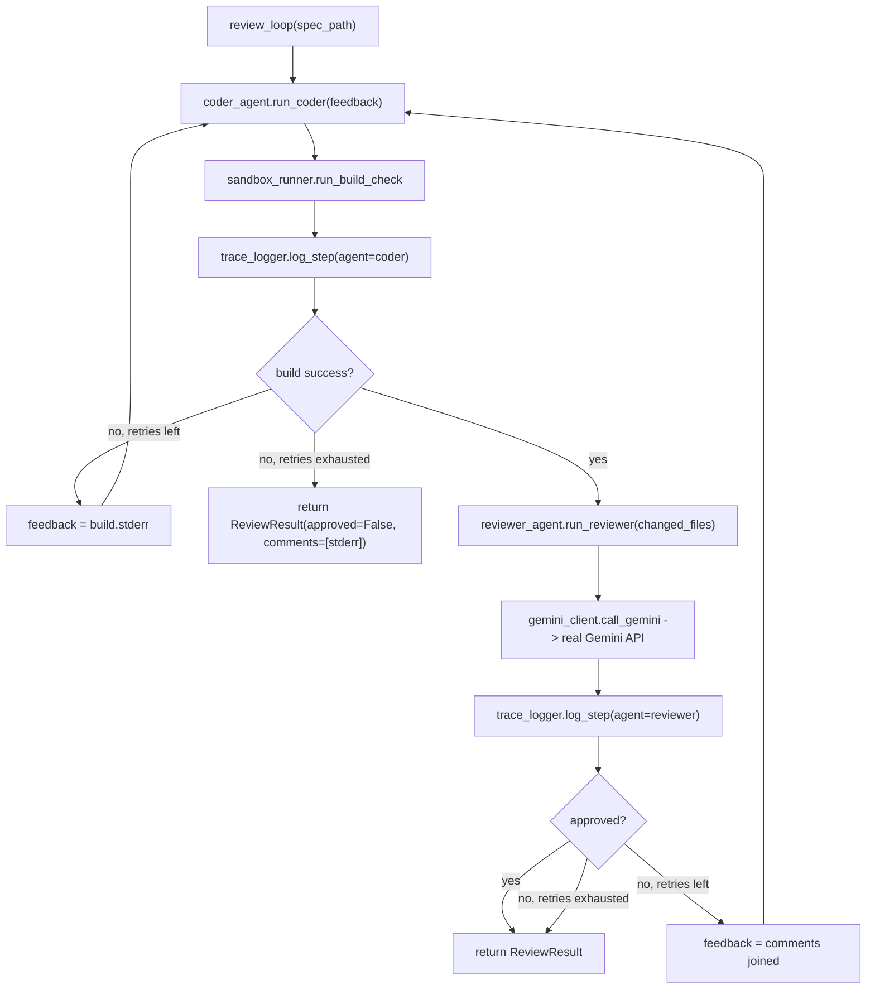

# Gemini-Backed Reviewer Agent + Review Loop (Phase 4b) Implementation Plan

> **For Agent:** Execute this plan task-by-task. Follow each step exactly, verify test results before proceeding, and commit after each task.
> **TDD Rule:** No production code without a failing test first.

**Goal:** Add a Gemini API wrapper (`agents/gemini_client.py`) and a Gemini-backed Reviewer Agent (`agents/reviewer_agent.py`) that checks the Coder Agent's output against `prompts/reviewer.txt`'s checklist, then compose them into `orchestrator.review_loop()` — a new retry loop that feeds both build failures and review rejections back to the Coder Agent, logging every attempt via `harness/trace_logger.py`.

**Architecture:** Two additive modules in `agents/` (`gemini_client.py` wraps `google.genai.Client.models.generate_content`, optionally returning a parsed Pydantic model via `response_schema`; `reviewer_agent.py` loads `prompts/reviewer.txt` via the existing `harness/prompt_store.load`, formats changed files' current content, and calls `gemini_client.call_gemini`) plus one new function `orchestrator.review_loop()`. `orchestrator.inner_loop`/`main` and all 28 existing Phase 4a tests are untouched.

**Tech Stack:** Python 3 (3.14 at `/opt/homebrew/bin/python3`), pytest, `google-genai==2.8.0`, `python-dotenv==1.2.2`, `pydantic` (already installed as a `google-genai` dependency), `GEMINI_API_KEY` configured in `.env` (gitignored).

**Complexity Path:** `Simplified TDD path`
**Status:** Draft

---

## Requirements

### User Stories
- As the game-factory orchestrator, I want `agents/gemini_client.call_gemini()` to call the real Gemini API with an optional structured `response_schema`, so that agents needing JSON output (like the Reviewer) get a typed Pydantic result instead of hand-parsing raw text.
- As the game-factory orchestrator, I want `agents/reviewer_agent.run_reviewer()` to review the Coder Agent's changed files against `prompts/reviewer.txt`'s checklist via Gemini, so that low-quality code (e.g. forbidden `any` types) is caught before being treated as "done".
- As the game-factory orchestrator, I want `orchestrator.review_loop()` to retry the Coder Agent with either build-failure or review-rejection feedback up to `max_retries`, logging every coder and reviewer attempt via `harness/trace_logger.log_step`, so that future Phase 4c optimizer work has trace data covering both failure modes.

### Acceptance Criteria
- Given a system prompt, a task string, and a Pydantic `response_schema`, when `gemini_client.call_gemini(system_prompt=..., task=..., response_schema=SomeModel)` is called, then it constructs `genai.Client(api_key=os.environ["GEMINI_API_KEY"])`, calls `.models.generate_content(model="gemini-2.5-flash", contents=task, config=types.GenerateContentConfig(system_instruction=system_prompt, response_mime_type="application/json", response_schema=SomeModel))`, and returns `response.parsed`. Without `response_schema`, it returns `response.text` and omits `response_mime_type`/`response_schema` from the config.
- Given `client.models.generate_content` raises `google.genai.errors.APIError`, when `call_gemini(...)` is called, then it raises `gemini_client.GeminiClientError` whose message includes the original error's string representation.
- Given a list of `workspace/`-relative changed file paths and a `repo_root`, when `reviewer_agent.run_reviewer(changed_files, repo_root)` is called, then it loads `prompts/reviewer.txt` via `prompt_store.load("reviewer", repo_root)`, formats each changed file's current content as `## <relative path>\n<content>` blocks (or `"No files were changed."` if the list is empty), and returns the `ReviewResult` from `gemini_client.call_gemini(..., response_schema=ReviewResult)` unchanged.
- Given `sandbox_runner.run_build_check()` returns `success=False` then `success=True`, when `orchestrator.review_loop(spec_path, max_retries=3)` runs, then `coder_agent.run_coder` is called twice — the 2nd call's `feedback` is the first build's `stderr` — `reviewer_agent.run_reviewer` is called only once (on the passing build), and `review_loop` returns that `ReviewResult`.
- Given `sandbox_runner.run_build_check()` always succeeds but `reviewer_agent.run_reviewer()` returns `approved=False` then `approved=True`, when `orchestrator.review_loop(spec_path, max_retries=3)` runs, then `coder_agent.run_coder` is called twice — the 2nd call's `feedback` is `"\n".join(comments)` from the first rejection — and `review_loop` returns the second (approved) `ReviewResult`.
- Given `max_retries=2` and `reviewer_agent.run_reviewer()` always returns `approved=False`, when `orchestrator.review_loop(spec_path, max_retries=2)` runs, then it returns the 2nd `ReviewResult` unchanged (no 3rd attempt).
- Given any `review_loop` run, when it completes, then `traces/<run_id>/trace.jsonl` contains one `agent="coder"` entry per attempt and one `agent="reviewer"` entry per attempt where the build passed, all sharing one `run_id`.

### Assumptions, Constraints, and Scope Boundaries
- `GEMINI_API_KEY` is configured in `.env` (gitignored, confirmed via `git check-ignore -v .env`); `google-genai==2.8.0` and `python-dotenv==1.2.2` are installed via `pip3 install --break-system-packages`, matching how `pytest` was installed in Phase 4a.
- All Phase H/I/J unit tests mock `agents.gemini_client.genai.Client` (or higher-level `gemini_client.call_gemini` / `reviewer_agent.run_reviewer`) — **no real network calls** in the default `pytest` run. Two checks (H4, J4) are marked `gemini` and excluded by default; run once during implementation.
- `reviewer_agent.run_reviewer` reviews **current file content**, not a `git diff` — sufficient for `prompts/reviewer.txt`'s static checklist (type usage, purity, PWA wiring); revisit if Phase 4c's Designer produces much larger files.
- `orchestrator.inner_loop` / `orchestrator.main` and all 28 existing tests are unchanged; `review_loop` is purely additive. `main()`'s CLI behavior is not wired to `review_loop` in this plan — deferred to Phase 4c.
- Designer/QA/Optimizer agents and `orchestrator.evolution_loop()` remain out of scope (Phase 4c) — `review_loop` is the data source the Optimizer will eventually analyze.

## Architecture Review
- **Reusable components**: `prompts/reviewer.txt` (existing Reviewer Agent system prompt + checklist, from Phase 3), `harness/prompt_store.load` (existing), `harness/trace_logger.log_step` (existing), `agents/coder_agent.run_coder` (existing), `harness/sandbox_runner.run_build_check`/`SandboxResult` (existing, Phase 4a).
- **Affected layers**: `agents/` gains `gemini_client.py` (Gemini SDK wrapper) and `reviewer_agent.py` (Gemini-backed reviewer, mirrors `coder_agent.py`'s shape); `orchestrator.py` gains `review_loop()` alongside the unchanged `inner_loop`/`main`.
- **Data flow**: `review_loop(spec_path)` → loop up to `max_retries`: `coder_agent.run_coder(spec_path, feedback)` → `sandbox_runner.run_build_check()` → `trace_logger.log_step(agent="coder", ...)` → if build fails, `feedback = stderr` and retry; if build passes, `reviewer_agent.run_reviewer(changed_files, repo_root)` → [`prompt_store.load("reviewer", repo_root)` + `gemini_client.call_gemini(..., response_schema=ReviewResult)` → real Gemini API] → `trace_logger.log_step(agent="reviewer", ...)` → if `approved`, return `ReviewResult`; else `feedback = "\n".join(comments)` and retry.



- **Exact file paths**:
  - New: `agents/gemini_client.py`, `agents/reviewer_agent.py`, `tests/agents/test_gemini_client.py`, `tests/agents/test_reviewer_agent.py`
  - Modified: `pyproject.toml`, `orchestrator.py`, `tests/test_orchestrator.py`

## Implementation Steps

### Phase H: `agents/gemini_client.py`

#### Task H1: Register `gemini` marker + declare dependencies
**Exception Type:** Configuration-only
**User Approval:** User approved this plan's "Phase H ... 1. Config task: register `gemini` marker + add `google-genai`/`python-dotenv` to `pyproject.toml`" via ExitPlanMode.
**Files:**
- Modify: `pyproject.toml`

**Implementation**

`pyproject.toml`:
```toml
[project]
name = "game-factory"
version = "0.1.0"
description = "AI agent pipeline that builds small TypeScript games"
requires-python = ">=3.12"
dependencies = [
    "pytest",
    "google-genai",
    "python-dotenv",
]

[tool.pytest.ini_options]
testpaths = ["tests"]
markers = [
    "slow: long-running checks, excluded by default",
    "docker: requires a local Docker daemon, excluded by default",
    "claude_cli: invokes the real claude CLI binary, excluded by default",
    "gemini: invokes the real Gemini API, excluded by default",
]
addopts = "-m \"not slow and not docker and not claude_cli and not gemini\""
```

**Verification**
Run:
```bash
cd /Users/kyo.lai82/Projects/Personal/game-factory && python3 -m pytest --collect-only && python3 -m pytest --markers | grep gemini
```

Confirm:
- `pytest --collect-only` exits with code `0` and reports `28/30 tests collected (2 deselected)` (no new test files yet — same 28 tests as the end of Phase 4a)
- `pytest --markers` output includes a line `@pytest.mark.gemini: invokes the real Gemini API, excluded by default`
- No `INTERNALERROR` or traceback

**COMMIT**
Run:
`git commit -m "chore: 🔧 register gemini pytest marker and declare google-genai/python-dotenv dependencies"`

---

#### Task H2: `call_gemini(system_prompt, task) -> str` returns `response.text`
**Goal:** `call_gemini` constructs `genai.Client(api_key=os.environ["GEMINI_API_KEY"])`, calls `.models.generate_content(model="gemini-2.5-flash", contents=task, config=types.GenerateContentConfig(system_instruction=system_prompt))`, and returns `response.text`.

**Files:**
- Create: `agents/gemini_client.py`
- Test: `tests/agents/test_gemini_client.py`

**RED - Write Failing Test**
```python
from unittest.mock import MagicMock, patch

from agents import gemini_client


def test_call_gemini_returns_text_response(monkeypatch) -> None:
    monkeypatch.setenv("GEMINI_API_KEY", "test-key")

    mock_response = MagicMock()
    mock_response.text = "OK"

    mock_client = MagicMock()
    mock_client.models.generate_content.return_value = mock_response

    with patch("agents.gemini_client.genai.Client", return_value=mock_client) as mock_client_cls:
        result = gemini_client.call_gemini(system_prompt="You are helpful.", task="Reply with OK")

    mock_client_cls.assert_called_once_with(api_key="test-key")
    mock_client.models.generate_content.assert_called_once()

    _, kwargs = mock_client.models.generate_content.call_args
    assert kwargs["model"] == "gemini-2.5-flash"
    assert kwargs["contents"] == "Reply with OK"
    assert kwargs["config"].system_instruction == "You are helpful."
    assert kwargs["config"].response_mime_type is None

    assert result == "OK"
```

**Verify RED**
Run:
```bash
cd /Users/kyo.lai82/Projects/Personal/game-factory && python3 -m pytest tests/agents/test_gemini_client.py -v
```
Confirm failure is exactly:
```
ImportError: cannot import name 'gemini_client' from 'agents' (/Users/kyo.lai82/Projects/Personal/game-factory/agents/__init__.py)
```
**Anti-rationalization:** Do not write `agents/gemini_client.py` before seeing this exact error. A different error (e.g. `SyntaxError`, `AttributeError`) means something else is wrong — stop and investigate before proceeding.

**GREEN - Minimal Code**

`agents/gemini_client.py`:
```python
import os

from dotenv import load_dotenv
from google import genai
from google.genai import types

load_dotenv()

GEMINI_MODEL = "gemini-2.5-flash"


def call_gemini(system_prompt: str, task: str) -> str:
    client = genai.Client(api_key=os.environ["GEMINI_API_KEY"])

    response = client.models.generate_content(
        model=GEMINI_MODEL,
        contents=task,
        config=types.GenerateContentConfig(system_instruction=system_prompt),
    )

    return response.text
```

**Verify GREEN**
Run:
```bash
cd /Users/kyo.lai82/Projects/Personal/game-factory && python3 -m pytest tests/agents/test_gemini_client.py -v
```
Confirm: `1 passed`.

**REFACTOR**
No duplication yet — skip.

**Verify GREEN (post-refactor)**
N/A (no refactor performed).

**COMMIT**
Run:
`git commit -m "feat: ✨ add agents/gemini_client.call_gemini basic text wrapper"`

---

#### Task H3: `response_schema` support → `response.parsed`
**Goal:** When `response_schema` is a Pydantic model class, `call_gemini` sets `response_mime_type="application/json"` and `response_schema=response_schema` on the config, and returns `response.parsed` instead of `response.text`.

**Files:**
- Modify: `agents/gemini_client.py`
- Modify: `tests/agents/test_gemini_client.py`

**RED - Write Failing Test**

Append to `tests/agents/test_gemini_client.py` (add `from pydantic import BaseModel` to the imports):
```python
from pydantic import BaseModel


class _EchoResult(BaseModel):
    approved: bool
    comments: list[str]


def test_call_gemini_with_response_schema_returns_parsed(monkeypatch) -> None:
    monkeypatch.setenv("GEMINI_API_KEY", "test-key")

    expected = _EchoResult(approved=True, comments=["looks good"])
    mock_response = MagicMock()
    mock_response.parsed = expected

    mock_client = MagicMock()
    mock_client.models.generate_content.return_value = mock_response

    with patch("agents.gemini_client.genai.Client", return_value=mock_client):
        result = gemini_client.call_gemini(
            system_prompt="You are a reviewer.",
            task="Review this diff.",
            response_schema=_EchoResult,
        )

    _, kwargs = mock_client.models.generate_content.call_args
    config = kwargs["config"]
    assert config.response_mime_type == "application/json"
    assert config.response_schema is _EchoResult

    assert result == expected
```

**Verify RED**
Run:
```bash
cd /Users/kyo.lai82/Projects/Personal/game-factory && python3 -m pytest tests/agents/test_gemini_client.py -v
```
Confirm the new test fails with exactly:
```
TypeError: call_gemini() got an unexpected keyword argument 'response_schema'
```
and the previous test (`test_call_gemini_returns_text_response`) still passes.

**Anti-rationalization:** This must be a `TypeError` about an unexpected keyword argument — H2's `call_gemini` signature has no `response_schema` parameter at all. If you see an `AssertionError` instead, re-check that `agents/gemini_client.py` was not already modified.

**GREEN - Minimal Code**

`agents/gemini_client.py`:
```python
import os
from typing import Any

from dotenv import load_dotenv
from google import genai
from google.genai import types
from pydantic import BaseModel

load_dotenv()

GEMINI_MODEL = "gemini-2.5-flash"


def call_gemini(
    system_prompt: str,
    task: str,
    response_schema: type[BaseModel] | None = None,
) -> Any:
    client = genai.Client(api_key=os.environ["GEMINI_API_KEY"])

    config_kwargs: dict[str, Any] = {"system_instruction": system_prompt}
    if response_schema is not None:
        config_kwargs["response_mime_type"] = "application/json"
        config_kwargs["response_schema"] = response_schema

    response = client.models.generate_content(
        model=GEMINI_MODEL,
        contents=task,
        config=types.GenerateContentConfig(**config_kwargs),
    )

    if response_schema is not None:
        return response.parsed

    return response.text
```

**Verify GREEN**
Run:
```bash
cd /Users/kyo.lai82/Projects/Personal/game-factory && python3 -m pytest tests/agents/test_gemini_client.py -v
```
Confirm: `2 passed`.

**REFACTOR**
No duplication — skip.

**Verify GREEN (post-refactor)**
N/A (no refactor performed).

**COMMIT**
Run:
`git commit -m "feat: ✨ support response_schema and return parsed Pydantic results"`

---

#### Task H4: Wrap `google.genai.errors.APIError` as `GeminiClientError` + real Gemini smoke test
**Goal:** If `client.models.generate_content` raises `google.genai.errors.APIError`, `call_gemini` raises `gemini_client.GeminiClientError` whose message includes the original error's string representation. Also add one `gemini`-marked test that makes a real call against the live Gemini API with a small Pydantic schema.

**Files:**
- Modify: `agents/gemini_client.py`
- Modify: `tests/agents/test_gemini_client.py`

**RED - Write Failing Test**

Append to `tests/agents/test_gemini_client.py` (add `import pytest` and `from google.genai import errors` to the imports):
```python
import pytest
from google.genai import errors


def test_call_gemini_wraps_api_error(monkeypatch) -> None:
    monkeypatch.setenv("GEMINI_API_KEY", "test-key")

    mock_client = MagicMock()
    mock_client.models.generate_content.side_effect = errors.APIError(
        500, {"error": {"message": "internal error", "status": "INTERNAL"}}
    )

    with patch("agents.gemini_client.genai.Client", return_value=mock_client):
        with pytest.raises(gemini_client.GeminiClientError) as exc_info:
            gemini_client.call_gemini(system_prompt="You are helpful.", task="Reply with OK")

    assert "internal error" in str(exc_info.value)
```

**Verify RED**
Run:
```bash
cd /Users/kyo.lai82/Projects/Personal/game-factory && python3 -m pytest tests/agents/test_gemini_client.py -v
```
Confirm the new test fails with exactly:
```
AttributeError: module 'agents.gemini_client' has no attribute 'GeminiClientError'
```
(raised while evaluating the `pytest.raises(gemini_client.GeminiClientError)` argument, before `call_gemini` is even invoked), and the previous 2 tests still pass.

**Anti-rationalization:** Do not add `GeminiClientError` and the try/except together with no failing step in between — confirm this exact `AttributeError` first.

**GREEN - Minimal Code**

`agents/gemini_client.py`:
```python
import os
from typing import Any

from dotenv import load_dotenv
from google import genai
from google.genai import errors, types
from pydantic import BaseModel

load_dotenv()

GEMINI_MODEL = "gemini-2.5-flash"


class GeminiClientError(Exception):
    pass


def call_gemini(
    system_prompt: str,
    task: str,
    response_schema: type[BaseModel] | None = None,
) -> Any:
    client = genai.Client(api_key=os.environ["GEMINI_API_KEY"])

    config_kwargs: dict[str, Any] = {"system_instruction": system_prompt}
    if response_schema is not None:
        config_kwargs["response_mime_type"] = "application/json"
        config_kwargs["response_schema"] = response_schema

    try:
        response = client.models.generate_content(
            model=GEMINI_MODEL,
            contents=task,
            config=types.GenerateContentConfig(**config_kwargs),
        )
    except errors.APIError as exc:
        raise GeminiClientError(str(exc)) from exc

    if response_schema is not None:
        return response.parsed

    return response.text
```

**Verify GREEN**
Run:
```bash
cd /Users/kyo.lai82/Projects/Personal/game-factory && python3 -m pytest tests/agents/test_gemini_client.py -v
```
Confirm: `3 passed`.

**REFACTOR**
No duplication — skip.

**Verify GREEN (post-refactor)**
N/A (no refactor performed).

**Manual real-API check (marked `gemini`, excluded by default)**

Append to `tests/agents/test_gemini_client.py`:
```python
@pytest.mark.gemini
def test_call_gemini_real_api_returns_parsed_review_result() -> None:
    class _ReviewResult(BaseModel):
        approved: bool
        comments: list[str]

    result = gemini_client.call_gemini(
        system_prompt="You are a strict TypeScript code reviewer. Respond with JSON matching the schema.",
        task="Review this code:\nconst x: any = 1;",
        response_schema=_ReviewResult,
    )

    assert isinstance(result, _ReviewResult)
    assert isinstance(result.approved, bool)
    assert isinstance(result.comments, list)
```

Run once:
```bash
cd /Users/kyo.lai82/Projects/Personal/game-factory && python3 -m pytest tests/agents/test_gemini_client.py -m gemini -v
```
Confirm: `1 passed` — a real Gemini call returns a populated `_ReviewResult` instance (either `approved` value is acceptable; this is a live-LLM response).

**COMMIT**
Run:
`git commit -m "feat: ✨ wrap google.genai APIError as GeminiClientError"`

---

### Phase I: `agents/reviewer_agent.py`

#### Task I1: `ReviewResult` model + `_format_changed_files` (non-empty files)
**Goal:** `ReviewResult(BaseModel)` has `approved: bool` and `comments: list[str]`. `_format_changed_files(changed_files, repo_root)` reads each file's current content and renders a `## <relative path>\n<content>` block per file, joined by blank lines.

**Files:**
- Create: `agents/reviewer_agent.py`
- Test: `tests/agents/test_reviewer_agent.py`

**RED - Write Failing Test**
```python
from pathlib import Path

from agents.reviewer_agent import ReviewResult, _format_changed_files


def test_review_result_has_approved_and_comments_fields() -> None:
    result = ReviewResult(approved=True, comments=["looks good"])
    assert result.approved is True
    assert result.comments == ["looks good"]


def test_format_changed_files_renders_each_file_content(tmp_path: Path) -> None:
    (tmp_path / "workspace").mkdir()
    (tmp_path / "workspace" / "grid.ts").write_text("export const x = 1;\n")
    (tmp_path / "workspace" / "game.ts").write_text("export const y = 2;\n")

    changed_files = [Path("workspace/grid.ts"), Path("workspace/game.ts")]

    formatted = _format_changed_files(changed_files, repo_root=tmp_path)

    assert "## workspace/grid.ts" in formatted
    assert "export const x = 1;" in formatted
    assert "## workspace/game.ts" in formatted
    assert "export const y = 2;" in formatted
```

**Verify RED**
Run:
```bash
cd /Users/kyo.lai82/Projects/Personal/game-factory && python3 -m pytest tests/agents/test_reviewer_agent.py -v
```
Confirm failure is exactly:
```
ModuleNotFoundError: No module named 'agents.reviewer_agent'
```

**GREEN - Minimal Code**

`agents/reviewer_agent.py`:
```python
from pathlib import Path

from pydantic import BaseModel


class ReviewResult(BaseModel):
    approved: bool
    comments: list[str]


def _format_changed_files(changed_files: list[Path], repo_root: Path) -> str:
    blocks = []
    for path in changed_files:
        content = (repo_root / path).read_text()
        blocks.append(f"## {path}\n{content}")

    return "\n\n".join(blocks)
```

**Verify GREEN**
Run:
```bash
cd /Users/kyo.lai82/Projects/Personal/game-factory && python3 -m pytest tests/agents/test_reviewer_agent.py -v
```
Confirm: `2 passed`.

**REFACTOR**
No duplication — skip.

**Verify GREEN (post-refactor)**
N/A (no refactor performed).

**COMMIT**
Run:
`git commit -m "feat: ✨ add ReviewResult model and _format_changed_files"`

---

#### Task I2: `run_reviewer(changed_files, repo_root) -> ReviewResult`
**Goal:** `run_reviewer` loads `prompts/reviewer.txt` via `prompt_store.load("reviewer", repo_root)` as the system prompt, calls `gemini_client.call_gemini(system_prompt=..., task=_format_changed_files(...), response_schema=ReviewResult)`, and returns its result unchanged.

**Files:**
- Modify: `agents/reviewer_agent.py`
- Modify: `tests/agents/test_reviewer_agent.py`

**RED - Write Failing Test**

Append to `tests/agents/test_reviewer_agent.py` (add `from unittest.mock import patch` and `from agents import reviewer_agent` to the imports):
```python
from unittest.mock import patch

from agents import reviewer_agent


def test_run_reviewer_loads_prompt_and_calls_gemini(tmp_path: Path) -> None:
    (tmp_path / "workspace").mkdir()
    (tmp_path / "workspace" / "grid.ts").write_text("export const x = 1;\n")

    changed_files = [Path("workspace/grid.ts")]
    expected = ReviewResult(approved=True, comments=[])

    with patch(
        "agents.reviewer_agent.prompt_store.load", return_value="REVIEWER SYSTEM PROMPT"
    ) as mock_load, patch(
        "agents.reviewer_agent.gemini_client.call_gemini", return_value=expected
    ) as mock_call:
        result = reviewer_agent.run_reviewer(changed_files, repo_root=tmp_path)

    mock_load.assert_called_once_with("reviewer", tmp_path)
    mock_call.assert_called_once_with(
        system_prompt="REVIEWER SYSTEM PROMPT",
        task=_format_changed_files(changed_files, repo_root=tmp_path),
        response_schema=ReviewResult,
    )
    assert result == expected
```

**Verify RED**
Run:
```bash
cd /Users/kyo.lai82/Projects/Personal/game-factory && python3 -m pytest tests/agents/test_reviewer_agent.py -v
```
Confirm failure is exactly:
```
AttributeError: module 'agents.reviewer_agent' has no attribute 'prompt_store'
```
(raised by the first `patch(...)` in the `with` statement, before `run_reviewer` is called), and the previous 2 tests still pass.

**Anti-rationalization:** This is an `AttributeError` about `prompt_store`, not about `run_reviewer` — `patch()` resolves its target eagerly when the `with` block is entered. If you see a different error, stop and investigate.

**GREEN - Minimal Code**

`agents/reviewer_agent.py`:
```python
from pathlib import Path

from pydantic import BaseModel

from agents import gemini_client
from harness import prompt_store


class ReviewResult(BaseModel):
    approved: bool
    comments: list[str]


def _format_changed_files(changed_files: list[Path], repo_root: Path) -> str:
    blocks = []
    for path in changed_files:
        content = (repo_root / path).read_text()
        blocks.append(f"## {path}\n{content}")

    return "\n\n".join(blocks)


def run_reviewer(changed_files: list[Path], repo_root: Path) -> ReviewResult:
    system_prompt = prompt_store.load("reviewer", repo_root)
    task = _format_changed_files(changed_files, repo_root)

    return gemini_client.call_gemini(
        system_prompt=system_prompt,
        task=task,
        response_schema=ReviewResult,
    )
```

**Verify GREEN**
Run:
```bash
cd /Users/kyo.lai82/Projects/Personal/game-factory && python3 -m pytest tests/agents/test_reviewer_agent.py -v
```
Confirm: `3 passed`.

**REFACTOR**
No duplication — skip.

**Verify GREEN (post-refactor)**
N/A (no refactor performed).

**COMMIT**
Run:
`git commit -m "feat: ✨ add agents/reviewer_agent.run_reviewer"`

---

#### Task I3: Empty `changed_files` → placeholder text
**Goal:** `_format_changed_files([], repo_root)` returns the fixed string `"No files were changed."` instead of an empty string, so `run_reviewer([], repo_root)` still sends Gemini a non-empty `task`.

**Files:**
- Modify: `agents/reviewer_agent.py`
- Modify: `tests/agents/test_reviewer_agent.py`

**RED - Write Failing Test**

Append to `tests/agents/test_reviewer_agent.py`:
```python
def test_format_changed_files_empty_list_returns_placeholder(tmp_path: Path) -> None:
    assert _format_changed_files([], repo_root=tmp_path) == "No files were changed."
```

**Verify RED**
Run:
```bash
cd /Users/kyo.lai82/Projects/Personal/game-factory && python3 -m pytest tests/agents/test_reviewer_agent.py -v
```
Confirm the new test fails with exactly:
```
AssertionError: assert '' == 'No files were changed.'
```
and the previous 3 tests still pass.

**GREEN - Minimal Code**

In `agents/reviewer_agent.py`, update `_format_changed_files`:
```python
def _format_changed_files(changed_files: list[Path], repo_root: Path) -> str:
    if not changed_files:
        return "No files were changed."

    blocks = []
    for path in changed_files:
        content = (repo_root / path).read_text()
        blocks.append(f"## {path}\n{content}")

    return "\n\n".join(blocks)
```

**Verify GREEN**
Run:
```bash
cd /Users/kyo.lai82/Projects/Personal/game-factory && python3 -m pytest tests/agents/test_reviewer_agent.py -v
```
Confirm: `4 passed`.

**REFACTOR**
No duplication — skip.

**Verify GREEN (post-refactor)**
N/A (no refactor performed).

**COMMIT**
Run:
`git commit -m "feat: ✨ use placeholder text when no files changed for review"`

---

### Phase J: `orchestrator.review_loop()`

#### Task J1: Happy path — build passes, review approves on first try
**Goal:** `review_loop(spec_path, repo_root=...)` calls `coder_agent.run_coder(spec_path, feedback=None, repo_root=repo_root)`, then `sandbox_runner.run_build_check()`; if the build passes, calls `reviewer_agent.run_reviewer(changed_files, repo_root)` and returns its result. If the build fails, returns `ReviewResult(approved=False, comments=[build_result.stderr])` (no retry yet — added in Task J2).

**Files:**
- Modify: `orchestrator.py`
- Modify: `tests/test_orchestrator.py`

**RED - Write Failing Test**

Append to `tests/test_orchestrator.py` (add `from agents.reviewer_agent import ReviewResult` to the imports):
```python
from agents.reviewer_agent import ReviewResult


def test_review_loop_happy_path_build_passes_and_review_approves(tmp_path: Path) -> None:
    spec_path = tmp_path / "spec.md"
    spec_path.write_text("Build something")

    build_result = SandboxResult(success=True, stdout="ok", stderr="", returncode=0)
    review_result = ReviewResult(approved=True, comments=[])

    with patch(
        "orchestrator.coder_agent.run_coder", return_value=[Path("workspace/grid.ts")]
    ) as mock_run_coder, patch(
        "orchestrator.sandbox_runner.run_build_check", return_value=build_result
    ) as mock_build_check, patch(
        "orchestrator.reviewer_agent.run_reviewer", return_value=review_result
    ) as mock_run_reviewer:
        result = orchestrator.review_loop(spec_path, repo_root=tmp_path)

    mock_run_coder.assert_called_once_with(spec_path, feedback=None, repo_root=tmp_path)
    mock_build_check.assert_called_once()
    mock_run_reviewer.assert_called_once_with([Path("workspace/grid.ts")], tmp_path)
    assert result == review_result
```

**Verify RED**
Run:
```bash
cd /Users/kyo.lai82/Projects/Personal/game-factory && python3 -m pytest tests/test_orchestrator.py -v
```
Confirm the new test fails with exactly:
```
AttributeError: <module 'orchestrator' from '/Users/kyo.lai82/Projects/Personal/game-factory/orchestrator.py'> does not have the attribute 'reviewer_agent'
```
(raised by the third `patch(...)` in the `with` statement, before `review_loop` is called), and the previous 6 tests still pass.

**GREEN - Minimal Code**

In `orchestrator.py`, change the import line and add `review_loop`:
```python
from agents import coder_agent, reviewer_agent
```

```python
def review_loop(
    spec_path: Path,
    max_retries: int = 3,
    repo_root: Path | None = None,
) -> reviewer_agent.ReviewResult:
    if repo_root is None:
        repo_root = REPO_ROOT

    changed_files = coder_agent.run_coder(spec_path, feedback=None, repo_root=repo_root)
    build_result = sandbox_runner.run_build_check()

    if not build_result.success:
        return reviewer_agent.ReviewResult(approved=False, comments=[build_result.stderr])

    return reviewer_agent.run_reviewer(changed_files, repo_root)
```

**Verify GREEN**
Run:
```bash
cd /Users/kyo.lai82/Projects/Personal/game-factory && python3 -m pytest tests/test_orchestrator.py -v
```
Confirm: `7 passed`.

**REFACTOR**
No duplication — skip.

**Verify GREEN (post-refactor)**
N/A (no refactor performed).

**COMMIT**
Run:
`git commit -m "feat: ✨ add orchestrator.review_loop happy path"`

---

#### Task J2: Retry on build failure or review rejection
**Goal:** `review_loop` retries up to `max_retries` times. On build failure, the next `run_coder` call's `feedback` is the build's `stderr`. On review rejection, the next `run_coder` call's `feedback` is `"\n".join(comments)`. If `approved=True`, return immediately. If retries are exhausted, return the last `ReviewResult` unchanged.

**Files:**
- Modify: `orchestrator.py`
- Modify: `tests/test_orchestrator.py`

**RED - Write Failing Tests**

Append to `tests/test_orchestrator.py`:
```python
def test_review_loop_retries_run_coder_on_build_failure(tmp_path: Path) -> None:
    spec_path = tmp_path / "spec.md"
    spec_path.write_text("Build something")

    build_results = [
        SandboxResult(success=False, stdout="", stderr="tsc error: foo", returncode=1),
        SandboxResult(success=True, stdout="ok", stderr="", returncode=0),
    ]
    review_result = ReviewResult(approved=True, comments=[])

    with patch("orchestrator.coder_agent.run_coder", return_value=[]) as mock_run_coder, patch(
        "orchestrator.sandbox_runner.run_build_check", side_effect=build_results
    ), patch("orchestrator.reviewer_agent.run_reviewer", return_value=review_result) as mock_run_reviewer:
        result = orchestrator.review_loop(spec_path, max_retries=3, repo_root=tmp_path)

    assert mock_run_coder.call_count == 2
    assert mock_run_reviewer.call_count == 1

    feedback_args = [call.kwargs["feedback"] for call in mock_run_coder.call_args_list]
    assert feedback_args == [None, "tsc error: foo"]
    assert result == review_result


def test_review_loop_retries_run_coder_on_review_rejection(tmp_path: Path) -> None:
    spec_path = tmp_path / "spec.md"
    spec_path.write_text("Build something")

    build_result = SandboxResult(success=True, stdout="ok", stderr="", returncode=0)
    review_results = [
        ReviewResult(approved=False, comments=["Avoid `any` types"]),
        ReviewResult(approved=True, comments=[]),
    ]

    with patch("orchestrator.coder_agent.run_coder", return_value=[]) as mock_run_coder, patch(
        "orchestrator.sandbox_runner.run_build_check", return_value=build_result
    ), patch("orchestrator.reviewer_agent.run_reviewer", side_effect=review_results) as mock_run_reviewer:
        result = orchestrator.review_loop(spec_path, max_retries=3, repo_root=tmp_path)

    assert mock_run_coder.call_count == 2
    assert mock_run_reviewer.call_count == 2

    feedback_args = [call.kwargs["feedback"] for call in mock_run_coder.call_args_list]
    assert feedback_args == [None, "Avoid `any` types"]
    assert result == review_results[1]


def test_review_loop_returns_last_rejection_when_retries_exhausted(tmp_path: Path) -> None:
    spec_path = tmp_path / "spec.md"
    spec_path.write_text("Build something")

    build_result = SandboxResult(success=True, stdout="ok", stderr="", returncode=0)
    review_results = [
        ReviewResult(approved=False, comments=["C1"]),
        ReviewResult(approved=False, comments=["C2"]),
    ]

    with patch("orchestrator.coder_agent.run_coder", return_value=[]) as mock_run_coder, patch(
        "orchestrator.sandbox_runner.run_build_check", return_value=build_result
    ), patch("orchestrator.reviewer_agent.run_reviewer", side_effect=review_results) as mock_run_reviewer:
        result = orchestrator.review_loop(spec_path, max_retries=2, repo_root=tmp_path)

    assert mock_run_coder.call_count == 2
    assert mock_run_reviewer.call_count == 2
    assert result == review_results[1]
    assert result.approved is False
```

**Verify RED**
Run:
```bash
cd /Users/kyo.lai82/Projects/Personal/game-factory && python3 -m pytest tests/test_orchestrator.py -v
```
Confirm all 3 new tests fail with:
```
assert 1 == 2
```
(on `mock_run_coder.call_count`) — J1's GREEN code returns immediately on the first build failure or first review result without retrying, and the previous 7 tests still pass.

**GREEN - Minimal Code**

In `orchestrator.py`, replace `review_loop` with:
```python
def review_loop(
    spec_path: Path,
    max_retries: int = 3,
    repo_root: Path | None = None,
) -> reviewer_agent.ReviewResult:
    if repo_root is None:
        repo_root = REPO_ROOT

    feedback: str | None = None
    review: reviewer_agent.ReviewResult

    for _ in range(max_retries):
        changed_files = coder_agent.run_coder(spec_path, feedback=feedback, repo_root=repo_root)
        build_result = sandbox_runner.run_build_check()

        if not build_result.success:
            feedback = build_result.stderr
            review = reviewer_agent.ReviewResult(approved=False, comments=[build_result.stderr])
            continue

        review = reviewer_agent.run_reviewer(changed_files, repo_root)

        if review.approved:
            return review

        feedback = "\n".join(review.comments)

    return review
```

**Verify GREEN**
Run:
```bash
cd /Users/kyo.lai82/Projects/Personal/game-factory && python3 -m pytest tests/test_orchestrator.py -v
```
Confirm: `10 passed`.

**REFACTOR**
No duplication — skip (mirrors `inner_loop`'s existing retry-loop shape from Phase 4a).

**Verify GREEN (post-refactor)**
N/A (no refactor performed).

**COMMIT**
Run:
`git commit -m "feat: ✨ retry orchestrator.review_loop on build failure or review rejection"`

---

#### Task J3: Log every coder and reviewer attempt via `trace_logger.log_step`
**Goal:** Each iteration logs one `agent="coder"` entry (build result, every attempt) and, only when the build passed, one `agent="reviewer"` entry (review result) — all sharing one `run_id`.

**Files:**
- Modify: `orchestrator.py`
- Modify: `tests/test_orchestrator.py`

**RED - Write Failing Test**

Append to `tests/test_orchestrator.py`:
```python
def test_review_loop_logs_coder_and_reviewer_attempts(tmp_path: Path) -> None:
    spec_path = tmp_path / "spec.md"
    spec_path.write_text("Build something")

    build_results = [
        SandboxResult(success=False, stdout="", stderr="tsc error: foo", returncode=1),
        SandboxResult(success=True, stdout="ok", stderr="", returncode=0),
    ]
    review_result = ReviewResult(approved=True, comments=[])

    with patch("orchestrator.coder_agent.run_coder", return_value=[]), patch(
        "orchestrator.sandbox_runner.run_build_check", side_effect=build_results
    ), patch("orchestrator.reviewer_agent.run_reviewer", return_value=review_result), patch(
        "orchestrator.trace_logger.log_step"
    ) as mock_log_step:
        orchestrator.review_loop(spec_path, max_retries=3, repo_root=tmp_path)

    assert mock_log_step.call_count == 3

    agents_logged = [call.kwargs["agent"] for call in mock_log_step.call_args_list]
    assert agents_logged == ["coder", "coder", "reviewer"]

    run_ids = {call.kwargs["run_id"] for call in mock_log_step.call_args_list}
    assert len(run_ids) == 1

    reviewer_call = mock_log_step.call_args_list[2]
    assert reviewer_call.kwargs["result"] == review_result.model_dump()
```

**Verify RED**
Run:
```bash
cd /Users/kyo.lai82/Projects/Personal/game-factory && python3 -m pytest tests/test_orchestrator.py -v
```
Confirm the new test fails with exactly:
```
assert 0 == 3
```
(on `mock_log_step.call_count` — J2's `review_loop` never calls `trace_logger.log_step`), and the previous 10 tests still pass.

**GREEN - Minimal Code**

In `orchestrator.py`, replace `review_loop` with:
```python
def review_loop(
    spec_path: Path,
    max_retries: int = 3,
    repo_root: Path | None = None,
) -> reviewer_agent.ReviewResult:
    if repo_root is None:
        repo_root = REPO_ROOT

    run_id = uuid.uuid4().hex
    feedback: str | None = None
    review: reviewer_agent.ReviewResult

    for _ in range(max_retries):
        changed_files = coder_agent.run_coder(spec_path, feedback=feedback, repo_root=repo_root)
        build_result = sandbox_runner.run_build_check()

        trace_logger.log_step(
            run_id=run_id,
            agent="coder",
            input=feedback,
            output=[str(p) for p in changed_files],
            result=dataclasses.asdict(build_result),
            traces_root=repo_root / "traces",
        )

        if not build_result.success:
            feedback = build_result.stderr
            review = reviewer_agent.ReviewResult(approved=False, comments=[build_result.stderr])
            continue

        review = reviewer_agent.run_reviewer(changed_files, repo_root)

        trace_logger.log_step(
            run_id=run_id,
            agent="reviewer",
            input=[str(p) for p in changed_files],
            output=review.comments,
            result=review.model_dump(),
            traces_root=repo_root / "traces",
        )

        if review.approved:
            return review

        feedback = "\n".join(review.comments)

    return review
```

**Verify GREEN**
Run:
```bash
cd /Users/kyo.lai82/Projects/Personal/game-factory && python3 -m pytest tests/test_orchestrator.py -v
```
Confirm: `11 passed`.

**REFACTOR**
No duplication — skip (mirrors `inner_loop`'s existing trace-logging shape from Phase 4a's Task G3).

**Verify GREEN (post-refactor)**
N/A (no refactor performed).

**COMMIT**
Run:
`git commit -m "feat: ✨ log coder and reviewer attempts in orchestrator.review_loop"`

---

#### Task J4: Manual integration check — real Gemini review with no changed files
**Goal:** With `coder_agent.run_coder` mocked as a no-op and a real `sandbox_runner.run_build_check()` (passes, per Phase 4a's Task G4), `reviewer_agent.run_reviewer([], repo_root)` makes a real Gemini call reviewing the `"No files were changed."` placeholder against `prompts/reviewer.txt`'s checklist. Confirms `review_loop` returns a `ReviewResult` and exactly one new `traces/<run_id>/trace.jsonl` is created with one `agent="coder"` entry followed by one `agent="reviewer"` entry.

**Files:**
- Modify: `tests/test_orchestrator.py`

**Implementation (marked `gemini`, excluded by default)**

Append to `tests/test_orchestrator.py` (add `import json` to the imports):
```python
import json


@pytest.mark.gemini
def test_review_loop_real_gemini_review_with_no_changed_files() -> None:
    traces_root = orchestrator.REPO_ROOT / "traces"
    before = set(traces_root.iterdir()) if traces_root.exists() else set()

    with patch("orchestrator.coder_agent.run_coder", return_value=[]):
        result = orchestrator.review_loop(
            orchestrator.REPO_ROOT / "specs" / "math-merge-10.md",
            max_retries=1,
        )

    assert isinstance(result, ReviewResult)

    after = set(traces_root.iterdir())
    new_dirs = after - before
    assert len(new_dirs) == 1

    lines = (new_dirs.pop() / "trace.jsonl").read_text().strip().splitlines()
    records = [json.loads(line) for line in lines]
    agents_logged = [r["agent"] for r in records]
    assert agents_logged == ["coder", "reviewer"]
```

**Run once**
```bash
cd /Users/kyo.lai82/Projects/Personal/game-factory && python3 -m pytest tests/test_orchestrator.py -m gemini -v
```

Confirm:
- `1 passed`
- This performs a real `docker build`/`docker run` (per Phase 4a's confirmed-passing sandbox) and one real Gemini API call — expect it to take noticeably longer than the default suite.
- Optionally inspect the new trace file directly: `cat traces/<new-run-id>/trace.jsonl | python3 -m json.tool` — confirm the `reviewer` entry's `result` has `approved`/`comments` keys matching a `ReviewResult`.

**COMMIT**
Run:
`git commit -m "test: ✅ add manual real-Gemini integration check for review_loop"`

---

## Out of Scope (Phase 4c)
Deferred until `review_loop` has produced real `traces/` data (the Optimizer needs trace history to analyze) and until a new game/spec motivates Designer + QA work:
- `agents/designer_agent.py` (writes `specs/*.md`)
- `agents/qa_agent.py` (writes `workspace/tests/unit/`, `workspace/tests/e2e/`)
- `agents/optimizer_agent.py` (edits `prompts/coder.txt` / `prompts/reviewer.txt` checklist based on trace analysis, with regression-test-gated revert)
- `orchestrator.evolution_loop()`
- Wiring `review_loop` into `main()`'s CLI (currently calls `inner_loop` only — unchanged by this plan)

## Testing Strategy
- Phases H-J unit tests (10 default + 1 happy-path/retry/log tests in `tests/test_orchestrator.py`, plus 3 in `tests/agents/test_gemini_client.py` and 4 in `tests/agents/test_reviewer_agent.py` = 11 new tests total) all mock `agents.gemini_client.genai.Client` / `gemini_client.call_gemini` / `reviewer_agent.run_reviewer` — zero real network calls in the default `pytest` run.
- New `gemini` marker (2 checks: H4, J4) excluded by default via `pyproject.toml`'s `addopts`, run manually once per phase during implementation.

## Risks & Mitigations
- **Risk:** Gemini API latency/rate limits could make H4/J4 slow or flaky. **Mitigation:** both are marker-gated, run once per phase, not part of the default suite.
- **Risk:** `_format_changed_files` reads whole file content (not a diff), so Reviewer sees entire files. **Mitigation:** acceptable for `prompts/reviewer.txt`'s static checklist (type usage, purity, PWA wiring) at current `workspace/` size; revisit if Phase 4c's Designer produces much larger games.
- **Risk:** J4's real Docker build can take minutes. **Mitigation:** consistent with Phase 4a's Task G4, run once as a final manual check, not in the default suite.

## Success Criteria
- [ ] `python3 -m pytest` (default markers) green: 28 existing + 11 new = 39 tests pass.
- [ ] `agents/gemini_client.call_gemini` implemented: plain text via `response.text`, structured output via `response_schema`/`response.parsed`, `google.genai.errors.APIError` wrapped as `GeminiClientError`.
- [ ] `agents/reviewer_agent.run_reviewer` implemented: loads `prompts/reviewer.txt` via `prompt_store.load`, formats changed files (or `"No files were changed."` placeholder), calls `gemini_client.call_gemini(..., response_schema=ReviewResult)`.
- [ ] `orchestrator.review_loop` implemented per the design above; `orchestrator.inner_loop`/`main` and the original 28 tests are unchanged.
- [ ] H4 and J4 `gemini`-marked checks each run once and pass.
- [ ] All 11 tasks (H1-H4, I1-I3, J1-J4) individually committed.
- [ ] `pyproject.toml` declares `pytest`/`google-genai`/`python-dotenv` dependencies and registers the `gemini` marker.
