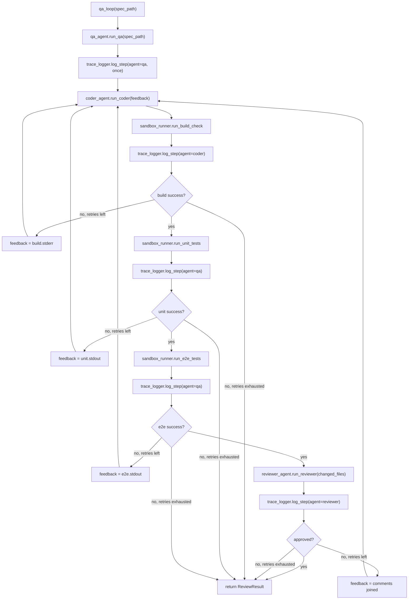

# QA Agent + `orchestrator.qa_loop()` (Phase 4c, slice 1) Implementation Plan

> **For Agent:** Execute this plan task-by-task. Follow each step exactly, verify test results before proceeding, and commit after each task.
> **TDD Rule:** No production code without a failing test first.

**Goal:** Add `harness/sandbox_runner.run_unit_tests()` (Vitest, via a new `sandbox.unit.Dockerfile`), extract `harness/workspace_diff.changed_paths()` from `coder_agent`'s private helper, add `agents/qa_agent.py` (writes `workspace/tests/unit/*.test.ts` + `workspace/tests/e2e/*.spec.ts` from the spec per `prompts/qa.txt`), and compose them into `orchestrator.qa_loop()` — a new pipeline `QA (once) → Coder → build check → unit tests → e2e tests → Reviewer`, retrying the Coder with feedback from any failing gate, and logging every step via `harness/trace_logger.py`.

**Architecture:** Two additive harness pieces (`harness/workspace_diff.py` extracted from `coder_agent._workspace_status`; `harness/sandbox_runner.run_unit_tests` + `sandbox.unit.Dockerfile`, mirroring the existing `run_build_check`/`run_e2e_tests` pattern), one additive agent module (`agents/qa_agent.py`, a near-mirror of `coder_agent.run_coder` without a `feedback` param, loading `prompts/qa.txt`), and one new orchestrator function `qa_loop()`. `orchestrator.inner_loop`/`review_loop`/`main` and all 40 existing Phase 4a/4b tests are untouched.

**Tech Stack:** Python 3 (3.14 at `/opt/homebrew/bin/python3`), pytest, existing `harness.sandbox_runner._run_sandbox` Docker helper, existing `agents.claude_cli.call_coder` CLI wrapper (reused as-is), existing `agents.reviewer_agent`/`gemini_client` (Phase 4b).

**Complexity Path:** `Simplified TDD path`
**Status:** Draft

---

## Requirements

### User Stories
- As the game-factory orchestrator, I want `harness.sandbox_runner.run_unit_tests()` to run the workspace's Vitest unit tests in an isolated Docker sandbox (mirroring `run_build_check`/`run_e2e_tests`), so that `qa_loop` can gate Coder retries on unit-test failures without polluting the host environment.
- As the game-factory orchestrator, I want `agents.qa_agent.run_qa()` to write/update `workspace/tests/unit/*.test.ts` and `workspace/tests/e2e/*.spec.ts` from the spec (per `prompts/qa.txt`'s contract — never touching `workspace/src/`), so that every `qa_loop` run starts from a spec-derived test suite before the Coder writes implementation code.
- As the game-factory orchestrator, I want `orchestrator.qa_loop()` to chain QA (once) → Coder → build check → unit tests → e2e tests → Reviewer, feeding any gate's failure output back to the Coder as `feedback` and retrying up to `max_retries`, logging every step via `trace_logger.log_step`, so that the Coder→QA→Reviewer pipeline described in `prompts/reviewer.txt` is realized and produces trace data for a future Optimizer.

### Acceptance Criteria
- Given `run_unit_tests()` is called, then it builds `sandbox.unit.Dockerfile` as image `game-sandbox-unit` and runs it in a container whose `--name` is distinct from `game-sandbox-instance` and `game-sandbox-e2e-instance`, returning a `SandboxResult` mapped from the run step's `stdout`/`stderr`/`returncode`.
- Given any `repo_root` with a git-initialized `workspace/`, when `harness.workspace_diff.changed_paths(repo_root)` is called, then it returns the set of `workspace/`-relative paths reported by `git status --porcelain workspace/`; `coder_agent.run_coder` uses this function internally and its 3 existing tests remain green.
- Given a spec path and `repo_root`, when `qa_agent.run_qa(spec_path, repo_root)` is called, then it loads `prompts/qa.txt` via `prompt_store.load("qa", repo_root)`, calls `claude_cli.call_coder(system_prompt=..., task=spec_path.read_text(), repo_root=repo_root)` (no `feedback` argument), and returns the sorted list of `workspace/`-relative paths changed by that call (empty list if none).
- Given `qa_agent.run_qa`, `coder_agent.run_coder`, `sandbox_runner.run_build_check`/`run_unit_tests`/`run_e2e_tests`, and `reviewer_agent.run_reviewer` all succeed/approve on the first attempt, when `orchestrator.qa_loop(spec_path, repo_root=...)` runs, then `run_qa` is called once before the retry loop, each of the other four is called exactly once, `qa_loop` returns the `ReviewResult` from `run_reviewer`, and `trace_logger.log_step` is called 5 times with `agent` values `["qa","coder","qa","qa","reviewer"]`, all sharing one `run_id`.
- Given `run_unit_tests()` returns `success=False` then `success=True` (build always passes), when `qa_loop(spec_path, max_retries=3)` runs, then `coder_agent.run_coder` is called twice — the 2nd call's `feedback` equals the first `unit_result.stdout` — and `run_e2e_tests`/`run_reviewer` are each called only once (on the passing iteration).
- Given `run_e2e_tests()` returns `success=False` then `success=True` (build/unit always pass), when `qa_loop(spec_path, max_retries=3)` runs, then `coder_agent.run_coder` is called twice — the 2nd call's `feedback` equals the first `e2e_result.stdout` — and `run_reviewer` is called only once (on the passing iteration).
- Given `reviewer_agent.run_reviewer` returns `approved=False` then `approved=True` (all sandbox gates always pass), when `qa_loop(spec_path, max_retries=3)` runs, then `coder_agent.run_coder` is called twice — the 2nd call's `feedback` equals `"\n".join(comments)` from the first rejection — and `qa_loop` returns the second (approved) `ReviewResult`.
- Given the real `workspace/` (Math Merge 10) and `qa_agent.run_qa`/`coder_agent.run_coder` mocked as no-ops, when `qa_loop(spec_path, max_retries=1)` runs without mocking the sandbox/reviewer, then `run_build_check`/`run_unit_tests`/`run_e2e_tests` all run for real against the current `workspace/` and `reviewer_agent.run_reviewer([], repo_root)` makes a real Gemini call; `traces/<run_id>/trace.jsonl` contains exactly the `["qa","coder","qa","qa","reviewer"]` sequence.

### Assumptions, Constraints, and Scope Boundaries
- All Phase K/L/M unit tests mock subprocess/Docker/`claude` CLI/Gemini calls — **no real network/Docker calls** in the default `pytest` run, except K1's docker-marked check and M4, both excluded by default via the existing `docker`/`gemini` markers.
- `qa_agent.run_qa` reuses `agents.claude_cli.call_coder` as-is (no rename) — it is already a generic "invoke `claude` CLI with a system prompt + task" wrapper; the `coder`-specific name is a Phase 4a historical artifact, renaming it is out of scope here.
- `orchestrator.inner_loop` / `review_loop` / `main` and all 40 existing tests are unchanged; `qa_loop` is purely additive. `main()`'s CLI behavior is not wired to `qa_loop` — deferred.
- `run_unit_tests`/`run_e2e_tests` failure feedback is the gate's raw `stdout` (mirrors `inner_loop`'s `stderr`-feedback pattern for build failures, Phase 4a) — may be large (full Vitest/Playwright output), accepted as consistent with prior art.
- Designer Agent (Phase 4d, writes `specs/*.md`) and Optimizer Agent + `orchestrator.evolution_loop()` (Phase 4e, builds on `prompt_store.update`/`rollback` and `prompts/reviewer.txt`'s `CHECKLIST_START/END` markers) remain out of scope.

## Architecture Review
- **Reusable components**: `harness.sandbox_runner._run_sandbox`/`SandboxResult` (existing, Phase 4a/4b), `harness.prompt_store.load` (existing), `agents.claude_cli.call_coder` (existing, Phase 4a, reused as-is for QA), `agents.coder_agent.run_coder` (existing), `agents.reviewer_agent.run_reviewer`/`ReviewResult` (existing, Phase 4b), `harness.trace_logger.log_step` (existing), `prompts/qa.txt` (existing, Phase 4a-era, unused until now).
- **Affected layers**: `harness/` gains `workspace_diff.py` (extracted from `coder_agent._workspace_status`) and `sandbox_runner.run_unit_tests` + `sandbox.unit.Dockerfile`; `agents/` gains `qa_agent.py`, and `coder_agent.py` is refactored (no behavior change) to use `workspace_diff.changed_paths`; `orchestrator.py` gains `qa_loop()` alongside the unchanged `inner_loop`/`review_loop`/`main`.
- **Data flow**: `qa_loop(spec_path)` → `qa_agent.run_qa(spec_path, repo_root)` (writes `workspace/tests/**`, logged once as `agent="qa"`) → loop up to `max_retries`: `coder_agent.run_coder(spec_path, feedback)` → `sandbox_runner.run_build_check()` (logged `agent="coder"`) → if fail, `feedback=stderr`, retry → `sandbox_runner.run_unit_tests()` (logged `agent="qa"`) → if fail, `feedback=stdout`, retry → `sandbox_runner.run_e2e_tests()` (logged `agent="qa"`) → if fail, `feedback=stdout`, retry → `reviewer_agent.run_reviewer(changed_files, repo_root)` (logged `agent="reviewer"`) → if `approved`, return; else `feedback="\n".join(comments)`, retry.



- **Exact file paths**:
  - New: `sandbox.unit.Dockerfile`, `harness/workspace_diff.py`, `tests/harness/test_workspace_diff.py`, `agents/qa_agent.py`, `tests/agents/test_qa_agent.py`
  - Modified: `harness/sandbox_runner.py`, `tests/harness/test_sandbox_runner.py`, `agents/coder_agent.py`, `orchestrator.py`, `tests/test_orchestrator.py`

## Implementation Steps

### Phase K: Harness additions

#### Task K1: `harness.sandbox_runner.run_unit_tests()` + `sandbox.unit.Dockerfile`
**Goal:** `run_unit_tests()` runs `npm run test:unit` (Vitest) inside a Docker sandbox via `_run_sandbox("sandbox.unit.Dockerfile", "game-sandbox-unit", "game-sandbox-unit-instance")`, mirroring `run_e2e_tests`.

**Files:**
- Create: `sandbox.unit.Dockerfile`
- Modify: `harness/sandbox_runner.py`
- Modify: `tests/harness/test_sandbox_runner.py`

**RED - Write Failing Test**

Update the import at the top of `tests/harness/test_sandbox_runner.py`:
```python
from harness.sandbox_runner import SandboxResult, run_build_check, run_e2e_tests, run_unit_tests
```

Append:
```python
def test_run_unit_tests_uses_unit_dockerfile_and_distinct_container_name() -> None:
    build_result = MagicMock(returncode=0, stdout="", stderr="")
    run_result = MagicMock(returncode=0, stdout="5 passed", stderr="")

    with patch(
        "harness.sandbox_runner.subprocess.run", side_effect=[build_result, run_result]
    ) as mock_run:
        result = run_unit_tests()

    build_call_args = mock_run.call_args_list[0].args[0]
    run_call_args = mock_run.call_args_list[1].args[0]

    assert build_call_args == [
        "docker",
        "build",
        "-t",
        "game-sandbox-unit",
        "-f",
        "sandbox.unit.Dockerfile",
        ".",
    ]

    name_index = run_call_args.index("--name")
    unit_container_name = run_call_args[name_index + 1]
    assert unit_container_name not in ("game-sandbox-instance", "game-sandbox-e2e-instance")
    assert run_call_args[-1] == "game-sandbox-unit"

    assert result == SandboxResult(success=True, stdout="5 passed", stderr="", returncode=0)
```

Also append (for the manual real-Docker check, run once before COMMIT):
```python
@pytest.mark.docker
@pytest.mark.skipif(shutil.which("docker") is None, reason="Docker not available")
def test_run_unit_tests_real_docker_succeeds() -> None:
    result = run_unit_tests()

    assert result.success is True
```

**Verify RED**
Run:
```bash
cd /Users/kyo.lai82/Projects/Personal/game-factory && python3 -m pytest tests/harness/test_sandbox_runner.py -v
```
Confirm failure is exactly:
```
ImportError: cannot import name 'run_unit_tests' from 'harness.sandbox_runner' (/Users/kyo.lai82/Projects/Personal/game-factory/harness/sandbox_runner.py)
```
This is a collection error affecting the whole file (all tests in `test_sandbox_runner.py` fail to collect).

**Anti-rationalization:** Do not write `run_unit_tests` or `sandbox.unit.Dockerfile` before seeing this exact `ImportError`. A different error means something else is wrong — stop and investigate before proceeding.

**GREEN - Minimal Code**

`sandbox.unit.Dockerfile`:
```dockerfile
FROM node:20-alpine
WORKDIR /app
COPY ./workspace /app
RUN npm install
CMD ["sh", "-c", "npm run test:unit"]
```

Append to `harness/sandbox_runner.py`:
```python
def run_unit_tests() -> SandboxResult:
    return _run_sandbox("sandbox.unit.Dockerfile", "game-sandbox-unit", "game-sandbox-unit-instance")
```

**Verify GREEN**
Run:
```bash
cd /Users/kyo.lai82/Projects/Personal/game-factory && python3 -m pytest tests/harness/test_sandbox_runner.py -v
```
Confirm: `7 passed, 1 deselected` (the new `test_run_unit_tests_uses_unit_dockerfile_and_distinct_container_name` plus the 6 existing default tests; `test_run_unit_tests_real_docker_succeeds` and `test_run_build_check_real_docker_succeeds` are both `docker`-marked, excluded by default).

**REFACTOR**
No duplication — `run_unit_tests` is a 1-line call to the existing `_run_sandbox` helper, same shape as `run_build_check`/`run_e2e_tests`. Skip.

**Verify GREEN (post-refactor)**
N/A (no refactor performed).

**Run once (manual docker check)**
Run:
```bash
cd /Users/kyo.lai82/Projects/Personal/game-factory && python3 -m pytest tests/harness/test_sandbox_runner.py -m docker -v
```
Confirm: `2 passed` (`test_run_build_check_real_docker_succeeds` and `test_run_unit_tests_real_docker_succeeds`), both performing real `docker build`/`docker run`.

**COMMIT**
Run:
`git commit -m "feat: ✨ add harness.sandbox_runner.run_unit_tests and sandbox.unit.Dockerfile"`

---

#### Task K2: `harness.workspace_diff.changed_paths` + refactor `coder_agent`
**Goal:** Extract `coder_agent._workspace_status` into `harness/workspace_diff.changed_paths(repo_root) -> set[str]` (so `qa_agent` can reuse it without duplication), and refactor `coder_agent.run_coder` to call it. `tests/agents/test_coder_agent.py`'s 3 existing tests stay green (they test `run_coder`'s behavior, not the private helper).

**Files:**
- Create: `harness/workspace_diff.py`
- Create: `tests/harness/test_workspace_diff.py`
- Modify: `agents/coder_agent.py`
- Verify (no modify): `tests/agents/test_coder_agent.py`

**RED - Write Failing Test**

`tests/harness/test_workspace_diff.py`:
```python
import subprocess
from pathlib import Path

import pytest

from harness import workspace_diff


@pytest.fixture
def repo(tmp_path: Path) -> Path:
    subprocess.run(["git", "init"], cwd=tmp_path, check=True, capture_output=True)
    subprocess.run(
        ["git", "config", "user.email", "test@example.com"],
        cwd=tmp_path,
        check=True,
        capture_output=True,
    )
    subprocess.run(["git", "config", "user.name", "Test"], cwd=tmp_path, check=True, capture_output=True)

    workspace = tmp_path / "workspace"
    workspace.mkdir()
    (workspace / "README.md").write_text("placeholder\n")

    subprocess.run(["git", "add", "."], cwd=tmp_path, check=True, capture_output=True)
    subprocess.run(["git", "commit", "-m", "initial commit"], cwd=tmp_path, check=True, capture_output=True)

    return tmp_path


def test_changed_paths_returns_empty_set_for_clean_workspace(repo: Path) -> None:
    assert workspace_diff.changed_paths(repo) == set()


def test_changed_paths_detects_new_and_modified_files(repo: Path) -> None:
    (repo / "workspace" / "new_file.ts").write_text("export const x = 1;\n")
    (repo / "workspace" / "README.md").write_text("changed\n")

    assert workspace_diff.changed_paths(repo) == {"workspace/new_file.ts", "workspace/README.md"}
```

**Verify RED**
Run:
```bash
cd /Users/kyo.lai82/Projects/Personal/game-factory && python3 -m pytest tests/harness/test_workspace_diff.py -v
```
Confirm failure is exactly:
```
ImportError: cannot import name 'workspace_diff' from 'harness' (/Users/kyo.lai82/Projects/Personal/game-factory/harness/__init__.py)
```

**Anti-rationalization:** Do not create `harness/workspace_diff.py` before seeing this exact error.

**GREEN - Minimal Code**

`harness/workspace_diff.py`:
```python
import subprocess
from pathlib import Path


def changed_paths(repo_root: Path) -> set[str]:
    result = subprocess.run(
        ["git", "status", "--porcelain", "workspace/"],
        cwd=repo_root,
        capture_output=True,
        text=True,
        check=True,
    )
    return {line[3:] for line in result.stdout.splitlines() if line}
```

**Verify GREEN**
Run:
```bash
cd /Users/kyo.lai82/Projects/Personal/game-factory && python3 -m pytest tests/harness/test_workspace_diff.py -v
```
Confirm: `2 passed`.

**REFACTOR**

`agents/coder_agent.py`'s `_workspace_status` is now duplicated logic. Refactor to use `workspace_diff.changed_paths`:

```python
from pathlib import Path

from agents import claude_cli
from harness import prompt_store, workspace_diff


def run_coder(
    spec_path: Path,
    feedback: str | None = None,
    repo_root: Path | None = None,
) -> list[Path]:
    system_prompt = prompt_store.load("coder", repo_root)
    task = spec_path.read_text()

    before = workspace_diff.changed_paths(repo_root)

    claude_cli.call_coder(
        system_prompt=system_prompt,
        task=task,
        feedback=feedback,
        repo_root=repo_root,
    )

    after = workspace_diff.changed_paths(repo_root)
    changed = after - before
    return sorted(Path(p) for p in changed)
```

This removes the `_workspace_status` function and the now-unused `import subprocess`.

**Verify GREEN (post-refactor)**
Run:
```bash
cd /Users/kyo.lai82/Projects/Personal/game-factory && python3 -m pytest
```
Confirm: `42 passed, 4 deselected` (40 existing + 2 new `tests/harness/test_workspace_diff.py` tests; `tests/agents/test_coder_agent.py`'s 3 existing tests stay green, asserting `run_coder`'s behavior unchanged).

**COMMIT**
Run:
`git commit -m "refactor: ♻️ extract harness.workspace_diff.changed_paths from coder_agent"`

---

### Phase L: `agents/qa_agent.py`

#### Task L1: `run_qa(spec_path, repo_root) -> list[Path]`
**Goal:** `run_qa` loads `prompts/qa.txt`, calls `claude_cli.call_coder(system_prompt=..., task=spec_path.read_text(), repo_root=repo_root)` (no `feedback`), and returns the sorted list of `workspace/`-relative paths changed by that call — a near-mirror of `coder_agent.run_coder`'s non-feedback path.

**Files:**
- Create: `agents/qa_agent.py`
- Create: `tests/agents/test_qa_agent.py`

**RED - Write Failing Test**

`tests/agents/test_qa_agent.py` (uses the existing `repo` fixture from `tests/agents/conftest.py`):
```python
from pathlib import Path
from unittest.mock import patch

from agents import qa_agent


def test_run_qa_loads_prompt_and_calls_claude_cli(repo: Path) -> None:
    spec_path = repo / "spec.md"
    spec_path.write_text("Build a snake game")

    with patch(
        "agents.qa_agent.prompt_store.load", return_value="QA SYSTEM PROMPT"
    ) as mock_load, patch(
        "agents.qa_agent.claude_cli.call_coder", return_value="done"
    ) as mock_call:
        qa_agent.run_qa(spec_path, repo_root=repo)

    mock_load.assert_called_once_with("qa", repo)
    mock_call.assert_called_once_with(
        system_prompt="QA SYSTEM PROMPT",
        task="Build a snake game",
        repo_root=repo,
    )


def test_run_qa_returns_changed_test_files(repo: Path) -> None:
    def fake_call_coder(**kwargs):
        unit_dir = repo / "workspace" / "tests" / "unit"
        unit_dir.mkdir(parents=True)
        (unit_dir / "grid.test.ts").write_text("test('x', () => {});\n")
        return "done"

    spec_path = repo / "spec.md"
    spec_path.write_text("Add grid tests")

    with patch("agents.qa_agent.prompt_store.load", return_value="QA SYSTEM"), patch(
        "agents.qa_agent.claude_cli.call_coder", side_effect=fake_call_coder
    ):
        changed = qa_agent.run_qa(spec_path, repo_root=repo)

    assert changed == [Path("workspace/tests/unit/grid.test.ts")]


def test_run_qa_returns_empty_list_for_preexisting_changes_only(repo: Path) -> None:
    (repo / "workspace" / "preexisting.ts").write_text("export const y = 2;\n")

    spec_path = repo / "spec.md"
    spec_path.write_text("Do nothing")

    with patch("agents.qa_agent.prompt_store.load", return_value="QA SYSTEM"), patch(
        "agents.qa_agent.claude_cli.call_coder", return_value="done"
    ):
        changed = qa_agent.run_qa(spec_path, repo_root=repo)

    assert changed == []
```

**Verify RED**
Run:
```bash
cd /Users/kyo.lai82/Projects/Personal/game-factory && python3 -m pytest tests/agents/test_qa_agent.py -v
```
Confirm failure is exactly:
```
ImportError: cannot import name 'qa_agent' from 'agents' (/Users/kyo.lai82/Projects/Personal/game-factory/agents/__init__.py)
```

**Anti-rationalization:** Do not create `agents/qa_agent.py` before seeing this exact error.

**GREEN - Minimal Code**

`agents/qa_agent.py`:
```python
from pathlib import Path

from agents import claude_cli
from harness import prompt_store, workspace_diff


def run_qa(spec_path: Path, repo_root: Path | None = None) -> list[Path]:
    system_prompt = prompt_store.load("qa", repo_root)
    task = spec_path.read_text()

    before = workspace_diff.changed_paths(repo_root)

    claude_cli.call_coder(
        system_prompt=system_prompt,
        task=task,
        repo_root=repo_root,
    )

    after = workspace_diff.changed_paths(repo_root)
    changed = after - before
    return sorted(Path(p) for p in changed)
```

**Verify GREEN**
Run:
```bash
cd /Users/kyo.lai82/Projects/Personal/game-factory && python3 -m pytest tests/agents/test_qa_agent.py -v
```
Confirm: `3 passed`.

**REFACTOR**
No duplication beyond what K2 already extracted into `workspace_diff` — skip.

**Verify GREEN (post-refactor)**
N/A (no refactor performed).

**COMMIT**
Run:
`git commit -m "feat: ✨ add agents.qa_agent.run_qa"`

---

### Phase M: `orchestrator.qa_loop()`

#### Task M1: `qa_loop` happy path (QA once → Coder → build → unit → e2e → Reviewer), with trace logging
**Goal:** Implement `qa_loop(spec_path, max_retries=3, repo_root=None) -> reviewer_agent.ReviewResult` as a straight-line (no retry yet) pipeline: `qa_agent.run_qa` once (logged `agent="qa"`), then `coder_agent.run_coder` → `run_build_check` (logged `agent="coder"`) → `run_unit_tests` (logged `agent="qa"`) → `run_e2e_tests` (logged `agent="qa"`) → `reviewer_agent.run_reviewer` (logged `agent="reviewer"`), returning the `ReviewResult`. Retry logic is added in M2/M3.

**Files:**
- Modify: `orchestrator.py`
- Modify: `tests/test_orchestrator.py`

**RED - Write Failing Test**

Append to `tests/test_orchestrator.py`:
```python
def test_qa_loop_happy_path_runs_qa_once_then_build_unit_e2e_review_pass(tmp_path: Path) -> None:
    spec_path = tmp_path / "spec.md"
    spec_path.write_text("Build something")

    qa_changed = [Path("workspace/tests/unit/grid.test.ts")]
    coder_changed = [Path("workspace/src/grid.ts")]
    build_result = SandboxResult(success=True, stdout="ok", stderr="", returncode=0)
    unit_result = SandboxResult(success=True, stdout="5 passed", stderr="", returncode=0)
    e2e_result = SandboxResult(success=True, stdout="3 passed", stderr="", returncode=0)
    review_result = ReviewResult(approved=True, comments=[])

    with patch(
        "orchestrator.qa_agent.run_qa", return_value=qa_changed
    ) as mock_run_qa, patch(
        "orchestrator.coder_agent.run_coder", return_value=coder_changed
    ) as mock_run_coder, patch(
        "orchestrator.sandbox_runner.run_build_check", return_value=build_result
    ) as mock_build_check, patch(
        "orchestrator.sandbox_runner.run_unit_tests", return_value=unit_result
    ) as mock_unit_tests, patch(
        "orchestrator.sandbox_runner.run_e2e_tests", return_value=e2e_result
    ) as mock_e2e_tests, patch(
        "orchestrator.reviewer_agent.run_reviewer", return_value=review_result
    ) as mock_run_reviewer, patch(
        "orchestrator.trace_logger.log_step"
    ) as mock_log_step:
        result = orchestrator.qa_loop(spec_path, repo_root=tmp_path)

    mock_run_qa.assert_called_once_with(spec_path, repo_root=tmp_path)
    mock_run_coder.assert_called_once_with(spec_path, feedback=None, repo_root=tmp_path)
    mock_build_check.assert_called_once()
    mock_unit_tests.assert_called_once()
    mock_e2e_tests.assert_called_once()
    mock_run_reviewer.assert_called_once_with(coder_changed, tmp_path)
    assert result == review_result

    agents_logged = [call.kwargs["agent"] for call in mock_log_step.call_args_list]
    assert agents_logged == ["qa", "coder", "qa", "qa", "reviewer"]

    run_ids = {call.kwargs["run_id"] for call in mock_log_step.call_args_list}
    assert len(run_ids) == 1
```

**Verify RED**
Run:
```bash
cd /Users/kyo.lai82/Projects/Personal/game-factory && python3 -m pytest tests/test_orchestrator.py -v -k qa_loop
```
Confirm failure is exactly:
```
AttributeError: module 'orchestrator' has no attribute 'qa_loop'
```

**Anti-rationalization:** Do not write `qa_loop` before seeing this exact `AttributeError`.

**GREEN - Minimal Code**

Add `qa_agent` to the imports at the top of `orchestrator.py`:
```python
from agents import coder_agent, qa_agent, reviewer_agent
```

Append to `orchestrator.py`:
```python
def qa_loop(
    spec_path: Path,
    max_retries: int = 3,
    repo_root: Path | None = None,
) -> reviewer_agent.ReviewResult:
    if repo_root is None:
        repo_root = REPO_ROOT

    run_id = uuid.uuid4().hex

    qa_changed = qa_agent.run_qa(spec_path, repo_root=repo_root)
    trace_logger.log_step(
        run_id=run_id,
        agent="qa",
        input=None,
        output=[str(p) for p in qa_changed],
        result={"changed_files": [str(p) for p in qa_changed]},
        traces_root=repo_root / "traces",
    )

    changed_files = coder_agent.run_coder(spec_path, feedback=None, repo_root=repo_root)
    build_result = sandbox_runner.run_build_check()

    trace_logger.log_step(
        run_id=run_id,
        agent="coder",
        input=None,
        output=[str(p) for p in changed_files],
        result=dataclasses.asdict(build_result),
        traces_root=repo_root / "traces",
    )

    if not build_result.success:
        return reviewer_agent.ReviewResult(approved=False, comments=[build_result.stderr])

    unit_result = sandbox_runner.run_unit_tests()

    trace_logger.log_step(
        run_id=run_id,
        agent="qa",
        input=None,
        output=[],
        result=dataclasses.asdict(unit_result),
        traces_root=repo_root / "traces",
    )

    if not unit_result.success:
        return reviewer_agent.ReviewResult(approved=False, comments=[unit_result.stdout])

    e2e_result = sandbox_runner.run_e2e_tests()

    trace_logger.log_step(
        run_id=run_id,
        agent="qa",
        input=None,
        output=[],
        result=dataclasses.asdict(e2e_result),
        traces_root=repo_root / "traces",
    )

    if not e2e_result.success:
        return reviewer_agent.ReviewResult(approved=False, comments=[e2e_result.stdout])

    review = reviewer_agent.run_reviewer(changed_files, repo_root)

    trace_logger.log_step(
        run_id=run_id,
        agent="reviewer",
        input=[str(p) for p in changed_files],
        output=review.comments,
        result=review.model_dump(),
        traces_root=repo_root / "traces",
    )

    return review
```

**Verify GREEN**
Run:
```bash
cd /Users/kyo.lai82/Projects/Personal/game-factory && python3 -m pytest tests/test_orchestrator.py -v
```
Confirm: all `test_qa_loop_*` and existing `test_inner_loop_*`/`test_review_loop_*`/`test_main_*` tests pass (11 passed, 1 deselected for the existing `gemini`-marked `review_loop` check).

**REFACTOR**
No duplication yet beyond `review_loop`'s already-accepted `trace_logger.log_step` repetition pattern — skip.

**Verify GREEN (post-refactor)**
N/A (no refactor performed).

**COMMIT**
Run:
`git commit -m "feat: ✨ add orchestrator.qa_loop happy path with qa/coder/unit/e2e/reviewer trace logging"`

---

#### Task M2: Retry `qa_loop` on build or unit-test failure
**Goal:** Wrap the pipeline in a `for _ in range(max_retries)` loop; convert the build-failure and unit-test-failure branches from immediate `return` to `feedback = ...; continue`, retrying `coder_agent.run_coder` with that feedback.

**Files:**
- Modify: `orchestrator.py`
- Modify: `tests/test_orchestrator.py`

**RED - Write Failing Test**

Append to `tests/test_orchestrator.py`:
```python
def test_qa_loop_retries_run_coder_on_unit_test_failure(tmp_path: Path) -> None:
    spec_path = tmp_path / "spec.md"
    spec_path.write_text("Build something")

    build_result = SandboxResult(success=True, stdout="ok", stderr="", returncode=0)
    unit_results = [
        SandboxResult(success=False, stdout="FAIL grid.test.ts", stderr="", returncode=1),
        SandboxResult(success=True, stdout="5 passed", stderr="", returncode=0),
    ]
    e2e_result = SandboxResult(success=True, stdout="3 passed", stderr="", returncode=0)
    review_result = ReviewResult(approved=True, comments=[])

    with patch("orchestrator.qa_agent.run_qa", return_value=[]), patch(
        "orchestrator.coder_agent.run_coder", return_value=[]
    ) as mock_run_coder, patch(
        "orchestrator.sandbox_runner.run_build_check", return_value=build_result
    ) as mock_build_check, patch(
        "orchestrator.sandbox_runner.run_unit_tests", side_effect=unit_results
    ) as mock_unit_tests, patch(
        "orchestrator.sandbox_runner.run_e2e_tests", return_value=e2e_result
    ) as mock_e2e_tests, patch(
        "orchestrator.reviewer_agent.run_reviewer", return_value=review_result
    ) as mock_run_reviewer:
        result = orchestrator.qa_loop(spec_path, max_retries=3, repo_root=tmp_path)

    assert mock_run_coder.call_count == 2
    assert mock_build_check.call_count == 2
    assert mock_unit_tests.call_count == 2
    assert mock_e2e_tests.call_count == 1
    assert mock_run_reviewer.call_count == 1

    feedback_args = [call.kwargs["feedback"] for call in mock_run_coder.call_args_list]
    assert feedback_args == [None, "FAIL grid.test.ts"]
    assert result == review_result
```

**Verify RED**
Run:
```bash
cd /Users/kyo.lai82/Projects/Personal/game-factory && python3 -m pytest tests/test_orchestrator.py -v -k unit_test_failure
```
Confirm failure is exactly:
```
assert 1 == 2
 +  where 1 = <MagicMock name='run_coder' id='...'>.call_count
```
(i.e. `mock_run_coder.call_count == 2` fails because M1's implementation calls `run_coder` only once and returns immediately on the first `unit_result.success is False`.)

**Anti-rationalization:** Do not add the retry loop before seeing this exact `call_count` failure.

**GREEN - Minimal Code**

Replace the body of `qa_loop` in `orchestrator.py` (everything after the `trace_logger.log_step(... agent="qa" ...)` call for `run_qa`) with a retry loop. Full updated function:

```python
def qa_loop(
    spec_path: Path,
    max_retries: int = 3,
    repo_root: Path | None = None,
) -> reviewer_agent.ReviewResult:
    if repo_root is None:
        repo_root = REPO_ROOT

    run_id = uuid.uuid4().hex
    feedback: str | None = None
    review: reviewer_agent.ReviewResult

    qa_changed = qa_agent.run_qa(spec_path, repo_root=repo_root)
    trace_logger.log_step(
        run_id=run_id,
        agent="qa",
        input=None,
        output=[str(p) for p in qa_changed],
        result={"changed_files": [str(p) for p in qa_changed]},
        traces_root=repo_root / "traces",
    )

    for _ in range(max_retries):
        changed_files = coder_agent.run_coder(spec_path, feedback=feedback, repo_root=repo_root)
        build_result = sandbox_runner.run_build_check()

        trace_logger.log_step(
            run_id=run_id,
            agent="coder",
            input=feedback,
            output=[str(p) for p in changed_files],
            result=dataclasses.asdict(build_result),
            traces_root=repo_root / "traces",
        )

        if not build_result.success:
            feedback = build_result.stderr
            review = reviewer_agent.ReviewResult(approved=False, comments=[build_result.stderr])
            continue

        unit_result = sandbox_runner.run_unit_tests()

        trace_logger.log_step(
            run_id=run_id,
            agent="qa",
            input=None,
            output=[],
            result=dataclasses.asdict(unit_result),
            traces_root=repo_root / "traces",
        )

        if not unit_result.success:
            feedback = unit_result.stdout
            review = reviewer_agent.ReviewResult(approved=False, comments=[unit_result.stdout])
            continue

        e2e_result = sandbox_runner.run_e2e_tests()

        trace_logger.log_step(
            run_id=run_id,
            agent="qa",
            input=None,
            output=[],
            result=dataclasses.asdict(e2e_result),
            traces_root=repo_root / "traces",
        )

        if not e2e_result.success:
            return reviewer_agent.ReviewResult(approved=False, comments=[e2e_result.stdout])

        review = reviewer_agent.run_reviewer(changed_files, repo_root)

        trace_logger.log_step(
            run_id=run_id,
            agent="reviewer",
            input=[str(p) for p in changed_files],
            output=review.comments,
            result=review.model_dump(),
            traces_root=repo_root / "traces",
        )

        return review

    return review
```

(Only the build-failure and unit-failure branches change from `return` to `feedback = ...; continue`; the e2e and review-rejection branches still `return` immediately — M3 converts those.)

**Verify GREEN**
Run:
```bash
cd /Users/kyo.lai82/Projects/Personal/game-factory && python3 -m pytest tests/test_orchestrator.py -v
```
Confirm: all pass, including the M1 happy-path test (single iteration, success on first try) and the new M2 test.

**REFACTOR**
No duplication — skip.

**Verify GREEN (post-refactor)**
N/A (no refactor performed).

**COMMIT**
Run:
`git commit -m "feat: ✨ retry orchestrator.qa_loop on build or unit test failure"`

---

#### Task M3: Retry `qa_loop` on e2e-test failure or review rejection
**Goal:** Convert the remaining two `return`-on-failure branches (e2e-test failure, review rejection) to `feedback = ...; continue`, completing the retry design for all four gates.

**Files:**
- Modify: `orchestrator.py`
- Modify: `tests/test_orchestrator.py`

**RED - Write Failing Test**

Append to `tests/test_orchestrator.py`:
```python
def test_qa_loop_retries_run_coder_on_e2e_test_failure(tmp_path: Path) -> None:
    spec_path = tmp_path / "spec.md"
    spec_path.write_text("Build something")

    build_result = SandboxResult(success=True, stdout="ok", stderr="", returncode=0)
    unit_result = SandboxResult(success=True, stdout="5 passed", stderr="", returncode=0)
    e2e_results = [
        SandboxResult(success=False, stdout="FAIL math-merge.spec.ts", stderr="", returncode=1),
        SandboxResult(success=True, stdout="3 passed", stderr="", returncode=0),
    ]
    review_result = ReviewResult(approved=True, comments=[])

    with patch("orchestrator.qa_agent.run_qa", return_value=[]), patch(
        "orchestrator.coder_agent.run_coder", return_value=[]
    ) as mock_run_coder, patch(
        "orchestrator.sandbox_runner.run_build_check", return_value=build_result
    ) as mock_build_check, patch(
        "orchestrator.sandbox_runner.run_unit_tests", return_value=unit_result
    ) as mock_unit_tests, patch(
        "orchestrator.sandbox_runner.run_e2e_tests", side_effect=e2e_results
    ) as mock_e2e_tests, patch(
        "orchestrator.reviewer_agent.run_reviewer", return_value=review_result
    ) as mock_run_reviewer:
        result = orchestrator.qa_loop(spec_path, max_retries=3, repo_root=tmp_path)

    assert mock_run_coder.call_count == 2
    assert mock_build_check.call_count == 2
    assert mock_unit_tests.call_count == 2
    assert mock_e2e_tests.call_count == 2
    assert mock_run_reviewer.call_count == 1

    feedback_args = [call.kwargs["feedback"] for call in mock_run_coder.call_args_list]
    assert feedback_args == [None, "FAIL math-merge.spec.ts"]
    assert result == review_result


def test_qa_loop_retries_run_coder_on_review_rejection(tmp_path: Path) -> None:
    spec_path = tmp_path / "spec.md"
    spec_path.write_text("Build something")

    build_result = SandboxResult(success=True, stdout="ok", stderr="", returncode=0)
    unit_result = SandboxResult(success=True, stdout="5 passed", stderr="", returncode=0)
    e2e_result = SandboxResult(success=True, stdout="3 passed", stderr="", returncode=0)
    review_results = [
        ReviewResult(approved=False, comments=["Avoid `any` types"]),
        ReviewResult(approved=True, comments=[]),
    ]

    with patch("orchestrator.qa_agent.run_qa", return_value=[]), patch(
        "orchestrator.coder_agent.run_coder", return_value=[]
    ) as mock_run_coder, patch(
        "orchestrator.sandbox_runner.run_build_check", return_value=build_result
    ), patch(
        "orchestrator.sandbox_runner.run_unit_tests", return_value=unit_result
    ), patch(
        "orchestrator.sandbox_runner.run_e2e_tests", return_value=e2e_result
    ), patch(
        "orchestrator.reviewer_agent.run_reviewer", side_effect=review_results
    ) as mock_run_reviewer:
        result = orchestrator.qa_loop(spec_path, max_retries=3, repo_root=tmp_path)

    assert mock_run_coder.call_count == 2
    assert mock_run_reviewer.call_count == 2

    feedback_args = [call.kwargs["feedback"] for call in mock_run_coder.call_args_list]
    assert feedback_args == [None, "Avoid `any` types"]
    assert result == review_results[1]
```

**Verify RED**
Run:
```bash
cd /Users/kyo.lai82/Projects/Personal/game-factory && python3 -m pytest tests/test_orchestrator.py -v -k "e2e_test_failure or review_rejection"
```
Confirm both fail with:
```
assert 1 == 2
 +  where 1 = <MagicMock name='run_coder' id='...'>.call_count
```
(M2's implementation still `return`s immediately on e2e failure and on any reviewer result, so `run_coder` is called only once in both new tests.)

**Anti-rationalization:** Do not convert the e2e/review branches before seeing these exact `call_count` failures.

**GREEN - Minimal Code**

In `orchestrator.py`'s `qa_loop`, change the e2e-failure branch from:
```python
        if not e2e_result.success:
            return reviewer_agent.ReviewResult(approved=False, comments=[e2e_result.stdout])
```
to:
```python
        if not e2e_result.success:
            feedback = e2e_result.stdout
            review = reviewer_agent.ReviewResult(approved=False, comments=[e2e_result.stdout])
            continue
```

And change the final reviewer block from:
```python
        review = reviewer_agent.run_reviewer(changed_files, repo_root)

        trace_logger.log_step(
            run_id=run_id,
            agent="reviewer",
            input=[str(p) for p in changed_files],
            output=review.comments,
            result=review.model_dump(),
            traces_root=repo_root / "traces",
        )

        return review
```
to:
```python
        review = reviewer_agent.run_reviewer(changed_files, repo_root)

        trace_logger.log_step(
            run_id=run_id,
            agent="reviewer",
            input=[str(p) for p in changed_files],
            output=review.comments,
            result=review.model_dump(),
            traces_root=repo_root / "traces",
        )

        if review.approved:
            return review

        feedback = "\n".join(review.comments)
```

**Verify GREEN**
Run:
```bash
cd /Users/kyo.lai82/Projects/Personal/game-factory && python3 -m pytest tests/test_orchestrator.py -v
```
Confirm: all pass (13 passed, 1 deselected).

**REFACTOR**
The 4 `trace_logger.log_step` call sites and 4 gate-check branches share a repetitive shape, mirroring `review_loop`'s existing 2-site pattern. Consistent with that already-accepted style — skip.

**Verify GREEN (post-refactor)**
N/A (no refactor performed).

**COMMIT**
Run:
`git commit -m "feat: ✨ retry orchestrator.qa_loop on e2e test failure or review rejection"`

---

#### Task M4: Manual real-sandbox + real-Gemini integration check (docker + gemini)
**Goal:** With `qa_agent.run_qa` and `coder_agent.run_coder` mocked as no-ops, run `qa_loop` against the real `workspace/` (Math Merge 10) with `max_retries=1` — `run_build_check`/`run_unit_tests`/`run_e2e_tests` execute for real (expected to pass against the existing seed code/tests), and `reviewer_agent.run_reviewer([], repo_root)` makes one real Gemini call (expected `approved=False`, "No files were changed...", mirroring Phase 4b's J4). Confirms the full `["qa","coder","qa","qa","reviewer"]` trace sequence is recorded with real sandbox results.

**Files:**
- Modify: `tests/test_orchestrator.py`

**Exception Type:** Manual integration check (marked `docker` + `gemini`, both excluded by default) — no RED/GREEN cycle; this test is expected to pass once written, mirroring J4's pattern.

**Implementation**

Append to `tests/test_orchestrator.py`:
```python
@pytest.mark.docker
@pytest.mark.gemini
def test_qa_loop_real_sandbox_and_gemini_review_with_no_changed_files() -> None:
    traces_root = orchestrator.REPO_ROOT / "traces"
    before = set(traces_root.iterdir()) if traces_root.exists() else set()

    with patch("orchestrator.qa_agent.run_qa", return_value=[]), patch(
        "orchestrator.coder_agent.run_coder", return_value=[]
    ):
        result = orchestrator.qa_loop(
            orchestrator.REPO_ROOT / "specs" / "math-merge-10.md",
            max_retries=1,
        )

    assert isinstance(result, ReviewResult)

    after = set(traces_root.iterdir())
    new_dirs = after - before
    assert len(new_dirs) == 1

    lines = (new_dirs.pop() / "trace.jsonl").read_text().strip().splitlines()
    records = [json.loads(line) for line in lines]
    agents_logged = [r["agent"] for r in records]
    assert agents_logged == ["qa", "coder", "qa", "qa", "reviewer"]
```

**Run once**
```bash
cd /Users/kyo.lai82/Projects/Personal/game-factory && python3 -m pytest tests/test_orchestrator.py -m "docker and gemini" -v
```

Confirm:
- `1 passed`
- This performs real `docker build`/`docker run` for `sandbox.Dockerfile`, `sandbox.unit.Dockerfile`, and `sandbox.e2e.Dockerfile` against the current `workspace/`, plus one real Gemini API call — expect this to take noticeably longer than the default suite (several minutes).
- Optionally inspect the new trace file: `cat traces/<new-run-id>/trace.jsonl | python3 -m json.tool` — confirm the two `agent="qa"` entries (after `"coder"`) have `result` keys matching `SandboxResult` (`success`/`stdout`/`stderr`/`returncode`), and the `agent="reviewer"` entry's `result` has `approved`/`comments` matching `ReviewResult`.

**If `run_unit_tests` or `run_e2e_tests` fails** against the current `workspace/` for environment reasons unrelated to code correctness (see Risks), document the failure output, treat this check as known-flaky, and do not let it block this task's commit — the mocked Phases K/L/M1-M3 tests are the source of truth for `qa_loop`'s logic.

**COMMIT**
Run:
`git commit -m "test: ✅ add manual real-sandbox and real-Gemini integration check for qa_loop"`

---

## Out of Scope (Phase 4d / 4e)
- **Phase 4d — Designer Agent** (`agents/designer_agent.py`, writes `specs/*.md`): deferred until a second game is needed to validate output quality.
- **Phase 4e — Optimizer Agent + `orchestrator.evolution_loop()`**: deferred until `qa_loop` has produced enough `traces/` runs (with unit/e2e failure modes) for the Optimizer's trace analysis to be meaningful; builds on the already-existing `prompt_store.update`/`rollback` and `prompts/reviewer.txt`'s `CHECKLIST_START/END` markers.
- Wiring `qa_loop` into `main()`'s CLI (currently calls `inner_loop` only — unchanged by this plan).

## Testing Strategy
- 10 new default tests across 4 files: 1 in `tests/harness/test_sandbox_runner.py` (K1), 2 in `tests/harness/test_workspace_diff.py` (K2), 3 in `tests/agents/test_qa_agent.py` (L1), 4 in `tests/test_orchestrator.py` (M1-M3) — all mock subprocess/Docker/`claude` CLI/Gemini calls, zero real network/Docker calls in the default `pytest` run.
- 2 new manual checks excluded by default: K1's `test_run_unit_tests_real_docker_succeeds` (`docker`-marked) and M4's `test_qa_loop_real_sandbox_and_gemini_review_with_no_changed_files` (`docker` + `gemini`-marked), each run once during implementation.

## Risks & Mitigations
- **Risk:** `run_unit_tests`/`run_e2e_tests` failure output may be large (full Vitest/Playwright stdout) fed back as Coder feedback. **Mitigation:** mirrors `inner_loop`'s existing `stderr`-feedback pattern (Phase 4a), accepted as consistent with prior art; revisit truncation if it causes `claude` CLI prompt-size issues in practice.
- **Risk:** M4's e2e run requires Playwright's dev-server config to work inside `sandbox.e2e.Dockerfile`. **Mitigation:** if it fails for environment reasons unrelated to code correctness, document the failure and treat M4 as a known-flaky manual check — it does not block Phases K/L/M1-M3 commits, which are fully covered by mocked tests.
- **Risk:** K1's and M4's real Docker builds can take minutes each. **Mitigation:** consistent with Phase 4a's `test_run_build_check_real_docker_succeeds` and Phase 4b's J4, run once per task as a final manual check, not part of the default suite.

## Success Criteria
- [ ] `python3 -m pytest` (default markers) green: 40 existing + 10 new = 50 tests pass, 6 deselected (4 original + 2 new: K1's `docker`-marked unit-sandbox check, M4's `docker`+`gemini`-marked check).
- [ ] `harness.sandbox_runner.run_unit_tests` implemented via `_run_sandbox("sandbox.unit.Dockerfile", "game-sandbox-unit", "game-sandbox-unit-instance")`; `sandbox.unit.Dockerfile` created.
- [ ] `harness.workspace_diff.changed_paths` extracted; `coder_agent.run_coder` refactored to use it; `tests/agents/test_coder_agent.py`'s 3 tests remain green.
- [ ] `agents.qa_agent.run_qa` implemented: loads `prompts/qa.txt`, calls `claude_cli.call_coder` (no `feedback`), returns changed `workspace/tests/**` paths.
- [ ] `orchestrator.qa_loop` implemented per the design above (QA once → loop of Coder→build→unit→e2e→Reviewer, each gate's failure feeding `feedback` back to Coder); `orchestrator.inner_loop`/`review_loop`/`main` and the original 40 tests are unchanged.
- [ ] K1's `docker`-marked check and M4 each run once and pass (or M4's known-flaky outcome is documented per Risks).
- [ ] All 6 tasks (K1, K2, L1, M1, M2, M3, M4) individually committed.
