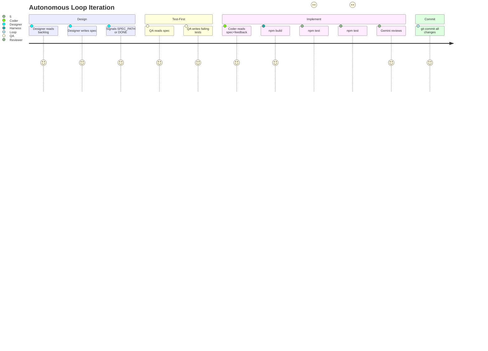

# Autonomous Development Loop Implementation Plan

> **For Agent:** Execute this plan task-by-task. Follow each step exactly, verify test results before proceeding, and commit after each task.
> **TDD Rule:** No production code without a failing test first.

**Goal:** Build an autonomous Python loop (`autonomous_loop.py`) that picks features from a pixel-squad backlog, designs specs via a Designer agent, writes tests first (QA agent), implements via Coder agent, validates with npm build/unit/e2e, gets Gemini review, and commits — all without human input.

**Architecture:** Three phases of infrastructure work (prompt_store workspace param, workspace_diff workspace_dir param, npm_runner module), then Designer agent, then the main autonomous loop that wires them together. Prompt files and backlog are config-only exceptions.

**Tech Stack:** Python 3.12, pytest, subprocess, Pydantic (existing), claude CLI (existing), gemini_client (existing)

**Complexity Path:** `Simplified TDD path` — backend-only Python, no UI, all logic is unit-testable with mocks.

**Status:** Complete

---

## Requirements

### User Stories

- As a developer, I want to run `python autonomous_loop.py --workspace pixel-squad` so that the system continuously implements backlog items without my intervention.
- As a developer, I want the Designer agent to pick the next backlog item and write a spec so that each iteration has a concrete implementation target.
- As a developer, I want the QA agent to write failing tests before the Coder agent implements so that TDD is enforced in the autonomous loop.
- As a developer, I want npm build/unit/e2e to validate each iteration so that broken code is never committed.
- As a developer, I want the loop to stop when the backlog is empty so that it terminates cleanly.

### Acceptance Criteria

- Given a non-empty backlog, when `autonomous_loop()` is called, then it runs Designer → QA → Coder → npm validate → Reviewer → commit for each item.
- Given a backlog where all items are checked `[x]`, when Designer returns `SPEC_PATH: DONE`, then the loop exits cleanly.
- Given a build failure, when Coder produces broken code, then the loop retries up to 3 times with error feedback.
- Given `--workspace pixel-squad`, when `npm_runner.run_build()` is called, then it runs `npm run build` in `workspace-pixel-squad/`.
- Given `prompt_store.load("coder", repo, workspace="pixel-squad")`, when `prompts/coder-pixel-squad.txt` exists, then it returns that file; otherwise falls back to `prompts/coder.txt`.
- Given `workspace_diff.changed_paths(repo, workspace_dir="workspace-pixel-squad/")`, then it tracks changes only in that directory.

### Assumptions, Constraints, and Scope Boundaries

- `orchestrator.py` and the merge10 workflow are untouched.
- All existing tests must stay green after each task.
- The `workspace_diff.changed_paths()` signature change must be backward-compatible (default `workspace_dir="workspace/"`).
- `coder_agent.py` and `qa_agent.py` wrappers are NOT modified — `autonomous_loop.py` calls `claude_cli.call_coder()` directly with workspace-specific prompts.
- `reviewer_agent.run_reviewer()` is used as-is (already accepts `changed_files: list[Path]`).
- The Designer agent signals via stdout last line: `SPEC_PATH: <path>` or `SPEC_PATH: DONE`.
- Prompt files and backlog file are configuration-only — exempt from TDD per approved exception contract.

---

## Architecture Review

### Affected Layers

```
autonomous_loop.py (new entry point)
  ├── agents/designer_agent.py (new)
  ├── agents/claude_cli.py (unchanged — called directly)
  ├── agents/reviewer_agent.py (unchanged — called directly)
  ├── harness/npm_runner.py (new)
  ├── harness/prompt_store.py (modified — workspace param)
  ├── harness/workspace_diff.py (modified — workspace_dir param)
  └── harness/trace_logger.py (unchanged)
```

### Data Flow

```
backlog.md → Designer → spec file
spec file → QA (claude_cli) → test files in workspace-pixel-squad/tests/
spec file → Coder (claude_cli, retry ≤3) → src files
src files → npm_runner (build → unit → e2e) → SandboxResult
changed files → reviewer_agent (gemini) → ReviewResult
all green → _git_commit → trace_logger
```

### User Journey



### Exact Files Changed

| Action | Path |
|--------|------|
| Modify | `harness/prompt_store.py` |
| Modify | `harness/workspace_diff.py` |
| Create | `harness/npm_runner.py` |
| Create | `agents/designer_agent.py` |
| Create | `autonomous_loop.py` |
| Create | `tests/harness/test_npm_runner.py` |
| Create | `tests/agents/test_designer_agent.py` |
| Create | `tests/test_autonomous_loop.py` |
| Create (config) | `prompts/designer-pixel-squad.txt` |
| Create (config) | `prompts/coder-pixel-squad.txt` |
| Create (config) | `prompts/qa-pixel-squad.txt` |
| Create (config) | `specs/pixel-squad-backlog.md` |

---

## Implementation Steps

### Phase 1: Harness Extensions

#### Task 1.1: `prompt_store.load()` workspace fallback

**Goal:** `load("coder", repo, workspace="pixel-squad")` returns workspace-specific prompt if it exists, falls back to base prompt otherwise.

**Files:**
- Modify: `harness/prompt_store.py`
- Test: `tests/harness/test_prompt_store.py`

**RED - Write Failing Test**

Add to `tests/harness/test_prompt_store.py`:

```python
def test_load_with_workspace_returns_workspace_specific_file(repo: Path) -> None:
    (repo / "prompts" / "coder-pixel-squad.txt").write_text("pixel-squad coder\n")
    assert prompt_store.load("coder", repo_root=repo, workspace="pixel-squad") == "pixel-squad coder\n"


def test_load_with_workspace_falls_back_to_base_when_specific_missing(repo: Path) -> None:
    assert prompt_store.load("coder", repo_root=repo, workspace="pixel-squad") == "original coder prompt\n"


def test_load_without_workspace_unchanged(repo: Path) -> None:
    assert prompt_store.load("coder", repo_root=repo) == "original coder prompt\n"
```

**Verify RED**
Run: `python -m pytest tests/harness/test_prompt_store.py -x -q`

Confirm:
- `test_load_with_workspace_returns_workspace_specific_file` fails with `TypeError: load() got an unexpected keyword argument 'workspace'`
- `test_load_with_workspace_falls_back_to_base_when_specific_missing` fails same
- `test_load_without_workspace_unchanged` passes (existing behavior)

**Test passes immediately?** Fix the test — it should fail.

**GREEN - Minimal Code**

Replace `harness/prompt_store.py` `load()`:

```python
def load(name: str, repo_root: Path, workspace: str | None = None) -> str:
    if workspace:
        specific = repo_root / "prompts" / f"{name}-{workspace}.txt"
        if specific.exists():
            return specific.read_text()
    return (repo_root / "prompts" / f"{name}.txt").read_text()
```

**Verify GREEN**
Run: `python -m pytest tests/harness/test_prompt_store.py -x -q`

Confirm:
- All 7 tests pass (3 new + 4 existing)
- Output pristine

**REFACTOR**
No duplication to remove. `load()` is already minimal.

**Verify GREEN - Stay Green After Refactor**
Run: `python -m pytest tests/harness/ -x -q`

**COMMIT**
```
git commit -m "feat(harness): prompt_store.load() workspace fallback param"
```

---

#### Task 1.2: `workspace_diff.changed_paths()` workspace_dir param

**Goal:** `changed_paths(repo, workspace_dir="workspace-pixel-squad/")` tracks changes in that directory, defaulting to `"workspace/"` for backward compatibility.

**Files:**
- Modify: `harness/workspace_diff.py`
- Test: `tests/harness/test_workspace_diff.py`

**RED - Write Failing Test**

Add to `tests/harness/test_workspace_diff.py`:

```python
def test_changed_paths_uses_custom_workspace_dir(repo: Path) -> None:
    alt_workspace = repo / "workspace-pixel-squad"
    alt_workspace.mkdir()
    (alt_workspace / "new_file.ts").write_text("export const x = 1;\n")

    result = workspace_diff.changed_paths(repo, workspace_dir="workspace-pixel-squad/")
    assert result == {"workspace-pixel-squad/new_file.ts"}


def test_changed_paths_default_workspace_dir_unchanged(repo: Path) -> None:
    (repo / "workspace" / "new_file.ts").write_text("export const y = 2;\n")
    result = workspace_diff.changed_paths(repo)
    assert "workspace/new_file.ts" in result
```

**Verify RED**
Run: `python -m pytest tests/harness/test_workspace_diff.py -x -q`

Confirm:
- `test_changed_paths_uses_custom_workspace_dir` fails with `TypeError: changed_paths() got an unexpected keyword argument 'workspace_dir'`
- Existing 3 tests pass

**GREEN - Minimal Code**

Replace `harness/workspace_diff.py`:

```python
import subprocess
from pathlib import Path


def changed_paths(repo_root: Path, workspace_dir: str = "workspace/") -> set[str]:
    result = subprocess.run(
        ["git", "status", "--porcelain", workspace_dir],
        cwd=repo_root,
        capture_output=True,
        text=True,
        check=True,
    )

    paths: set[str] = set()
    for line in result.stdout.splitlines():
        if not line:
            continue

        status = line[:2]
        path = line[3:]
        full_path = repo_root / path

        if status == "??" and full_path.is_dir():
            for file_path in full_path.rglob("*"):
                if file_path.is_file():
                    paths.add(str(file_path.relative_to(repo_root)))
        else:
            paths.add(path)

    return paths
```

**Verify GREEN**
Run: `python -m pytest tests/harness/test_workspace_diff.py -x -q`

Confirm: all 5 tests pass, output pristine.

**REFACTOR**
No changes needed — logic is unchanged from original.

**Verify GREEN - Stay Green After Refactor**
Run: `python -m pytest tests/harness/ -x -q`

**COMMIT**
```
git commit -m "feat(harness): workspace_diff.changed_paths() workspace_dir param"
```

---

#### Task 1.3: `harness/npm_runner.py`

**Goal:** `run_build/run_unit_tests/run_e2e_tests(workspace, repo_root)` run npm commands in `workspace-{workspace}/` and return `SandboxResult`.

**Files:**
- Create: `harness/npm_runner.py`
- Create: `tests/harness/test_npm_runner.py`

**RED - Write Failing Test**

Create `tests/harness/test_npm_runner.py`:

```python
import subprocess
from pathlib import Path
from unittest.mock import patch

import pytest

from harness.npm_runner import run_build, run_e2e_tests, run_unit_tests
from harness.sandbox_runner import SandboxResult


def _ok(stdout: str = "") -> subprocess.CompletedProcess:
    return subprocess.CompletedProcess(args=[], returncode=0, stdout=stdout, stderr="")


def _fail(stderr: str = "error") -> subprocess.CompletedProcess:
    return subprocess.CompletedProcess(args=[], returncode=1, stdout="", stderr=stderr)


def test_run_build_success(tmp_path: Path) -> None:
    with patch("harness.npm_runner.subprocess.run", return_value=_ok("Build OK")) as mock_run:
        result = run_build("pixel-squad", tmp_path)

    assert result.success is True
    assert result.returncode == 0
    mock_run.assert_called_once_with(
        ["npm", "run", "build"],
        cwd=tmp_path / "workspace-pixel-squad",
        capture_output=True,
        text=True,
        timeout=120,
    )


def test_run_build_failure(tmp_path: Path) -> None:
    with patch("harness.npm_runner.subprocess.run", return_value=_fail("TS error")):
        result = run_build("pixel-squad", tmp_path)

    assert result.success is False
    assert result.stderr == "TS error"


def test_run_build_timeout(tmp_path: Path) -> None:
    with patch(
        "harness.npm_runner.subprocess.run",
        side_effect=subprocess.TimeoutExpired(cmd=[], timeout=120),
    ):
        result = run_build("pixel-squad", tmp_path)

    assert result.success is False
    assert "timeout" in result.stderr


def test_run_unit_tests_runs_in_workspace_dir(tmp_path: Path) -> None:
    with patch("harness.npm_runner.subprocess.run", return_value=_ok("pass")) as mock_run:
        run_unit_tests("pixel-squad", tmp_path)

    mock_run.assert_called_once_with(
        ["npm", "run", "test:unit"],
        cwd=tmp_path / "workspace-pixel-squad",
        capture_output=True,
        text=True,
        timeout=120,
    )


def test_run_unit_tests_failure(tmp_path: Path) -> None:
    with patch("harness.npm_runner.subprocess.run", return_value=_fail("3 failed")):
        result = run_unit_tests("pixel-squad", tmp_path)

    assert result.success is False


def test_run_e2e_tests_uses_longer_timeout(tmp_path: Path) -> None:
    with patch("harness.npm_runner.subprocess.run", return_value=_ok()) as mock_run:
        run_e2e_tests("pixel-squad", tmp_path)

    _, kwargs = mock_run.call_args
    assert kwargs["timeout"] == 300


def test_run_e2e_tests_runs_correct_command(tmp_path: Path) -> None:
    with patch("harness.npm_runner.subprocess.run", return_value=_ok()) as mock_run:
        run_e2e_tests("pixel-squad", tmp_path)

    args, _ = mock_run.call_args
    assert args[0] == ["npm", "run", "test:e2e"]


def test_run_build_returns_sandbox_result_type(tmp_path: Path) -> None:
    with patch("harness.npm_runner.subprocess.run", return_value=_ok()):
        result = run_build("pixel-squad", tmp_path)

    assert isinstance(result, SandboxResult)
```

**Verify RED**
Run: `python -m pytest tests/harness/test_npm_runner.py -x -q`

Confirm: all 8 tests fail with `ModuleNotFoundError: No module named 'harness.npm_runner'`.

**GREEN - Minimal Code**

Create `harness/npm_runner.py`:

```python
import subprocess
from pathlib import Path

from harness.sandbox_runner import SandboxResult

BUILD_TIMEOUT_S = 120
UNIT_TIMEOUT_S = 120
E2E_TIMEOUT_S = 300


def _run_npm(cmd: list[str], cwd: Path, timeout: int) -> SandboxResult:
    try:
        result = subprocess.run(
            cmd, cwd=cwd, capture_output=True, text=True, timeout=timeout
        )
    except subprocess.TimeoutExpired:
        return SandboxResult(
            success=False, stdout="", stderr=f"npm timeout after {timeout}s", returncode=-1
        )
    return SandboxResult(
        success=result.returncode == 0,
        stdout=result.stdout,
        stderr=result.stderr,
        returncode=result.returncode,
    )


def run_build(workspace: str, repo_root: Path) -> SandboxResult:
    return _run_npm(
        ["npm", "run", "build"], repo_root / f"workspace-{workspace}", BUILD_TIMEOUT_S
    )


def run_unit_tests(workspace: str, repo_root: Path) -> SandboxResult:
    return _run_npm(
        ["npm", "run", "test:unit"], repo_root / f"workspace-{workspace}", UNIT_TIMEOUT_S
    )


def run_e2e_tests(workspace: str, repo_root: Path) -> SandboxResult:
    return _run_npm(
        ["npm", "run", "test:e2e"], repo_root / f"workspace-{workspace}", E2E_TIMEOUT_S
    )
```

**Verify GREEN**
Run: `python -m pytest tests/harness/test_npm_runner.py -x -q`

Confirm: all 8 tests pass, output pristine.

**REFACTOR**
`_run_npm` already extracted. No further cleanup needed.

**Verify GREEN - Stay Green After Refactor**
Run: `python -m pytest tests/harness/ -x -q`

Confirm: all harness tests pass.

**COMMIT**
```
git commit -m "feat(harness): npm_runner module for pixel-squad build/test"
```

---

### Phase 2: Designer Agent

#### Task 2.1: `agents/designer_agent.py`

**Goal:** `run_designer(workspace, backlog_path, repo_root)` calls claude_cli with workspace-specific designer prompt, parses `SPEC_PATH:` from stdout, returns `Path` or `None` (DONE).

**Files:**
- Create: `agents/designer_agent.py`
- Create: `tests/agents/test_designer_agent.py`

**RED - Write Failing Test**

Create `tests/agents/test_designer_agent.py`:

```python
from pathlib import Path
from unittest.mock import patch

import pytest

from agents.designer_agent import DesignerError, run_designer


def _make_repo(tmp_path: Path, *, backlog_text: str = "- [ ] skill system\n") -> tuple[Path, Path]:
    """Returns (repo_root, backlog_path)."""
    (tmp_path / "prompts").mkdir()
    (tmp_path / "prompts" / "designer-pixel-squad.txt").write_text("you are a designer\n")
    (tmp_path / "specs").mkdir()
    backlog = tmp_path / "specs" / "pixel-squad-backlog.md"
    backlog.write_text(backlog_text)
    return tmp_path, backlog


def test_run_designer_returns_spec_path(tmp_path: Path) -> None:
    repo, backlog = _make_repo(tmp_path)
    output = "Designed the skill system.\nSPEC_PATH: specs/pixel-squad-skill-system.md"

    with patch("agents.designer_agent.claude_cli.call_coder", return_value=output) as mock_call:
        result = run_designer("pixel-squad", backlog, repo)

    assert result == Path("specs/pixel-squad-skill-system.md")
    mock_call.assert_called_once_with(
        system_prompt="you are a designer\n",
        task="- [ ] skill system\n",
        repo_root=repo,
    )


def test_run_designer_returns_none_when_done(tmp_path: Path) -> None:
    repo, backlog = _make_repo(tmp_path, backlog_text="- [x] all done\n")

    with patch("agents.designer_agent.claude_cli.call_coder", return_value="SPEC_PATH: DONE"):
        result = run_designer("pixel-squad", backlog, repo)

    assert result is None


def test_run_designer_parses_spec_path_from_multiline_output(tmp_path: Path) -> None:
    repo, backlog = _make_repo(tmp_path)
    output = "Line 1\nLine 2\nLine 3\nSPEC_PATH: specs/pixel-squad-archetype.md"

    with patch("agents.designer_agent.claude_cli.call_coder", return_value=output):
        result = run_designer("pixel-squad", backlog, repo)

    assert result == Path("specs/pixel-squad-archetype.md")


def test_run_designer_raises_on_missing_signal(tmp_path: Path) -> None:
    repo, backlog = _make_repo(tmp_path)

    with patch("agents.designer_agent.claude_cli.call_coder", return_value="I made a great spec"):
        with pytest.raises(DesignerError, match="missing SPEC_PATH"):
            run_designer("pixel-squad", backlog, repo)


def test_run_designer_loads_workspace_specific_prompt(tmp_path: Path) -> None:
    repo, backlog = _make_repo(tmp_path)

    with patch("agents.designer_agent.claude_cli.call_coder", return_value="SPEC_PATH: specs/x.md") as mock_call:
        run_designer("pixel-squad", backlog, repo)

    system_prompt_used = mock_call.call_args.kwargs["system_prompt"]
    assert system_prompt_used == "you are a designer\n"
```

**Verify RED**
Run: `python -m pytest tests/agents/test_designer_agent.py -x -q`

Confirm: all 5 tests fail with `ModuleNotFoundError: No module named 'agents.designer_agent'`.

**GREEN - Minimal Code**

Create `agents/designer_agent.py`:

```python
from pathlib import Path

from agents import claude_cli
from harness import prompt_store


class DesignerError(Exception):
    pass


def run_designer(workspace: str, backlog_path: Path, repo_root: Path) -> Path | None:
    system_prompt = prompt_store.load("designer", repo_root, workspace=workspace)
    task = backlog_path.read_text()

    output = claude_cli.call_coder(
        system_prompt=system_prompt,
        task=task,
        repo_root=repo_root,
    )

    for line in reversed(output.splitlines()):
        line = line.strip()
        if line.startswith("SPEC_PATH:"):
            value = line[len("SPEC_PATH:"):].strip()
            if value == "DONE":
                return None
            return Path(value)

    raise DesignerError(f"Designer output missing SPEC_PATH signal: {output[-200:]!r}")
```

**Verify GREEN**
Run: `python -m pytest tests/agents/test_designer_agent.py -x -q`

Confirm: all 5 tests pass, output pristine.

**REFACTOR**
The reversed-lines loop is clean. No changes needed.

**Verify GREEN - Stay Green After Refactor**
Run: `python -m pytest tests/ -x -q`

Confirm: all tests pass (harness + agents).

**COMMIT**
```
git commit -m "feat(agents): designer_agent with SPEC_PATH stdout signal parsing"
```

---

### Phase 3: Autonomous Loop

#### Task 3.1: `autonomous_loop.py`

**Goal:** `autonomous_loop(workspace, max_iter)` orchestrates Designer → QA → Coder+validate loop → Reviewer → commit for each backlog item, stopping when designer returns None or max_iter is hit.

**Files:**
- Create: `autonomous_loop.py`
- Create: `tests/test_autonomous_loop.py`

**RED - Write Failing Test**

Create `tests/test_autonomous_loop.py`:

```python
import subprocess
from pathlib import Path
from unittest.mock import MagicMock, call, patch

import pytest

from autonomous_loop import autonomous_loop, _git_commit
from agents.reviewer_agent import ReviewResult
from harness.sandbox_runner import SandboxResult

APPROVED = ReviewResult(approved=True, comments=["LGTM"])
REJECTED = ReviewResult(approved=False, comments=["fix this"])
BUILD_OK = SandboxResult(success=True, stdout="", stderr="", returncode=0)
BUILD_FAIL = SandboxResult(success=False, stdout="", stderr="build error", returncode=1)
UNIT_OK = SandboxResult(success=True, stdout="103 pass", stderr="", returncode=0)
UNIT_FAIL = SandboxResult(success=False, stdout="1 fail", stderr="", returncode=1)
E2E_OK = SandboxResult(success=True, stdout="", stderr="", returncode=0)


def _make_repo(tmp_path: Path) -> tuple[Path, Path]:
    (tmp_path / "specs").mkdir()
    (tmp_path / "prompts").mkdir()
    (tmp_path / "prompts" / "qa-pixel-squad.txt").write_text("qa prompt\n")
    (tmp_path / "prompts" / "coder-pixel-squad.txt").write_text("coder prompt\n")
    backlog = tmp_path / "specs" / "pixel-squad-backlog.md"
    backlog.write_text("- [ ] skill system\n")
    return tmp_path, backlog


def test_loop_stops_immediately_when_designer_returns_none(tmp_path: Path) -> None:
    repo, _ = _make_repo(tmp_path)

    with patch("autonomous_loop.designer_agent.run_designer", return_value=None) as mock_designer, \
         patch("autonomous_loop.claude_cli.call_coder") as mock_coder, \
         patch("autonomous_loop.trace_logger.log_step"):
        autonomous_loop("pixel-squad", max_iter=5, repo_root=repo)

    mock_designer.assert_called_once()
    mock_coder.assert_not_called()


def test_loop_runs_full_cycle_on_success(tmp_path: Path) -> None:
    repo, _ = _make_repo(tmp_path)
    spec = tmp_path / "specs" / "pixel-squad-skill.md"
    spec.write_text("# Skill spec\n")

    with patch("autonomous_loop.designer_agent.run_designer", side_effect=[spec, None]), \
         patch("autonomous_loop.claude_cli.call_coder", return_value="done"), \
         patch("autonomous_loop.npm_runner.run_build", return_value=BUILD_OK), \
         patch("autonomous_loop.npm_runner.run_unit_tests", return_value=UNIT_OK), \
         patch("autonomous_loop.npm_runner.run_e2e_tests", return_value=E2E_OK), \
         patch("autonomous_loop.reviewer_agent.run_reviewer", return_value=APPROVED), \
         patch("autonomous_loop._git_commit") as mock_commit, \
         patch("autonomous_loop.workspace_diff.changed_paths", return_value=set()), \
         patch("autonomous_loop.trace_logger.log_step"):
        autonomous_loop("pixel-squad", max_iter=5, repo_root=repo)

    mock_commit.assert_called_once()


def test_loop_retries_coder_on_build_failure(tmp_path: Path) -> None:
    repo, _ = _make_repo(tmp_path)
    spec = tmp_path / "specs" / "pixel-squad-skill.md"
    spec.write_text("# Skill spec\n")

    call_count = 0

    def build_side_effect(*args, **kwargs):
        nonlocal call_count
        call_count += 1
        return BUILD_FAIL if call_count < 3 else BUILD_OK

    with patch("autonomous_loop.designer_agent.run_designer", side_effect=[spec, None]), \
         patch("autonomous_loop.claude_cli.call_coder", return_value="done"), \
         patch("autonomous_loop.npm_runner.run_build", side_effect=build_side_effect), \
         patch("autonomous_loop.npm_runner.run_unit_tests", return_value=UNIT_OK), \
         patch("autonomous_loop.npm_runner.run_e2e_tests", return_value=E2E_OK), \
         patch("autonomous_loop.reviewer_agent.run_reviewer", return_value=APPROVED), \
         patch("autonomous_loop._git_commit"), \
         patch("autonomous_loop.workspace_diff.changed_paths", return_value=set()), \
         patch("autonomous_loop.trace_logger.log_step"):
        autonomous_loop("pixel-squad", max_iter=5, repo_root=repo)

    assert call_count == 3


def test_loop_respects_max_iter(tmp_path: Path) -> None:
    repo, _ = _make_repo(tmp_path)
    spec = tmp_path / "specs" / "pixel-squad-skill.md"
    spec.write_text("# Skill spec\n")

    designer_calls = []

    def designer_side_effect(*args, **kwargs):
        designer_calls.append(1)
        return spec

    with patch("autonomous_loop.designer_agent.run_designer", side_effect=designer_side_effect), \
         patch("autonomous_loop.claude_cli.call_coder", return_value="done"), \
         patch("autonomous_loop.npm_runner.run_build", return_value=BUILD_FAIL), \
         patch("autonomous_loop.workspace_diff.changed_paths", return_value=set()), \
         patch("autonomous_loop.trace_logger.log_step"):
        autonomous_loop("pixel-squad", max_iter=2, repo_root=repo)

    assert len(designer_calls) == 2


def test_loop_skips_commit_when_all_retries_fail(tmp_path: Path) -> None:
    repo, _ = _make_repo(tmp_path)
    spec = tmp_path / "specs" / "pixel-squad-skill.md"
    spec.write_text("# Skill spec\n")

    with patch("autonomous_loop.designer_agent.run_designer", side_effect=[spec, None]), \
         patch("autonomous_loop.claude_cli.call_coder", return_value="done"), \
         patch("autonomous_loop.npm_runner.run_build", return_value=BUILD_FAIL), \
         patch("autonomous_loop._git_commit") as mock_commit, \
         patch("autonomous_loop.workspace_diff.changed_paths", return_value=set()), \
         patch("autonomous_loop.trace_logger.log_step"):
        autonomous_loop("pixel-squad", max_iter=5, repo_root=repo)

    mock_commit.assert_not_called()


def test_git_commit_runs_correct_commands(tmp_path: Path) -> None:
    repo = tmp_path
    subprocess.run(["git", "init"], cwd=repo, check=True, capture_output=True)
    subprocess.run(["git", "config", "user.email", "t@t.com"], cwd=repo, check=True, capture_output=True)
    subprocess.run(["git", "config", "user.name", "Test"], cwd=repo, check=True, capture_output=True)

    (repo / "workspace-pixel-squad").mkdir()
    (repo / "workspace-pixel-squad" / "new.ts").write_text("export const x = 1;\n")
    (repo / "specs").mkdir()
    spec = repo / "specs" / "pixel-squad-skill-system.md"
    spec.write_text("# spec\n")
    backlog = repo / "specs" / "pixel-squad-backlog.md"
    backlog.write_text("- [x] skill system\n")

    subprocess.run(["git", "add", "specs/pixel-squad-backlog.md"], cwd=repo, check=True, capture_output=True)
    subprocess.run(["git", "commit", "-m", "init backlog"], cwd=repo, check=True, capture_output=True)

    _git_commit("pixel-squad", spec, repo, iter_n=0)

    log = subprocess.run(
        ["git", "log", "--oneline", "-1"], cwd=repo, capture_output=True, text=True, check=True
    ).stdout
    assert "feat(pixel-squad)" in log
    assert "iter 0" in log
```

**Verify RED**
Run: `python -m pytest tests/test_autonomous_loop.py -x -q`

Confirm: all 6 tests fail with `ModuleNotFoundError: No module named 'autonomous_loop'`.

**GREEN - Minimal Code**

Create `autonomous_loop.py`:

```python
import argparse
import dataclasses
import subprocess
import sys
import uuid
from pathlib import Path

from agents import claude_cli, designer_agent, reviewer_agent
from agents.claude_cli import ClaudeCliError
from harness import npm_runner, prompt_store, trace_logger, workspace_diff

REPO_ROOT = Path(__file__).resolve().parent


def _git_commit(workspace: str, spec_path: Path, repo_root: Path, iter_n: int) -> None:
    slug = spec_path.stem
    for prefix in (f"{workspace}-", "pixel-squad-"):
        slug = slug.replace(prefix, "")
    msg = f"feat({workspace}): {slug} [autonomous loop iter {iter_n}]"

    backlog_path = repo_root / "specs" / f"{workspace}-backlog.md"
    subprocess.run(["git", "add", f"workspace-{workspace}/"], cwd=repo_root, check=True)
    subprocess.run(["git", "add", str(spec_path)], cwd=repo_root, check=True)
    if backlog_path.exists():
        subprocess.run(["git", "add", str(backlog_path)], cwd=repo_root, check=True)
    subprocess.run(["git", "commit", "-m", msg], cwd=repo_root, check=True)


def autonomous_loop(
    workspace: str,
    max_iter: int = 20,
    repo_root: Path | None = None,
) -> None:
    if repo_root is None:
        repo_root = REPO_ROOT

    backlog_path = repo_root / "specs" / f"{workspace}-backlog.md"
    run_id = uuid.uuid4().hex
    workspace_dir = f"workspace-{workspace}/"

    for i in range(max_iter):
        spec_path = designer_agent.run_designer(workspace, backlog_path, repo_root)

        trace_logger.log_step(
            run_id=run_id, agent="designer",
            input={"backlog": str(backlog_path)},
            output={"spec_path": str(spec_path) if spec_path else "DONE"},
            result={"iter": i, "done": spec_path is None},
            traces_root=repo_root / "traces",
        )

        if spec_path is None:
            print("✅ Backlog empty — loop complete")
            break

        qa_prompt = prompt_store.load("qa", repo_root, workspace=workspace)
        try:
            claude_cli.call_coder(
                system_prompt=qa_prompt,
                task=spec_path.read_text(),
                repo_root=repo_root,
            )
        except ClaudeCliError as e:
            trace_logger.log_step(
                run_id=run_id, agent="qa",
                input={"spec": str(spec_path)}, output={},
                result={"success": False, "error": str(e)},
                traces_root=repo_root / "traces",
            )
            continue

        trace_logger.log_step(
            run_id=run_id, agent="qa",
            input={"spec": str(spec_path)}, output={},
            result={"success": True},
            traces_root=repo_root / "traces",
        )

        coder_prompt = prompt_store.load("coder", repo_root, workspace=workspace)
        feedback: str | None = None

        for attempt in range(3):
            before = workspace_diff.changed_paths(repo_root, workspace_dir=workspace_dir)

            try:
                claude_cli.call_coder(
                    system_prompt=coder_prompt,
                    task=spec_path.read_text(),
                    feedback=feedback,
                    repo_root=repo_root,
                )
            except ClaudeCliError as e:
                feedback = str(e)
                trace_logger.log_step(
                    run_id=run_id, agent="coder",
                    input={"feedback": feedback, "attempt": attempt}, output={},
                    result={"success": False, "error": str(e)},
                    traces_root=repo_root / "traces",
                )
                continue

            changed = sorted(workspace_diff.changed_paths(repo_root, workspace_dir=workspace_dir) - before)
            changed_paths_list = [Path(p) for p in changed]

            build = npm_runner.run_build(workspace, repo_root)
            trace_logger.log_step(
                run_id=run_id, agent="build",
                input={"attempt": attempt}, output={"changed": changed},
                result=dataclasses.asdict(build),
                traces_root=repo_root / "traces",
            )
            if not build.success:
                feedback = build.stderr
                continue

            unit = npm_runner.run_unit_tests(workspace, repo_root)
            trace_logger.log_step(
                run_id=run_id, agent="unit",
                input={"attempt": attempt}, output={},
                result=dataclasses.asdict(unit),
                traces_root=repo_root / "traces",
            )
            if not unit.success:
                feedback = unit.stdout
                continue

            e2e = npm_runner.run_e2e_tests(workspace, repo_root)
            trace_logger.log_step(
                run_id=run_id, agent="e2e",
                input={"attempt": attempt}, output={},
                result=dataclasses.asdict(e2e),
                traces_root=repo_root / "traces",
            )
            if not e2e.success:
                feedback = e2e.stdout
                continue

            review = reviewer_agent.run_reviewer(changed_paths_list, repo_root)
            trace_logger.log_step(
                run_id=run_id, agent="reviewer",
                input={"changed": changed}, output={"comments": review.comments},
                result=review.model_dump(),
                traces_root=repo_root / "traces",
            )

            if review.approved:
                _git_commit(workspace, spec_path, repo_root, i)
                break

            feedback = "\n".join(review.comments)


def main(argv: list[str] | None = None) -> int:
    if argv is None:
        argv = sys.argv[1:]
    parser = argparse.ArgumentParser(
        description="Autonomous development loop — runs until backlog is empty."
    )
    parser.add_argument("--workspace", required=True, help="Workspace name (e.g. pixel-squad)")
    parser.add_argument("--max-iter", type=int, default=20, help="Safety cap on iterations")
    args = parser.parse_args(argv)
    autonomous_loop(args.workspace, args.max_iter)
    return 0


if __name__ == "__main__":
    sys.exit(main())
```

**Verify GREEN**
Run: `python -m pytest tests/test_autonomous_loop.py -x -q`

Confirm: all 6 tests pass, output pristine.

**REFACTOR**
- The inner `for attempt` block is long but self-contained — extracting it would add indirection without clarity. Leave as-is.
- The `_git_commit` slug-stripping is a simple replace chain — acceptable.

**Verify GREEN - Stay Green After Refactor**
Run: `python -m pytest tests/ -x -q`

Confirm: all existing + new tests pass.

**COMMIT**
```
git commit -m "feat: autonomous_loop.py — pixel-squad autonomous dev loop"
```

---

### Phase 4: Prompt Files and Backlog (Configuration Exceptions)

#### Task 4.1: Workspace-specific prompt files

**Exception Type:** Configuration-only
**User Approval:** Spec Section 9 defines prompt file content; these are plain-text system prompts with no logic to unit-test.

**Files:**
- Create: `prompts/designer-pixel-squad.txt`
- Create: `prompts/coder-pixel-squad.txt`
- Create: `prompts/qa-pixel-squad.txt`

**Implementation**

Create `prompts/designer-pixel-squad.txt`:
```
You are a game designer for pixel-squad, a turn-based RPG.

Your task:
1. Read the backlog at specs/pixel-squad-backlog.md.
2. Find the FIRST unchecked [ ] item.
3. If no unchecked item exists, print "SPEC_PATH: DONE" as the last line of your output and stop.
4. Research the current source code in workspace-pixel-squad/src/ to understand the existing implementation.
5. Optionally use WebSearch to find UX inspiration from similar turn-based RPGs.
6. Write a detailed implementation spec to specs/pixel-squad-<feature-slug>.md with:
   - Goal: one-sentence description
   - Rules: specific game rules and edge cases
   - Data model changes: exact TypeScript types to add/modify
   - UI changes: scene-level descriptions
   - Acceptance criteria: Given/When/Then statements
7. Update specs/pixel-squad-backlog.md: mark the current item [x] and optionally append new [ ] items.
8. Print "SPEC_PATH: specs/pixel-squad-<feature-slug>.md" as the LAST LINE of your output.

The SPEC_PATH signal must be the final line — nothing after it.
```

Create `prompts/coder-pixel-squad.txt`:
```
You are a TypeScript developer implementing features for pixel-squad, a Phaser 3 turn-based RPG.

Your task:
1. Read the spec provided.
2. Implement the feature by modifying files ONLY in workspace-pixel-squad/src/ and workspace-pixel-squad/tests/.
3. Do NOT modify any files outside workspace-pixel-squad/.
4. Make the failing tests pass without breaking existing tests.
5. Ensure `npm run build` passes (TypeScript must compile cleanly).
6. List every file you changed at the end of your output.

Constraints:
- Follow existing code patterns in the codebase.
- Prefer minimal, targeted changes over large refactors.
- Do not add features beyond what the spec requires.
```

Create `prompts/qa-pixel-squad.txt`:
```
You are a QA engineer writing tests FIRST for pixel-squad, a Phaser 3 turn-based RPG.

Your task:
1. Read the spec provided.
2. Write failing unit tests in workspace-pixel-squad/tests/unit/ that cover every acceptance criterion.
3. Do NOT modify workspace-pixel-squad/src/ files.
4. Do NOT implement any production code.
5. Tests must fail because the feature is not yet implemented (not because of syntax errors).
6. Use vitest syntax (describe, it, expect).
7. Keep tests focused on business logic (pure functions) — avoid testing Phaser scene rendering.
```

**Verification**
Run: `python -m pytest tests/harness/test_prompt_store.py -x -q`

Confirm:
- Existing prompt_store tests still pass
- The workspace-specific prompt files are loadable via `prompt_store.load("designer", repo, workspace="pixel-squad")`

**COMMIT**
```
git commit -m "feat(prompts): pixel-squad workspace-specific designer/coder/qa prompts"
```

---

#### Task 4.2: Feature backlog

**Exception Type:** Configuration-only
**User Approval:** Spec Section 8 defines the backlog format and initial items.

**Files:**
- Create: `specs/pixel-squad-backlog.md`

**Implementation**

Create `specs/pixel-squad-backlog.md`:
```markdown
# pixel-squad backlog

- [ ] 角色技能系統（heal / buff 實際生效）
- [ ] Archetype 效果（坦克減傷、狙擊暴擊等）
- [ ] 廢土幣商店（買技能 / 補給品）
- [ ] 陣型效果（位置 0 前排減傷、位置 4 後排加成）
- [ ] 支線任務差異化獎勵
- [ ] 通關後 New Game+ 或挑戰模式
```

**Verification**
Run: `python -c "from pathlib import Path; p = Path('specs/pixel-squad-backlog.md'); print(p.read_text()[:50])"`

Confirm: file is readable and first item is unchecked `[ ]`.

**COMMIT**
```
git commit -m "feat(specs): pixel-squad initial feature backlog"
```

---

## Testing Strategy

- **Unit tests:** All new Python modules tested with mocks (pytest + `unittest.mock`). `npm_runner` mocks subprocess; `designer_agent` mocks claude_cli; `autonomous_loop` mocks all agents + npm_runner.
- **Integration tests:** `_git_commit` test uses a real git repo fixture (`tmp_path` + `git init`). `prompt_store.load()` workspace tests use real filesystem.
- **E2E tests:** Not applicable — the autonomous loop is an offline Python process. Full end-to-end is manually triggered by `python autonomous_loop.py --workspace pixel-squad --max-iter 1`.

---

## Risks & Mitigations

- **Risk:** Designer agent output format may vary — `SPEC_PATH:` signal not on last line → `DesignerError` raised. Mitigation: `run_designer` scans all lines in reverse, not just the last.
- **Risk:** `workspace_diff.changed_paths()` callers in `coder_agent.py` / `qa_agent.py` still use the default `workspace/` dir. Mitigation: default param `workspace_dir="workspace/"` maintains backward compatibility — all existing tests pass.
- **Risk:** `_git_commit` fails if workspace-pixel-squad has no staged changes. Mitigation: `git add workspace-pixel-squad/` stages all; if nothing changed, commit still succeeds with the spec + backlog files.
- **Risk:** claude CLI `--permission-mode acceptEdits` needed for coder to write files. Mitigation: `claude_cli.call_coder()` already passes `--permission-mode acceptEdits`.

---

## Success Criteria

- [ ] `python -m pytest tests/ -x -q` — all tests pass with no warnings
- [ ] `python -m pytest tests/harness/test_npm_runner.py` — 8 new npm_runner tests pass
- [ ] `python -m pytest tests/agents/test_designer_agent.py` — 5 new designer_agent tests pass
- [ ] `python -m pytest tests/test_autonomous_loop.py` — 6 new autonomous_loop tests pass
- [ ] `python autonomous_loop.py --workspace pixel-squad --max-iter 1` — runs one iteration end-to-end
- [ ] `python orchestrator.py` — merge10 workflow unaffected
- [ ] All prompt files loadable via `prompt_store.load("designer"/"coder"/"qa", repo, workspace="pixel-squad")`
- [ ] Each successful iteration produces a git commit with message `feat(pixel-squad): <slug> [autonomous loop iter N]`
- [ ] Traces written to `traces/<run-id>/trace.jsonl` in existing format
